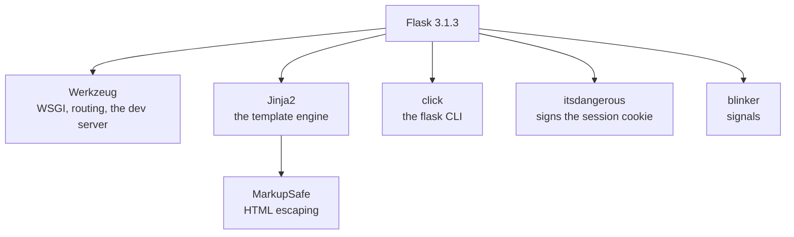

Once your virtual environment is activated, install Flask:

```bash
pip install Flask
```

## Verify installation

You can quickly verify installation in Python:

```bash
python -c "import flask; print(flask.__version__)"
```

## What gets installed?

Flask depends on a few important libraries:

- **Werkzeug**: request/response handling, dev server
- **Jinja2**: templating engine
- **ItsDangerous**: signing cookies
- **Click**: CLI tooling

You don’t need to learn them all now, but it’s helpful to know what’s underneath.

## Pinning versions

For learning projects, installing latest is fine.

For production apps, it’s common to pin versions in `requirements.txt` or use a tool like Poetry. (We’ll keep it simple in this tutorial track.)

## What `pip install flask` actually brings

Flask is a small package that composes several others. Measured in a fresh virtual
environment on CPython 3.14.4:



| measured in a clean venv | packages | site-packages |
|:--|--:|--:|
| `pip install flask` | **9** | **19 MB** |
| `pip install django` | **5** | **56 MB** |

Worth pausing on, because it contradicts the usual shorthand. **Django installs fewer
packages than Flask** — it is one large distribution, while Flask is a thin layer over
several independent libraries. Flask is smaller on disk; it is not smaller by dependency
count.

The nine are `Flask`, `Werkzeug`, `Jinja2`, `MarkupSafe`, `click`, `blinker`,
`itsdangerous`, `colorama` (Windows console colour) and `pip` itself.

:::note[Why this matters when you pin]
Those are all separate projects with their own release schedules. `Flask==3.1.3` alone
does not pin what you got — a new Werkzeug can change behaviour under a fixed Flask
version. Use `pip freeze > requirements.txt`, or a lock file, to record all of them.
:::

## See it move

```p5 title="What one pip install pulls in" desc="Flask is a thin layer over several independent packages, each with its own release schedule." height="330"
let hover = -1;
const DEPS = [
  { n: "Werkzeug", d: "WSGI, routing, dev server, the debugger" },
  { n: "Jinja2", d: "the template engine render_template uses" },
  { n: "click", d: "builds the flask command line" },
  { n: "itsdangerous", d: "cryptographically signs the session cookie" },
  { n: "blinker", d: "signals such as request_started" },
  { n: "MarkupSafe", d: "escapes HTML, pulled in by Jinja2" },
];

function setup() {
  createCanvas(600, 330);
  textFont("monospace");
}

function draw() {
  background(13, 17, 23);
  noStroke();
  fill(230);
  textSize(13);
  textAlign(LEFT, TOP);
  text("pip install flask", 24, 16);
  fill(120);
  textSize(11);
  text("9 packages, 19 MB - hover a box", 24, 36);

  const cx = 300;
  stroke(255, 211, 67);
  strokeWeight(2);
  fill(38, 34, 18);
  rect(cx - 62, 64, 124, 34, 5);
  noStroke();
  fill(255, 211, 67);
  textSize(13);
  textAlign(CENTER, CENTER);
  text("Flask", cx, 81);

  hover = -1;
  for (let i = 0; i < DEPS.length; i++) {
    const col = i % 3;
    const row = floor(i / 3);
    const x = 42 + col * 178;
    const y = 140 + row * 62;
    const on = mouseX > x && mouseX < x + 160 && mouseY > y && mouseY < y + 44;
    if (on) hover = i;

    stroke(60, 70, 84);
    strokeWeight(1);
    line(cx, 98, x + 80, y);

    stroke(on ? color(75, 139, 190) : color(48, 56, 68));
    strokeWeight(on ? 2 : 1);
    fill(on ? color(20, 30, 42) : color(18, 23, 30));
    rect(x, y, 160, 44, 4);
    noStroke();
    fill(on ? color(75, 139, 190) : 150);
    textSize(11);
    textAlign(CENTER, CENTER);
    text(DEPS[i].n, x + 80, y + 22);
  }

  noStroke();
  textAlign(LEFT, TOP);
  textSize(11);
  if (hover >= 0) {
    fill(75, 139, 190);
    text(DEPS[hover].n + ": " + DEPS[hover].d, 24, 280);
  } else {
    fill(90);
    text("each is a separate project with its own version -", 24, 280);
    text("pinning Flask alone does not pin these", 24, 298);
  }
}
```

## Check yourself

<Quiz
  questions={[
    {
      q: "Measured in clean virtual environments, pip install flask brought in 9 packages and django brought in 5. What does that tell you?",
      options: [
        "the measurement is wrong, since Flask is the microframework",
        "Flask is a thin layer composed of several independent packages, while Django is one large distribution",
        "Django is missing dependencies that must be installed separately",
        "package count is the same as install size",
      ],
      answer: 1,
      explain:
        "Flask was 19 MB against Django's 56 MB, so Flask is smaller on disk. But it is assembled from Werkzeug, Jinja2, click, itsdangerous and blinker, so it has MORE distributions, not fewer.",
    },
    {
      q: "Why is Flask==3.1.3 in requirements.txt not enough to reproduce an install?",
      options: [
        "the version string is not valid for pip",
        "Flask's dependencies are separate projects that release independently, so Werkzeug or Jinja2 can change under a fixed Flask",
        "pip ignores exact pins",
        "Flask has no dependencies to pin",
      ],
      answer: 1,
      explain:
        "A new Werkzeug can alter routing or dev-server behaviour with Flask unchanged. Record every package with pip freeze or a lock file.",
    },
  ]}
/>
