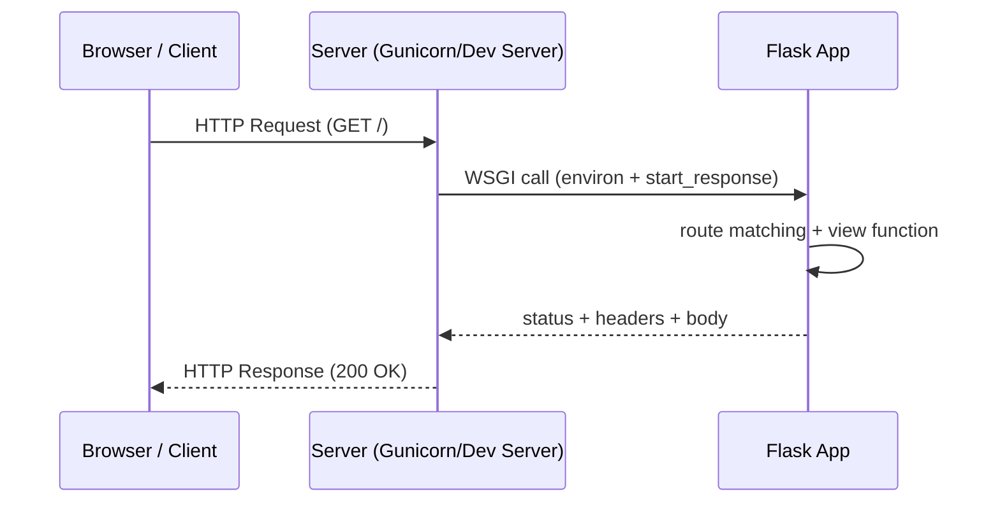

A **web framework** is a toolbox and set of conventions for building web applications.

At a minimum, a backend web app does this loop:

1. Receive an HTTP request (URL, method, headers, body)
2. Decide what code should handle it (routing)
3. Run business logic (validate, load data, compute)
4. Return an HTTP response (status code, headers, body)

Flask is a framework that makes steps 2–4 pleasant.

## The request/response mental model

## Why frameworks exist

Without a framework, you still can build a web app—but you must implement a lot of “boring but essential” plumbing:

- URL parsing and dispatch (routing)
- Request parsing (query string, JSON, form bodies)
- Response formatting
- Cookies and sessions
- Security basics (CSRF, secure cookies, common headers)
- Error handling and debug tools
- Templating and static file organization

Frameworks don’t remove complexity—they **organize** it.

## Backend vs frontend (quick clarity)

- **Frontend**: what runs in the browser (HTML/CSS/JS)
- **Backend**: what runs on the server (Python/Flask), typically handles:
  - authentication and authorization
  - database CRUD
  - server-side rendering (templates) and/or APIs

Flask can serve HTML pages, JSON APIs, or both.

## Microframework vs “full stack” framework

Flask is often called a **microframework**.

That doesn’t mean it’s only for small apps. It means:

- Flask keeps the core small (routing, request handling)
- You add features using **extensions** (Flask-Login, Flask-SQLAlchemy, Flask-WTF, etc.)

This design makes Flask flexible, but it also means you need to learn structure and best practices.

## Common beginner pitfalls

- Confusing the dev server with a production server
- Returning Python dicts without understanding JSON response headers
- Putting everything into one file (works at first; hurts later)
- Not using environments/virtualenvs → dependency conflicts
