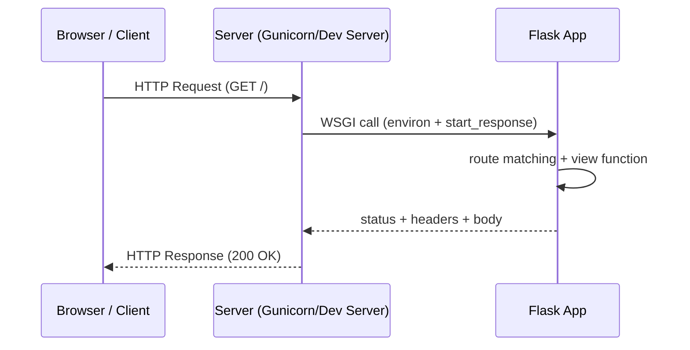

A **web framework** is a toolbox and set of conventions for building web applications.

At a minimum, a backend web app does this loop:

1. Receive an HTTP request (URL, method, headers, body)
2. Decide what code should handle it (routing)
3. Run business logic (validate, load data, compute)
4. Return an HTTP response (status code, headers, body)

Flask is a framework that makes steps 2–4 pleasant.

## The request/response mental model

```mermaid
sequenceDiagram
  participant B as Browser / Client
  participant S as Server (Gunicorn/Dev Server)
  participant A as Flask App

  B->>S: HTTP Request (GET /)
  S->>A: WSGI call (environ + start_response)
  A->>A: route matching + view function
  A-->>S: status + headers + body
  S-->>B: HTTP Response (200 OK)
```

## Why frameworks exist

Without a framework, you still can build a web app—but you must implement a lot of “boring but essential” plumbing:

- URL parsing and dispatch (routing)
- Request parsing (query string, JSON, form bodies)
- Response formatting
- Cookies and sessions
- Security basics (CSRF, secure cookies, common headers)
- Error handling and debug tools
- Templating and static file organization

Frameworks don’t remove complexity—they **organize** it.

## Backend vs frontend (quick clarity)

- **Frontend**: what runs in the browser (HTML/CSS/JS)
- **Backend**: what runs on the server (Python/Flask), typically handles:
  - authentication and authorization
  - database CRUD
  - server-side rendering (templates) and/or APIs

Flask can serve HTML pages, JSON APIs, or both.

## Microframework vs “full stack” framework

Flask is often called a **microframework**.

That doesn’t mean it’s only for small apps. It means:

- Flask keeps the core small (routing, request handling)
- You add features using **extensions** (Flask-Login, Flask-SQLAlchemy, Flask-WTF, etc.)

This design makes Flask flexible, but it also means you need to learn structure and best practices.

## Common beginner pitfalls

- Confusing the dev server with a production server
- Returning Python dicts without understanding JSON response headers
- Putting everything into one file (works at first; hurts later)
- Not using environments/virtualenvs → dependency conflicts

## Check yourself

<Quiz
  questions={[
    {
      q: "Which list correctly describes what a backend does for each request?",
      options: [
        "Draw the page, run CSS, and animate elements in the browser",
        "Receive the request, route it to the right code, run the logic (validate, load data), and return a response with a status code, headers and body",
        "Only store files on disk",
        "Compile Python to JavaScript",
      ],
      answer: 1,
      explain: "That four-step loop is what every web backend does. A framework such as Flask supplies the routing and request/response plumbing so you write only the logic.",
    },
    {
      q: "Flask is called a microframework. What does that mean in practice?",
      options: [
        "It can only build tiny apps",
        "The core is small (routing and request handling) and you add features such as login, forms and databases through extensions",
        "It has no security features at all",
        "It runs without Python",
      ],
      answer: 1,
      explain: "Small refers to the core, not to the apps you can build. Flexibility comes from choosing extensions, which also means you choose the structure yourself.",
    },
    {
      q: "Why use a framework instead of handling raw HTTP yourself?",
      options: [
        "Frameworks remove all complexity",
        "They organise the repeated plumbing (routing, parsing, cookies, error handling, security basics) so you do not rebuild and mis-build it",
        "Raw HTTP is not allowed in Python",
        "Frameworks make servers faster by definition",
      ],
      answer: 1,
      explain: "The complexity does not vanish. A framework gives it a tested structure, so common tasks are done consistently and with fewer security mistakes.",
    },
  ]}
/>
