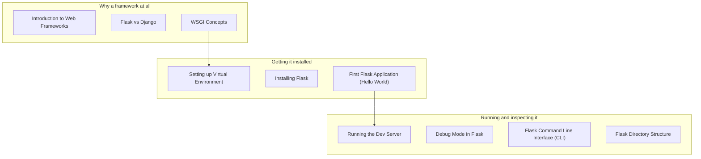

Phase 1 is all about building a correct mental model.

If you understand how a request reaches your Flask function and becomes a response, everything else (templates, forms, databases, auth) becomes much easier.

## You’ll learn

- What a web framework does (and what it doesn’t)
- Flask vs Django: when to choose which
- WSGI basics (the “bridge” between server and Python)
- Creating and running a Flask app
- Dev server vs production server
- Debug mode and Flask CLI
- A practical Flask project structure

## Phase checklist

1. Introduction to Web Frameworks
2. Flask vs Django
3. WSGI Concepts
4. Setting up Virtual Environment
5. Installing Flask
6. First Flask Application (Hello World)
7. Running the Dev Server
8. Debug Mode in Flask
9. Flask Command Line Interface (CLI)
10. Flask Directory Structure

## The phase at a glance

This phase exists to **get a Flask app running and understand what is running it**. It assumes Python basics: functions, imports, the command line, and once it is done you can build a page that says hello.



## Where this sits in the track

```p5 title="The track, and what each phase unlocks" desc="Each phase assumes the one before it. Click a phase to see what you can build once it is done." height="330"
let sel = 0;
const NAMES = ['Fundamentals', 'Routing', 'Templating', 'Forms', 'Databases', 'Auth', 'Architecture', 'REST APIs', 'Deployment'];
const BUILDS = ['a page that says hello', 'a site with several URLs and a JSON endpoint', 'a real multi-page site with a shared layout', 'a site that accepts and validates input', 'a site whose data survives a restart', 'a site with accounts and private pages', 'an app split into modules, configurable per environment', 'an API other programs can call', 'all of it, running on a public server'];

function setup() {
  createCanvas(600, 330);
  textFont('monospace');
}

function draw() {
  background(13, 17, 23);
  noStroke();
  fill(230);
  textSize(13);
  textAlign(LEFT, TOP);
  text('the Flask track', 24, 16);
  fill(120);
  textSize(11);
  text('click a phase', 24, 36);

  for (let i = 0; i < NAMES.length; i++) {
    const col = i % 3;
    const row = floor(i / 3);
    const x = 24 + col * 186;
    const y = 62 + row * 56;
    const done = i < sel;
    const on = i === sel;
    stroke(on ? color(255, 211, 67) : (done ? color(120, 190, 130) : color(48, 56, 68)));
    strokeWeight(on ? 2 : 1);
    fill(on ? color(38, 34, 18) : (done ? color(18, 28, 22) : color(17, 22, 29)));
    rect(x, y, 174, 46, 4);
    noStroke();
    fill(on ? color(255, 211, 67) : (done ? color(120, 190, 130) : 110));
    textSize(11);
    textAlign(LEFT, TOP);
    text('Phase ' + (i + 1), x + 12, y + 8);
    fill(on ? color(255, 211, 67) : (done ? 150 : 90));
    textSize(11);
    text(NAMES[i], x + 12, y + 26);
  }

  stroke(48, 56, 68);
  strokeWeight(1);
  fill(18, 23, 30);
  rect(24, 240, 552, 62, 5);
  noStroke();
  fill(110);
  textSize(10);
  textAlign(LEFT, TOP);
  text('after Phase ' + (sel + 1) + ' you can build', 38, 250);
  fill(120, 190, 130);
  textSize(13);
  text(BUILDS[sel], 38, 272);

  fill(90);
  textSize(10);
  textAlign(LEFT, TOP);
  text('green = assumed knowledge by the time you reach the highlighted phase', 24, 312);
}

function mousePressed() {
  for (let i = 0; i < NAMES.length; i++) {
    const col = i % 3;
    const row = floor(i / 3);
    const x = 24 + col * 186;
    const y = 62 + row * 56;
    if (mouseX > x && mouseX < x + 174 && mouseY > y && mouseY < y + 46) sel = i;
  }
}
```

## The pages, in reading order

| # | page |
|--:|:--|
| 1 | Introduction to Web Frameworks |
| 2 | Flask vs Django |
| 3 | WSGI Concepts |
| 4 | Setting up Virtual Environment |
| 5 | Installing Flask |
| 6 | First Flask Application (Hello World) |
| 7 | Running the Dev Server |
| 8 | Debug Mode in Flask |
| 9 | Flask Command Line Interface (CLI) |
| 10 | Flask Directory Structure |

10 pages. They are ordered so that each one only uses ideas from the pages above it — reading out of order mostly works, but the examples assume what came before.

## Check yourself

<Quiz
  questions={[
    {
      q: "What does Phase 1 assume you already know?",
      options: [
        "HTML and CSS",
        "Python basics: functions, imports and the command line",
        "SQL",
        "JavaScript",
      ],
      answer: 1,
      explain:
        "The phase is about getting Flask running and understanding WSGI, the dev server and the CLI. No front-end or database knowledge is needed yet.",
    },
    {
      q: "Why does this phase cover WSGI before writing much application code?",
      options: [
        "WSGI is required syntax in every Flask file",
        "it is the interface between a web server and your Python app, which explains why the dev server is not the thing you deploy",
        "Flask cannot start without configuring WSGI",
        "it is only relevant to Django",
      ],
      answer: 1,
      explain:
        "Understanding that Flask is a WSGI application is what makes gunicorn and the production warning make sense later, in Phase 9.",
    },
    {
      q: "What do the phase overview pages give you that the individual pages do not?",
      options: [
        "the full code for each topic",
        "the reading order, what the phase assumes, and what you can build once it is done",
        "a downloadable project template",
        "the deployment configuration",
      ],
      answer: 1,
      explain:
        "Each overview lists its pages in sidebar order and names the phase's prerequisites and outcome, so you can tell whether you are ready for it.",
    },
  ]}
/>
