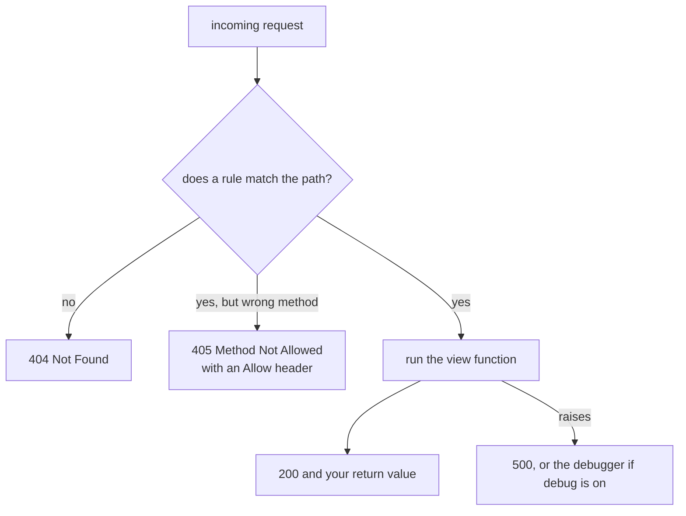

import Quiz from "../../../../components/Quiz.astro";

During development you typically run:

- `flask run`

This starts Werkzeug’s development server.

## Typical output

You’ll usually see:

- the URL (like `http://127.0.0.1:5000`)
- that it’s a development server

## Host and port

- Default host: `127.0.0.1` (only accessible from your machine)
- Default port: `5000`

You can change them:

```bash
flask run --host 0.0.0.0 --port 8000
```

### When should you use `0.0.0.0`?

Use it when you want access from another device on your network.

Be careful: exposing dev servers is not recommended on public networks.

## What happens when you visit the page?

1. Browser connects to the host/port
2. Sends `GET /`
3. Dev server forwards to Flask app
4. Flask finds a matching route and runs your view function
5. Response is returned

If you get a 404, it usually means:

- you didn’t define the route, or
- your URL doesn’t match the route rule

## What the routing table looks like before any request

Flask builds a `url_map` at import time. Every rule you registered is in it — plus one
you did not write:

```python title="routes.py" showLineNumbers{1}
for rule in app.url_map.iter_rules():
    print(rule, rule.endpoint, sorted(rule.methods - {"HEAD", "OPTIONS"}))
```

```text title="measured output"
/                       index    ['GET']
/api/items              items    ['GET', 'POST']
/static/<path:filename> static   ['GET']     <- added automatically
/user/<name>            user     ['GET']
```

`HEAD` and `OPTIONS` are attached to every `GET` rule for you, and a `/static/` route
exists from the moment the app object is created.

## How a request finds a view



Measured against the app above:

| request | status | note |
|:--|--:|:--|
| `GET /nope` | **404** | no rule matches |
| `DELETE /api/items` | **405** | rule exists, method does not |
| `Allow` header on that 405 | | `GET, POST, OPTIONS, HEAD` |

A 405 rather than a 404 is a useful signal: the URL is right and the verb is wrong.

## The trailing slash rule is asymmetric

```python title="slashes.py" showLineNumbers{1}
@app.route("/dir/")     # declared WITH a slash
def d(): ...

@app.route("/file")     # declared WITHOUT one
def f(): ...
```

| declared | requested | result |
|:--|:--|:--|
| `/dir/` | `/dir` | **308 redirect** to `/dir/` |
| `/file` | `/file/` | **404** |

A rule ending in a slash behaves like a directory: ask without the slash and Flask
redirects you. A rule without one behaves like a file: the slashed form simply does not
exist. The redirect costs an extra round trip, and a `POST` that gets redirected can
lose its body in some clients — so declare the form you intend and link to it exactly.

:::danger[The dev server is not a production server]
Werkzeug prints this on every start: *"This is a development server. Do not use it in a
production deployment."* It is single-process by default, does not handle load, and has
no hardening. Deploy behind `gunicorn`, `uwsgi` or `waitress`.
:::

## See it move

```p5 title="Matching a request against the url_map" desc="Flask checks the path first, then the method. That order is why a wrong verb gives 405 rather than 404." height="330"
let reqIdx = 0;
const RULES = [
  { p: "/", m: ["GET"] },
  { p: "/api/items", m: ["GET", "POST"] },
  { p: "/user/<name>", m: ["GET"] },
];
const REQS = [
  { verb: "GET", path: "/", hit: 0, code: 200 },
  { verb: "GET", path: "/user/ada", hit: 2, code: 200 },
  { verb: "POST", path: "/api/items", hit: 1, code: 200 },
  { verb: "DELETE", path: "/api/items", hit: 1, code: 405 },
  { verb: "GET", path: "/nope", hit: -1, code: 404 },
];

function setup() {
  createCanvas(600, 330);
  textFont("monospace");
}

function draw() {
  background(13, 17, 23);
  const r = REQS[reqIdx];

  noStroke();
  fill(230);
  textSize(14);
  textAlign(LEFT, TOP);
  text(r.verb + "  " + r.path, 24, 18);

  fill(120);
  textSize(11);
  text("url_map, checked in order:", 24, 52);

  for (let i = 0; i < RULES.length; i++) {
    const y = 74 + i * 46;
    const pathHit = i === r.hit;
    const methodOk = pathHit && RULES[i].m.indexOf(r.verb) >= 0;
    stroke(pathHit ? (methodOk ? color(120, 190, 130) : color(255, 211, 67)) : color(48, 56, 68));
    strokeWeight(pathHit ? 2 : 1);
    fill(pathHit ? color(24, 32, 40) : color(17, 22, 29));
    rect(24, y, 360, 36, 4);
    noStroke();
    fill(pathHit ? 220 : 110);
    textSize(12);
    textAlign(LEFT, CENTER);
    text(RULES[i].p, 38, y + 18);
    fill(pathHit ? 160 : 80);
    textSize(10);
    textAlign(RIGHT, CENTER);
    text(RULES[i].m.join(", "), 372, y + 18);

    if (pathHit) {
      noStroke();
      fill(methodOk ? color(120, 190, 130) : color(255, 211, 67));
      textSize(11);
      textAlign(LEFT, CENTER);
      text(methodOk ? "path matches, method allowed" : "path matches, method NOT allowed", 396, y + 18);
    }
  }

  const c = r.code === 200 ? color(120, 190, 130) : (r.code === 405 ? color(255, 211, 67) : color(232, 110, 110));
  stroke(c);
  strokeWeight(1);
  fill(18, 23, 30);
  rect(24, 218, 360, 52, 5);
  noStroke();
  fill(c);
  textSize(20);
  textAlign(LEFT, CENTER);
  text(r.code, 40, 244);
  fill(150);
  textSize(11);
  const msg = r.code === 200 ? "view runs" : (r.code === 405 ? "Allow: GET, POST, OPTIONS, HEAD" : "no rule matched the path");
  text(msg, 96, 244);

  drawBtn(24, 288, 200, "next request");
  fill(90);
  textSize(10);
  textAlign(LEFT, TOP);
  text("path is matched first, then the method", 240, 294);
}

function drawBtn(x, y, w, label) {
  const hot = mouseX > x && mouseX < x + w && mouseY > y && mouseY < y + 24;
  stroke(hot ? color(255, 211, 67) : color(60, 70, 84));
  strokeWeight(1);
  fill(hot ? color(34, 40, 50) : color(22, 28, 36));
  rect(x, y, w, 24, 4);
  noStroke();
  fill(hot ? color(255, 211, 67) : 200);
  textSize(11);
  textAlign(CENTER, CENTER);
  text(label, x + w / 2, y + 12);
}

function mousePressed() {
  if (mouseY > 288 && mouseY < 312 && mouseX > 24 && mouseX < 224) reqIdx = (reqIdx + 1) % REQS.length;
}
```

## Check yourself

<Quiz
  questions={[
    {
      q: "A route is declared as @app.route('/dir/') and a client requests /dir. What happens?",
      options: [
        "404, because the paths differ",
        "200, the view runs directly",
        "308 redirect to /dir/",
        "405 Method Not Allowed",
      ],
      answer: 2,
      explain:
        "A rule ending in a slash behaves like a directory and Flask redirects. The reverse is not symmetric: a rule declared '/file' requested as '/file/' gives 404.",
    },
    {
      q: "DELETE /api/items returns 405 rather than 404. What does that distinction tell you?",
      options: [
        "the server is misconfigured",
        "the path matched a rule but the method is not allowed for it",
        "the view raised an exception",
        "the route requires authentication",
      ],
      answer: 1,
      explain:
        "Flask matches the path first, then the method. A 405 means the URL is right and the verb is wrong, and the response carries an Allow header listing what is permitted.",
    },
    {
      q: "Which rule appears in app.url_map without you writing it?",
      options: [
        "a catch-all 404 handler",
        "/static/<path:filename>",
        "/favicon.ico",
        "/health",
      ],
      answer: 1,
      explain:
        "Creating the Flask object registers the static route. Iterating url_map also shows HEAD and OPTIONS attached automatically to every GET rule.",
    },
  ]}
/>
