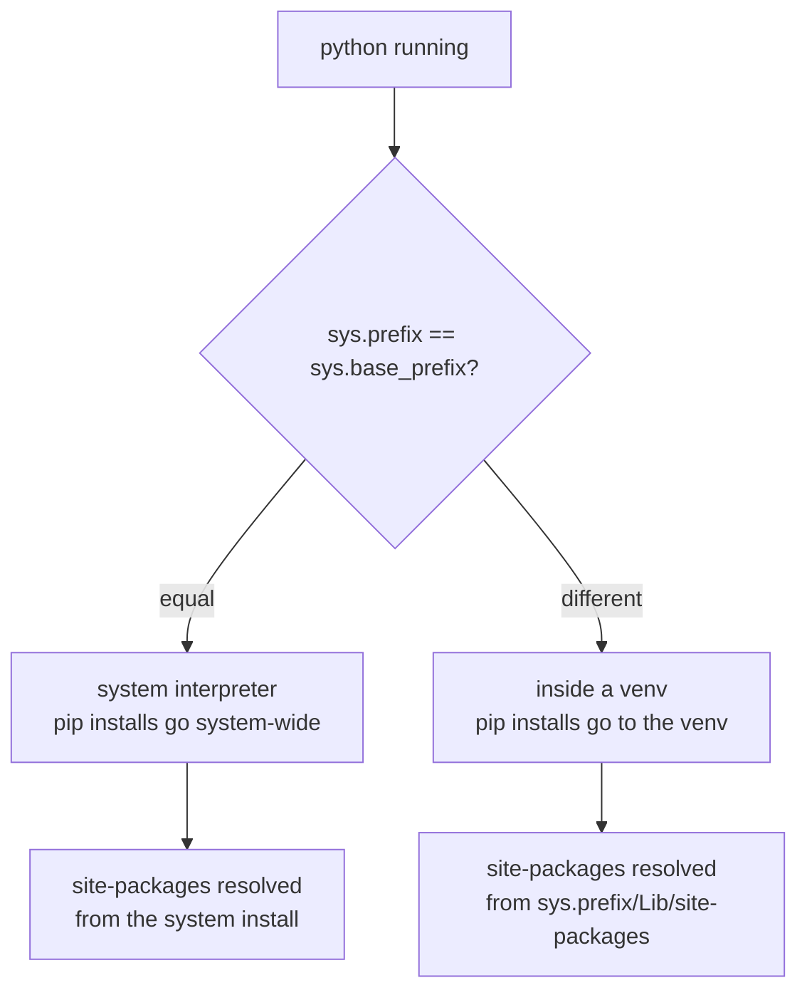

A **virtual environment** (venv) isolates project dependencies.

This prevents situations like:

- Project A needs Flask 2.x
- Project B needs Flask 3.x
- both break if you install packages globally

## Recommended: `venv` (built-in)

Pick a project folder (example: `my-flask-app/`), then create a venv:

```bash
python3 -m venv .venv
```

Activate it:

- Linux/macOS:

```bash
source .venv/bin/activate
```

You’ll usually see your shell prompt change.

## Upgrade pip (optional but recommended)

```bash
python -m pip install --upgrade pip
```

## Install packages into the venv

When the venv is activated, `pip install ...` installs *inside* that environment.

## Freeze dependencies (good habit)

```bash
pip freeze > requirements.txt
```

Later, someone can reproduce your env:

```bash
pip install -r requirements.txt
```

## Common errors

- **You forgot to activate the venv** → `pip` installs globally.
- **You activated a different venv** in another terminal.
- **Your editor uses a different interpreter** than the terminal.

If you’re using VS Code, select the Python interpreter pointing to `.venv`.

## What a virtual environment actually changes

A virtual environment is not a sandbox and not a container. It is a directory plus one
redirected value: `sys.prefix`. Everything else follows from that.



```python title="am_i_in_a_venv.py" showLineNumbers{1}
import sys

sys.prefix        # ...\scratch\flaskenv          <- the venv
sys.base_prefix   # ...\Python\pythoncore-3.14-64 <- the real install
sys.prefix != sys.base_prefix     # True  -> you are in a venv
```

That comparison is the reliable test. Checking the `VIRTUAL_ENV` environment variable is
**not** reliable: it is set by the `activate` script, so running
`venv/Scripts/python.exe` directly puts you in the venv with `VIRTUAL_ENV` unset —
measured exactly that way here.

:::caution[Activation is a convenience, not the mechanism]
`activate` only edits `PATH` and your prompt. The isolation comes from *which* python
binary runs. `path/to/venv/bin/python -m pip install flask` works with no activation at
all, which is why CI scripts and `tox` never bother activating.
:::

## See it move

```p5 title="Where does import look?" desc="A virtual environment changes sys.prefix, and every import and pip install follows from that single value." height="320"
let inVenv = true;

function setup() {
  createCanvas(600, 320);
  textFont("monospace");
}

function draw() {
  background(13, 17, 23);
  noStroke();
  fill(230);
  textSize(13);
  textAlign(LEFT, TOP);
  text(inVenv ? "venv/Scripts/python.exe" : "system python.exe", 24, 16);
  fill(inVenv ? color(120, 190, 130) : color(255, 211, 67));
  textSize(11);
  text(inVenv ? "sys.prefix != sys.base_prefix" : "sys.prefix == sys.base_prefix", 24, 36);

  const boxes = [
    { n: "system site-packages", sub: "shared by every project", x: 24 },
    { n: "venv site-packages", sub: "this project only", x: 310 },
  ];
  for (let i = 0; i < 2; i++) {
    const b = boxes[i];
    const active = (i === 1) === inVenv;
    stroke(active ? color(120, 190, 130) : color(48, 56, 68));
    strokeWeight(active ? 2 : 1);
    fill(active ? color(20, 34, 24) : color(18, 22, 28));
    rect(b.x, 70, 266, 92, 5);
    noStroke();
    fill(active ? color(120, 190, 130) : 90);
    textSize(12);
    textAlign(LEFT, TOP);
    text(b.n, b.x + 14, 84);
    fill(active ? 150 : 70);
    textSize(10);
    text(b.sub, b.x + 14, 104);
    if (active) {
      fill(120, 190, 130);
      textSize(11);
      text("import flask  ->  found here", b.x + 14, 132);
    }
  }

  stroke(60, 70, 84);
  strokeWeight(1);
  fill(20, 26, 34);
  rect(24, 180, 552, 62, 5);
  noStroke();
  fill(110);
  textSize(10);
  textAlign(LEFT, TOP);
  text("pip install flask  writes to", 38, 192);
  fill(255, 211, 67);
  textSize(13);
  text(inVenv ? "the venv - other projects are unaffected"
              : "the system - every project on this machine sees it", 38, 214);

  drawBtn(24, 258, 260, inVenv ? "running: venv python" : "running: system python");
  fill(90);
  textSize(10);
  textAlign(LEFT, TOP);
  text("activation only edits PATH; the binary you run is what matters", 24, 292);
}

function drawBtn(x, y, w, label) {
  const hot = mouseX > x && mouseX < x + w && mouseY > y && mouseY < y + 24;
  stroke(hot ? color(255, 211, 67) : color(60, 70, 84));
  strokeWeight(1);
  fill(hot ? color(34, 40, 50) : color(22, 28, 36));
  rect(x, y, w, 24, 4);
  noStroke();
  fill(hot ? color(255, 211, 67) : 200);
  textSize(11);
  textAlign(CENTER, CENTER);
  text(label, x + w / 2, y + 12);
}

function mousePressed() {
  if (mouseY > 258 && mouseY < 282 && mouseX > 24 && mouseX < 284) inVenv = !inVenv;
}
```

## Check yourself

<Quiz
  questions={[
    {
      q: "What is the reliable way to tell, from inside Python, whether you are in a virtual environment?",
      options: [
        "check that the VIRTUAL_ENV environment variable is set",
        "compare sys.prefix with sys.base_prefix; they differ inside a venv",
        "check whether pip is installed",
        "look for an activate script next to the interpreter",
      ],
      answer: 1,
      explain:
        "VIRTUAL_ENV is set by the activate script only. Running venv/Scripts/python.exe directly puts you in the venv with that variable unset — measured exactly that way. sys.prefix != sys.base_prefix is the real test.",
    },
    {
      q: "What does the activate script actually do?",
      options: [
        "it isolates the process from system packages",
        "it edits PATH and the shell prompt, so that 'python' resolves to the venv binary",
        "it rewrites sys.path inside the running interpreter",
        "it creates the site-packages directory",
      ],
      answer: 1,
      explain:
        "Activation is convenience only. Isolation comes from which interpreter runs, which is why venv/bin/python -m pip install works with no activation and CI scripts rarely activate.",
    },
  ]}
/>
