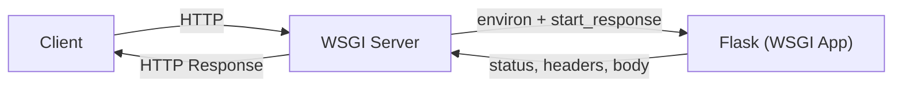

When you run a Flask app, there’s always a “server” involved.

But your Flask code is just Python functions. So how does an HTTP request become a Python function call?

That bridge is **WSGI**.

## What is WSGI?

**WSGI** stands for **Web Server Gateway Interface**.

It’s a Python standard that defines a simple contract between:

- a **WSGI server** (Gunicorn, uWSGI, Waitress)
- a **WSGI app** (Flask app)

The goal: any WSGI server can run any WSGI-compatible Python web app.

## The simplest WSGI mental model

A WSGI server:

1. Accepts an HTTP request from the network
2. Builds an `environ` dictionary (details about the request)
3. Calls your Flask app like a Python callable
4. Receives the response body iterator
5. Sends bytes back to the client



## Dev server vs WSGI server

When you run:

- `flask run`

Flask uses a **development server** (Werkzeug).

It is:

- fine for local development
- not designed for heavy production workloads
- not tuned for security/hardening

In production, you typically run Flask behind:

- Gunicorn (WSGI server) and often
- Nginx (reverse proxy for TLS, caching, static files, etc.)

## Where does “WSGI app” live in Flask?

If you have:

```python
from flask import Flask
app = Flask(__name__)
```

`app` is a WSGI application callable.

WSGI servers point to it like:

- `gunicorn "app:app"`

Meaning: import the module `app.py`, then use the `app` variable.

## Why you should care

Understanding WSGI helps you debug:

- “It works locally but not in production.”
- incorrect host/port binding
- reverse proxy headers (X-Forwarded-For)
- timeouts and worker model issues

## Check yourself

<Quiz
  questions={[
    {
      q: "What problem does WSGI solve?",
      options: [
        "It defines a standard contract so any WSGI server can run any WSGI-compatible Python app",
        "It renders HTML templates",
        "It stores sessions",
        "It compiles Flask to C",
      ],
      answer: 0,
      explain: "WSGI is the agreed interface between server and application. Because of it, you can switch from the dev server to Gunicorn without changing your Flask code.",
    },
    {
      q: "In gunicorn 'app:app', what does the second 'app' refer to?",
      options: [
        "The port",
        "The variable inside the module app.py that holds the Flask object, which is the WSGI callable",
        "The number of workers",
        "The process name",
      ],
      answer: 1,
      explain: "The part before the colon names the module to import. The part after names the object to call, which is your Flask instance.",
    },
    {
      q: "The app works with flask run but misbehaves in production behind a proxy. Which WSGI-level detail is a likely cause?",
      options: [
        "Python version",
        "The app sees the proxy's address and scheme in the environ, so forwarded headers such as X-Forwarded-For and X-Forwarded-Proto have to be configured and trusted",
        "The templates folder",
        "The virtual environment name",
      ],
      answer: 1,
      explain: "The server builds environ from the connection it receives. Behind a proxy that connection is the proxy's, so the real client details arrive only in forwarded headers.",
    },
  ]}
/>
