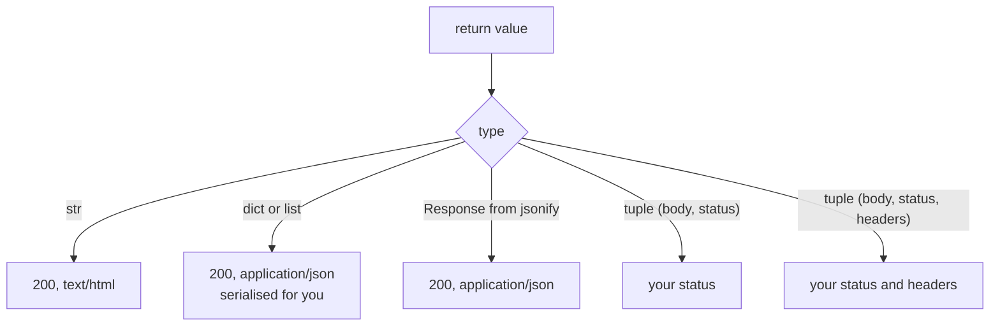

import Quiz from "../../../../components/Quiz.astro";

APIs most commonly return JSON.

## Returning dicts (Flask 2+)

Flask can automatically serialize dicts:

```python
from flask import Flask

app = Flask(__name__)


@app.route("/api/status")
def api_status():
    return {"status": "ok"}
```

## Using jsonify

`jsonify()` gives you more control and is explicit:

```python
from flask import Flask, jsonify

app = Flask(__name__)


@app.route("/api/user")
def api_user():
    return jsonify(id=1, name="Ravi")
```

## Status codes

Return a tuple to include a status code:

```python
@app.route("/api/create", methods=["POST"])
def api_create():
    return {"created": True}, 201
```

## Common pitfalls

- Returning objects that aren’t JSON-serializable (e.g., datetime)
  - fix: convert to string or use a serializer
- Doing `return json.dumps(data)` without setting `Content-Type: application/json`
  - fix: use dict return or `jsonify`

import DataCampExercise from "../../../../components/DataCampExercise.astro";

## 🧪 Try It Yourself

### Exercise 1 – Create a Flask App

<DataCampExercise
  lang="python"
  hint={`Import Flask, create \`app = Flask(__name__)\`, then define a route.`}
  code={`# Task: Exercise 1 – Create a Flask App
# (Simulated – we run the route function directly)
from flask import Flask

app = ___(  __name__  )   # replace ___ with Flask

@app.route("/")
def home():
    return "Hello, Flask!"

# Simulate calling the route
with app.test_client() as client:
    r = client.get("/")
    print(r.data.decode())

# ── Expected Output ───────────────────────────────────────────
# Hello, Flask!
# ──────────────────────────────────────────────────────────────`}
  solution={`from flask import Flask

app = Flask(__name__)

@app.route("/")
def home():
    return "Hello, Flask!"

with app.test_client() as client:
    r = client.get("/")
    print(r.data.decode())`}
  sct={`test_output_contains("Hello, Flask!")
success_msg("First Flask route works!")`}
  height={148}
/>

### Exercise 2 – Dynamic Route

<DataCampExercise
  lang="python"
  hint={`Use \`<name>\` in the route path and add it as a function parameter.`}
  code={`# Task: Exercise 2 – Dynamic Route
from flask import Flask

app = Flask(__name__)

# Hint: add a <name> variable to the route
@app.route("/greet/<___>")   # replace ___ with name
def greet(name):
    return f"Hello, {name}!"

with app.test_client() as c:
    print(c.get("/greet/Alice").data.decode())

# ── Expected Output ───────────────────────────────────────────
# Hello, Alice!
# ──────────────────────────────────────────────────────────────`}
  solution={`from flask import Flask

app = Flask(__name__)

@app.route("/greet/<name>")
def greet(name):
    return f"Hello, {name}!"

with app.test_client() as c:
    print(c.get("/greet/Alice").data.decode())`}
  sct={`test_output_contains("Hello, Alice!")
success_msg("Dynamic routes work!")`}
  height={140}
/>

### Exercise 3 – Return JSON

<DataCampExercise
  lang="python"
  hint={`Use \`flask.jsonify(data)\` to return a JSON response.`}
  code={`# Task: Exercise 3 – Return JSON
from flask import Flask, jsonify

app = Flask(__name__)

@app.route("/status")
def status():
    # Hint: use jsonify to return a dict as JSON
    return ___({"ok": True, "code": 200})   # replace ___ with jsonify

with app.test_client() as c:
    import json
    data = json.loads(c.get("/status").data)
    print("ok:", data["ok"])
    print("code:", data["code"])

# ── Expected Output ───────────────────────────────────────────
# ok: True
# code: 200
# ──────────────────────────────────────────────────────────────`}
  solution={`from flask import Flask, jsonify
import json

app = Flask(__name__)

@app.route("/status")
def status():
    return jsonify({"ok": True, "code": 200})

with app.test_client() as c:
    data = json.loads(c.get("/status").data)
    print("ok:", data["ok"])
    print("code:", data["code"])`}
  sct={`test_output_contains("ok: True")
test_output_contains("code: 200")
success_msg("jsonify returns JSON responses!")`}
  height={152}
/>

## What Flask does with your return value

A view can return several things and Flask decides the status, headers and body from
what it gets back:



Measured on Flask 3.1.3:

| view returns | status | `Content-Type` | body |
|:--|--:|:--|:--|
| `jsonify(b=2, a=1)` | 200 | `application/json` | `{"a":1,"b":2}` |
| `{"b": 2, "a": 1}` | 200 | `application/json` | `{"a":1,"b":2}` |
| `[1, 2, 3]` | 200 | `application/json` | `[1,2,3]` |
| `"plain"` | 200 | `text/html; charset=utf-8` | `plain` |

Returning a plain `dict` or `list` is enough — `jsonify` is not required. Note two
details in the output: the keys came back **sorted** (`a` before `b`, though `b` was
written first), and there is no space after the colon.

```python title="key_order.py" showLineNumbers{1}
app.json.sort_keys            # True by default
# -> b'{"a":1,"b":2}'

app.json.sort_keys = False
# -> b'{"b":2,"a":1}'         # insertion order preserved
```

Sorted keys are the default so that identical data always produces identical bytes,
which makes responses cacheable and diffable. Turn it off when the order carries meaning.

## Status codes and headers

```python title="tuples.py" showLineNumbers{1}
return jsonify(error="nope"), 404
# -> 404  {"error":"nope"}

return jsonify(ok=True), 201, {"X-Custom": "yes"}
# -> 201  X-Custom: yes  {"ok":true}
```

## What will and will not serialise

```python title="types.py" showLineNumbers{1}
jsonify(when=datetime(2026, 8, 9, 12, 0, 0))
# {"when":"Sun, 09 Aug 2026 12:00:00 GMT"}   <- an HTTP date, not ISO 8601

jsonify(d=Decimal("1.5"))     # works — Flask handles Decimal
jsonify(s={1, 2})             # 500: TypeError: Object of type set is not JSON serializable
```

:::caution[The datetime format may not be what your client expects]
Flask serialises `datetime` as an **HTTP date** (`Sun, 09 Aug 2026 12:00:00 GMT`), not
ISO 8601. JavaScript's `new Date()` parses it, but most API consumers and schema
validators expect `2026-08-09T12:00:00Z`. Format dates explicitly with `.isoformat()`
when the shape matters.
:::

## A pitfall that is easy to hit

```python title="too_late.py" showLineNumbers{1}
c = app.test_client()
c.get("/existing")            # the app has now handled a request

@app.route("/late")           # AssertionError: The setup method 'route' can no longer
def late(): ...               # be called on the application. It has already handled
                              # its first request...
```

Flask freezes the routing table once the app starts serving. Registering blueprints or
routes lazily — inside a function that runs on first use, for instance — fails with that
message. Register everything during setup, which is exactly what an application factory
makes natural.

## See it move

```p5 title="From return value to HTTP response" desc="Flask infers status, Content-Type and body from what the view returns. Click through the forms a view can use." height="330"
let idx = 0;
const CASES = [
  { code: "return jsonify(b=2, a=1)", status: 200, ct: "application/json", body: "{\"a\":1,\"b\":2}", note: "keys sorted by default" },
  { code: "return {\"b\": 2, \"a\": 1}", status: 200, ct: "application/json", body: "{\"a\":1,\"b\":2}", note: "a dict is enough - jsonify not required" },
  { code: "return [1, 2, 3]", status: 200, ct: "application/json", body: "[1,2,3]", note: "lists work too" },
  { code: "return \"plain\"", status: 200, ct: "text/html; charset=utf-8", body: "plain", note: "a str is HTML, not JSON" },
  { code: "return jsonify(error=\"nope\"), 404", status: 404, ct: "application/json", body: "{\"error\":\"nope\"}", note: "tuple sets the status" },
  { code: "return jsonify(s={1, 2})", status: 500, ct: "text/html; charset=utf-8", body: "TypeError: set is not JSON serializable", note: "no serialiser for set" },
];

function setup() {
  createCanvas(600, 330);
  textFont("monospace");
}

function draw() {
  background(13, 17, 23);
  const c = CASES[idx];
  const ok = c.status < 400;

  noStroke();
  fill(120);
  textSize(11);
  textAlign(LEFT, TOP);
  text("the view returns", 24, 18);
  stroke(75, 139, 190);
  strokeWeight(1);
  fill(20, 30, 42);
  rect(24, 38, 552, 40, 4);
  noStroke();
  fill(220);
  textSize(13);
  textAlign(LEFT, CENTER);
  text(c.code, 38, 58);

  stroke(60, 70, 84);
  strokeWeight(1);
  line(300, 84, 300, 104);
  noStroke();
  fill(90);
  textSize(9);
  textAlign(LEFT, CENTER);
  text("Flask converts", 308, 94);

  const col = ok ? color(120, 190, 130) : color(232, 110, 110);
  stroke(col);
  strokeWeight(1);
  fill(18, 23, 30);
  rect(24, 110, 552, 118, 5);

  noStroke();
  fill(col);
  textSize(22);
  textAlign(LEFT, TOP);
  text(c.status, 40, 124);
  fill(110);
  textSize(10);
  text("status", 40, 152);

  fill(150);
  textSize(11);
  text("Content-Type", 130, 124);
  fill(75, 139, 190);
  textSize(12);
  text(c.ct, 130, 142);

  fill(150);
  textSize(11);
  text("body", 130, 172);
  fill(220);
  textSize(12);
  text(c.body.length > 44 ? c.body.slice(0, 43) + "." : c.body, 130, 190);

  fill(255, 211, 67);
  textSize(11);
  textAlign(LEFT, TOP);
  text(c.note, 24, 244);

  drawBtn(24, 276, 180, "next return value");
  fill(90);
  textSize(10);
  text(idx + 1 + " of " + CASES.length, 220, 282);
}

function drawBtn(x, y, w, label) {
  const hot = mouseX > x && mouseX < x + w && mouseY > y && mouseY < y + 24;
  stroke(hot ? color(255, 211, 67) : color(60, 70, 84));
  strokeWeight(1);
  fill(hot ? color(34, 40, 50) : color(22, 28, 36));
  rect(x, y, w, 24, 4);
  noStroke();
  fill(hot ? color(255, 211, 67) : 200);
  textSize(11);
  textAlign(CENTER, CENTER);
  text(label, x + w / 2, y + 12);
}

function mousePressed() {
  if (mouseY > 276 && mouseY < 300 && mouseX > 24 && mouseX < 204) idx = (idx + 1) % CASES.length;
}
```

## Check yourself

<Quiz
  questions={[
    {
      q: "A view returns the dict {'b': 2, 'a': 1}. What does the client receive?",
      options: [
        "a 500, because a dict is not a valid return value",
        "200 with Content-Type application/json and the body sorted as a then b",
        "200 with Content-Type text/html and the dict's repr",
        "200 with the body in insertion order, b then a",
      ],
      answer: 1,
      explain:
        "Returning a dict or list is enough; jsonify is not required. Keys come back sorted because app.json.sort_keys is True by default, which makes identical data produce identical bytes.",
    },
    {
      q: "jsonify of a datetime produces the HTTP date 'Sun, 09 Aug 2026 12:00:00 GMT'. Why might that be a problem?",
      options: [
        "the date is wrong",
        "it is an HTTP date rather than ISO 8601, which most API consumers and schema validators expect",
        "datetimes cannot be serialised at all",
        "the timezone is dropped",
      ],
      answer: 1,
      explain:
        "Flask uses the HTTP date format. JavaScript parses it, but clients expecting 2026-08-09T12:00:00Z will not. Call .isoformat() explicitly when the shape matters.",
    },
    {
      q: "Why does registering a route after the app has served a request raise AssertionError?",
      options: [
        "routes must be unique and this one already existed",
        "Flask freezes the routing table once serving begins, since late changes would not apply consistently",
        "the decorator can only be used at module level",
        "the test client does not support new routes",
      ],
      answer: 1,
      explain:
        "The message is 'The setup method route can no longer be called on the application.' Register everything during setup — which is what an application factory makes natural.",
    },
  ]}
/>
