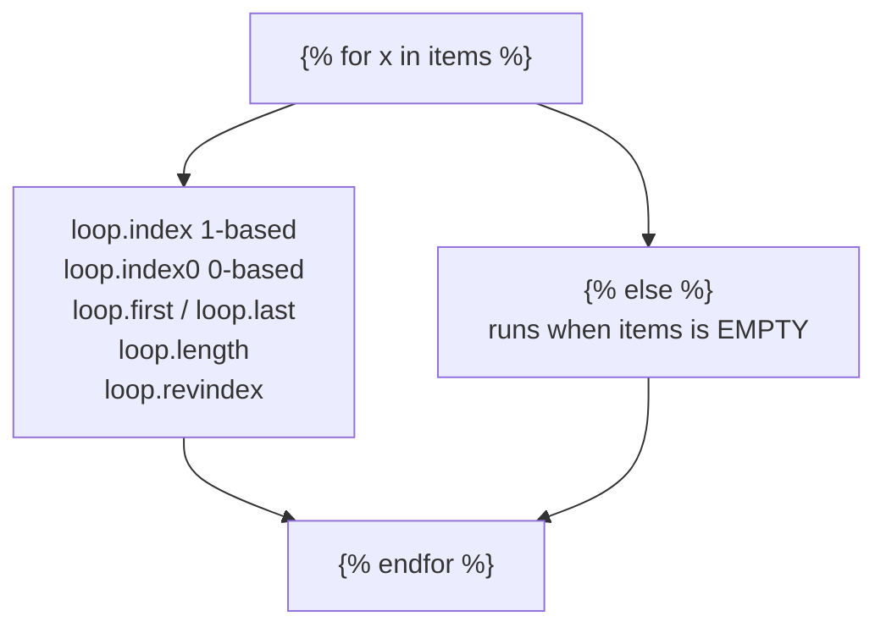

import Quiz from "../../../../components/Quiz.astro";

Control structures are how you build dynamic pages.

## If / elif / else

```html

  <p>Hello, {{ user.username }}!</p>

  <p>Hello, {{ guest_name }}!</p>

  <p>Hello, stranger!</p>

```

## For loops

```html
<ul>
  
    <li>{{ item }}</li>
  
</ul>
```

### Loop helpers

Jinja provides `loop` inside loops:

- `loop.index` (1-based)
- `loop.index0` (0-based)
- `loop.first`, `loop.last`

```html

  <p>{{ loop.index }}. {{ user.username }}</p>

```

## Handling empty lists

```html

  <!-- show list -->

  <p>No users found.</p>

```

## Keep logic light

Prefer to compute complex values in Python and pass them in.

Templates should be readable.

## Loops carry a `loop` object

Inside `` Jinja2 gives you a `loop` variable with everything you usually need,
so you rarely have to track an index yourself:



Measured:

```text title="template"
{{ loop.index }}:{{ x }}{{ ',' if not loop.last }}
```

```text title="items = ['a','b','c']"
1:a,2:b,3:c
```

`loop.index` is **1-based**; use `loop.index0` when you need to match a Python index.
The `{{ ',' if not loop.last }}` idiom is the clean way to join with separators without a
trailing comma.

## `for ... else` runs on an empty sequence

```text title="empty.html"
{{ x }}EMPTY
```

renders `EMPTY`. This is **not** Python's `for/else`, which runs when the loop completes
without `break`. In Jinja2 it means "the sequence had no items", which is exactly the
"no results" case every list page needs:

```text title="results.html"

  <article>{{ post.title }}</article>

  <p>No posts yet.</p>

```

:::caution[Different from Python, same keyword]
Python's `else` after `for` runs when the loop was not broken out of. Jinja2's runs when
the loop body never executed. Reading Jinja2's as Python's gives you the opposite of the
truth.
:::

## Conditionals and the inline form

```text title="conditions.html"

  <a href="{{ url_for('admin') }}">Admin</a>

  <a href="{{ url_for('staff') }}">Staff</a>

  <a href="{{ url_for('profile') }}">Profile</a>


<span class="{{ 'active' if page == current else '' }}">...</span>
```

The inline `{{ a if cond else b }}` is an expression, so it belongs inside `{{ }}`.
Jinja2 supports `and`, `or`, `not`, `in`, and chained comparisons, but deliberately does
**not** allow arbitrary Python — that pressure is intentional. If a condition needs real
logic, compute it in the view and pass a boolean.

## See it move

```p5 title="The loop variable, step by step" desc="loop.index is 1-based, loop.first and loop.last mark the ends, and the else branch runs only when the sequence is empty." height="340"
let n = 3;
let step = 0;
let playing = true;
let t = 0;

function setup() {
  createCanvas(600, 340);
  textFont("monospace");
}

function draw() {
  background(13, 17, 23);
  if (playing) { t++; if (t % 40 === 0) step = (step + 1) % max(1, n + 1); }
  if (n === 0) step = 0;

  noStroke();
  fill(230);
  textSize(12);
  textAlign(LEFT, TOP);
  text("{{ loop.index }}:{{ x }}EMPTY", 24, 16);

  const items = ["a", "b", "c", "d", "e"].slice(0, n);
  for (let i = 0; i < items.length; i++) {
    const x = 24 + i * 88;
    const active = i === step;
    const done = i < step;
    stroke(active ? color(255, 211, 67) : color(48, 56, 68));
    strokeWeight(active ? 2 : 1);
    fill(active ? color(38, 34, 18) : (done ? color(20, 30, 24) : color(18, 23, 30)));
    rect(x, 52, 76, 44, 4);
    noStroke();
    fill(active ? color(255, 211, 67) : (done ? color(120, 190, 130) : 110));
    textSize(15);
    textAlign(CENTER, CENTER);
    text(items[i], x + 38, 74);
  }

  if (n === 0) {
    noStroke();
    fill(232, 110, 110);
    textSize(13);
    textAlign(LEFT, TOP);
    text("items is empty  ->  the  branch runs  ->  'EMPTY'", 24, 66);
  }

  if (n > 0 && step < n) {
    const rows = [
      ["loop.index", step + 1],
      ["loop.index0", step],
      ["loop.first", step === 0 ? "True" : "False"],
      ["loop.last", step === n - 1 ? "True" : "False"],
      ["loop.length", n],
      ["loop.revindex", n - step],
    ];
    for (let i = 0; i < rows.length; i++) {
      const col = i % 2;
      const row = floor(i / 2);
      const x = 24 + col * 280;
      const y = 122 + row * 34;
      noStroke();
      fill(150);
      textSize(11);
      textAlign(LEFT, CENTER);
      text(rows[i][0], x, y + 12);
      fill(75, 139, 190);
      textSize(13);
      text(rows[i][1], x + 130, y + 12);
    }
    noStroke();
    fill(120, 190, 130);
    textSize(12);
    textAlign(LEFT, TOP);
    text("output so far:  " + items.slice(0, step + 1).map(function (v, i) { return (i + 1) + ":" + v; }).join(""), 24, 236);
  } else if (n > 0) {
    noStroke();
    fill(120, 190, 130);
    textSize(12);
    textAlign(LEFT, TOP);
    text("loop finished. output:  " + items.map(function (v, i) { return (i + 1) + ":" + v; }).join(""), 24, 236);
  }

  drawBtn(24, 286, 130, "items: " + n);
  drawBtn(166, 286, 90, playing ? "pause" : "play");
  fill(90);
  textSize(10);
  textAlign(LEFT, TOP);
  text("set items to 0 to see the else branch", 272, 292);
}

function drawBtn(x, y, w, label) {
  const hot = mouseX > x && mouseX < x + w && mouseY > y && mouseY < y + 24;
  stroke(hot ? color(255, 211, 67) : color(60, 70, 84));
  strokeWeight(1);
  fill(hot ? color(34, 40, 50) : color(22, 28, 36));
  rect(x, y, w, 24, 4);
  noStroke();
  fill(hot ? color(255, 211, 67) : 200);
  textSize(11);
  textAlign(CENTER, CENTER);
  text(label, x + w / 2, y + 12);
}

function mousePressed() {
  if (mouseY < 286 || mouseY > 310) return;
  if (mouseX > 24 && mouseX < 154) { n = (n + 1) % 6; step = 0; t = 0; }
  if (mouseX > 166 && mouseX < 256) playing = !playing;
}
```

## Check yourself

<Quiz
  questions={[
    {
      q: "In Jinja2, when does the  branch of a  run?",
      options: [
        "when the loop finishes without a break, as in Python",
        "when the sequence is empty, so the body never ran",
        "after every iteration",
        "only when the loop raises",
      ],
      answer: 1,
      explain:
        "Measured: {{ x }}EMPTY renders 'EMPTY'. This is the opposite of Python's for/else, which runs when the loop was not broken out of.",
    },
    {
      q: "For items = ['a','b','c'], what does {{ loop.index }} produce on the first iteration?",
      options: [
        "0",
        "1",
        "3",
        "it is undefined outside a loop body",
      ],
      answer: 1,
      explain:
        "loop.index is 1-based; loop.index0 is the 0-based version. Measured output was '1:a,2:b,3:c'.",
    },
    {
      q: "Which is the idiomatic way to join items with commas and no trailing comma?",
      options: [
        "{{ ',' if not loop.last }}",
        ", on a separate line",
        "strip the final character in the view",
        "{{ ',' if loop.first }}",
      ],
      answer: 0,
      explain:
        "loop.last is True on the final iteration, so the separator is emitted for every item except that one. Measured: '1:a,2:b,3:c'.",
    },
  ]}
/>
