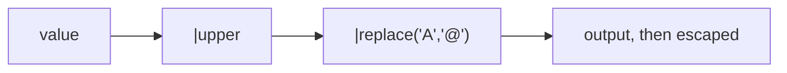

When built-in filters aren’t enough, you can create custom ones.

## Register a custom filter

```python
from flask import Flask

app = Flask(__name__)


def format_username(value: str) -> str:
    return value.strip().title()


app.jinja_env.filters["format_username"] = format_username
```

Use it in templates:

```html
<p>{{ username | format_username }}</p>
```

## Alternative: decorator style

Flask also supports:

```python
@app.template_filter("format_username")
def format_username(value):
    return value.strip().title()
```

## When to use custom filters

- formatting dates
- truncating text in a consistent way
- normalizing usernames/display names

If the same template logic repeats, it’s a good candidate for a filter.

## A filter is a function with a name in the template namespace

```python title="filters.py" showLineNumbers{1}
@app.template_filter("shout")
def shout(s):
    return str(s).upper() + "!"
```

```text title="usage"
{{ 'hi'|shout }}      ->  HI!
```

The value on the left of `|` becomes the first argument. Extra arguments come from the
call: `{{ x|round(2) }}` invokes `round(x, 2)`. Filters chain left to right, so
`{{ v|upper|replace('A','@') }}` uppercases first and then replaces — measured `'@BC'`
for `v = 'abc'`.



## The part that goes wrong: filters that return HTML

A filter's return value is escaped like any other value. A filter that builds markup
therefore comes out as visible text:

```python title="badge.py" showLineNumbers{1}
@app.template_filter("badge_unsafe")
def badge_unsafe(s):
    return f"<span class='b'>{s}</span>"        # a plain str
```

```text title="measured"
{{ 'ok'|badge_unsafe }}       ->  &lt;span class=&#39;b&#39;&gt;ok&lt;/span&gt;
```

The obvious fix is `|safe`, and it is the wrong one:

```text title="measured, with hostile input"
{{ v|badge_unsafe|safe }}  where v = <script>x</script>
->  <span class='b'><script>x</script></span>        <- the script runs
```

`|safe` disables escaping for the **whole** result, including the interpolated user
value. The correct approach marks only the wrapper as safe and lets the value be
escaped:

```python title="badge_safe.py" showLineNumbers{1}
from markupsafe import Markup

@app.template_filter("badge_safe")
def badge_safe(s):
    return Markup("<span class='b'>{}</span>").format(s)
```

```text title="measured, same hostile input"
{{ v|badge_safe }}
->  <span class='b'>&lt;script&gt;x&lt;/script&gt;</span>     <- markup kept, input escaped
```

`Markup.format` escapes every argument as it substitutes. That single difference is what
separates a safe HTML-producing filter from an injection point.

:::danger[Never write `|safe` after a filter that touches request data]
If you find yourself appending `|safe`, the filter should have returned `Markup`
instead. `|safe` is for values you produced entirely yourself and can vouch for.
:::

## Built-ins worth knowing before writing your own

| filter | measured |
|:--|:--|
| `{{ v\|default('none') }}` when `v` is missing | `none` |
| `{{ [1,2,3]\|length }}` | `3` |
| `{{ ['a','b']\|join('-') }}` | `a-b` |
| `{{ 3.14159\|round(2) }}` | `3.14` |
| `{{ {'a':1}\|tojson }}` | `{"a": 1}` |

`tojson` is the safe way to hand data to JavaScript — it escapes characters that would
otherwise break out of a `<script>` block.

## See it move

```p5 title="A filter's output is escaped too" desc="Returning a plain string gets escaped; adding |safe unescapes the user input as well; returning Markup escapes only the value." height="340"
let mode = 0;   // 0 = plain str, 1 = |safe, 2 = Markup
let hostile = true;

function setup() {
  createCanvas(600, 340);
  textFont("monospace");
}

function draw() {
  background(13, 17, 23);
  const val = hostile ? "<script>x</script>" : "ok";
  const labels = ['return f"<span>{s}</span>"', '... piped through |safe', 'return Markup("<span>{}</span>").format(s)'];
  const outs = [
    "&lt;span&gt;" + (hostile ? "&lt;script&gt;x&lt;/script&gt;" : "ok") + "&lt;/span&gt;",
    "<span>" + val + "</span>",
    "<span>" + (hostile ? "&lt;script&gt;x&lt;/script&gt;" : "ok") + "</span>",
  ];
  const safe = [true, !hostile, true];
  const notes = [
    "markup escaped too - shows as text, not a badge",
    hostile ? "the script tag survives - THIS EXECUTES" : "fine here, but only because the input is harmless",
    "wrapper kept as markup, value escaped",
  ];

  noStroke();
  fill(230);
  textSize(12);
  textAlign(LEFT, TOP);
  text("input value  s = " + val, 24, 16);

  for (let i = 0; i < 3; i++) {
    const y = 46 + i * 34;
    const on = i === mode;
    stroke(on ? color(255, 211, 67) : color(40, 48, 58));
    strokeWeight(on ? 2 : 1);
    fill(on ? color(28, 34, 44) : color(17, 22, 29));
    rect(24, y, 400, 28, 3);
    noStroke();
    fill(on ? 220 : 110);
    textSize(10);
    textAlign(LEFT, CENTER);
    text(labels[i], 34, y + 14);
  }

  const c = safe[mode] ? color(120, 190, 130) : color(232, 110, 110);
  stroke(c);
  strokeWeight(1);
  fill(18, 23, 30);
  rect(24, 162, 552, 96, 5);
  noStroke();
  fill(110);
  textSize(10);
  textAlign(LEFT, TOP);
  text("rendered output", 38, 174);
  fill(220);
  textSize(11);
  const o = outs[mode];
  text(o.length > 58 ? o.slice(0, 57) + "." : o, 38, 196);
  fill(c);
  textSize(11);
  text(safe[mode] ? "SAFE" : "VULNERABLE", 38, 224);
  fill(150);
  textSize(10);
  text(notes[mode], 110, 225);

  drawBtn(24, 276, 190, "mode: " + ["plain str", "|safe", "Markup"][mode]);
  drawBtn(226, 276, 210, hostile ? "input: hostile" : "input: harmless");
  fill(90);
  textSize(10);
  textAlign(LEFT, TOP);
  text("|safe looks fine on harmless input - which is why it ships", 24, 310);
}

function drawBtn(x, y, w, label) {
  const hot = mouseX > x && mouseX < x + w && mouseY > y && mouseY < y + 24;
  stroke(hot ? color(255, 211, 67) : color(60, 70, 84));
  strokeWeight(1);
  fill(hot ? color(34, 40, 50) : color(22, 28, 36));
  rect(x, y, w, 24, 4);
  noStroke();
  fill(hot ? color(255, 211, 67) : 200);
  textSize(11);
  textAlign(CENTER, CENTER);
  text(label, x + w / 2, y + 12);
}

function mousePressed() {
  if (mouseY < 276 || mouseY > 300) return;
  if (mouseX > 24 && mouseX < 214) mode = (mode + 1) % 3;
  if (mouseX > 226 && mouseX < 436) hostile = !hostile;
}
```

## Check yourself

<Quiz
  questions={[
    {
      q: "A filter returns the plain string '<span>ok</span>'. What appears on the page?",
      options: [
        "a rendered span element",
        "the escaped text &lt;span&gt;ok&lt;/span&gt;, visible to the reader",
        "nothing, the markup is stripped",
        "a Jinja2 error",
      ],
      answer: 1,
      explain:
        "A filter's return value is escaped like any other value. To emit real markup the filter must return Markup, not a str.",
    },
    {
      q: "Why is {{ v|badge_unsafe|safe }} dangerous when v comes from a request?",
      options: [
        "safe is slower than escaping",
        "|safe disables escaping for the whole result, including the interpolated user value, so a script tag in v executes",
        "the filter runs twice",
        "safe only works on strings shorter than 255 characters",
      ],
      answer: 1,
      explain:
        "Measured with v = <script>x</script>: the output was <span class='b'><script>x</script></span>. Return Markup(...).format(s) instead so the wrapper is markup and the value is escaped.",
    },
    {
      q: "What does Markup('<span>{}</span>').format(s) do differently from an f-string?",
      options: [
        "nothing, they produce the same result",
        "it escapes each substituted argument while keeping the surrounding markup as HTML",
        "it disables autoescaping for the template",
        "it validates that s is valid HTML",
      ],
      answer: 1,
      explain:
        "Markup.format escapes its arguments as it substitutes them. That is what makes the wrapper render as markup while hostile input is neutralised.",
    },
  ]}
/>
