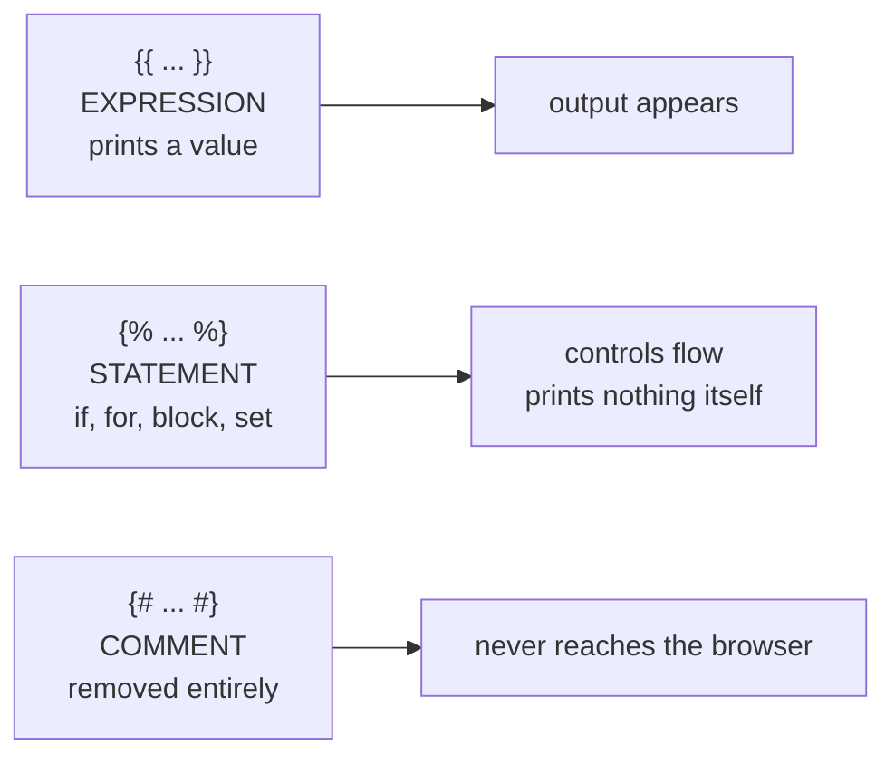

Jinja2 uses special delimiters to embed logic into HTML.

## 1) Print an expression: `{{ ... }}`

Use this to output variables or expressions:

```html
<p>User: {{ username }}</p>
<p>2 + 2 = {{ 2 + 2 }}</p>
```

## 2) Template statements: ``

Use this for control flow (if/for), blocks, macros:

```html

  <p>Welcome back!</p>

  <p>Please log in.</p>

```

## 3) Comments: `{# ... #}`

These do not appear in final HTML:

```html
{# This is a comment #}
```

## Common pitfall

If you accidentally use `{{ ... }}` for an `if` statement, you’ll get confusing output/errors.

Remember:

- `{{ }}` outputs
- `` controls

## Three delimiters, three jobs

Jinja2 has exactly three pieces of syntax, and mixing them up is the most common
template error:



```text title="one template, all three"
A{{ 1+1 }} B{{ i }} C{# hidden #}D
```

renders to exactly:

```text title="measured output"
A2 B12 CD
```

The comment left nothing behind — not even whitespace — and the `` produced
output only through the `{{ i }}` inside it. A common mistake is writing
``, which is a statement tag containing an expression and raises; you
want `{{ user.name }}`.

## Autoescaping is decided by the file name

This is the single most important thing on this page. Flask's rule is:

```python title="flask/app.py" showLineNumbers{1}
return filename.endswith((".html", ".htm", ".xml", ".xhtml", ".svg"))
```

Measured:

| template name | autoescaped? |
|:--|:--|
| `page.html` | **yes** |
| `page.svg` | **yes** |
| `page.xml` | **yes** |
| `page.txt` | no |
| `report.csv` | no |
| `page.j2` | **no** |
| `index.html.j2` | **no** |

:::danger[`index.html.j2` does not autoescape]
The `name.html.j2` convention is widespread — it makes editors highlight the file
correctly — and it turns HTML escaping **off**, because the name does not *end* with
`.html`. Every `{{ user_input }}` in such a template is an XSS hole.

Either name templates `.html`, or set escaping explicitly:

```python title="fix.py" showLineNumbers{1}
app.jinja_env.autoescape = True          # blunt: escape everything
# or
from jinja2 import select_autoescape
app.jinja_env.autoescape = select_autoescape(
    enabled_extensions=("html", "htm", "xml", "j2"),
    default_for_string=True,
)
```
:::

With escaping on, hostile input is neutralised:

```text title="measured, v = <script>alert(1)</script>"
{{ v }}        ->  &lt;script&gt;alert(1)&lt;/script&gt;
{{ v|safe }}   ->  <script>alert(1)</script>      <- injected verbatim
{{ v|e }}      ->  &lt;script&gt;alert(1)&lt;/script&gt;
```

`|safe` means "I promise this is trusted HTML". Applying it to anything derived from a
request is how XSS happens.

## Whitespace control

```text title="without the minus"

  {{ i }}
          ->  '\n  1\n\n  2\n'
```

```text title="with it"

  {{ i }}
         ->  '\n  1\n  2'
```

A `-` on either side of a tag strips adjacent whitespace. It matters for anything
whitespace-sensitive — YAML, CSV, plain-text email — and is cosmetic for HTML.

## See it move

```p5 title="Which delimiter does what" desc="Expressions print, statements control flow, comments vanish. Autoescaping depends on the template's file extension." height="340"
let sel = 0;
const ROWS = [
  { d: "{{ value }}", kind: "expression", out: "prints the value, escaped", c: [75, 139, 190] },
  { d: "", kind: "statement", out: "controls flow, prints nothing", c: [255, 211, 67] },
  { d: "{# note #}", kind: "comment", out: "removed entirely from the output", c: [120, 130, 145] },
];
const FILES = [
  { n: "page.html", esc: true },
  { n: "page.svg", esc: true },
  { n: "page.txt", esc: false },
  { n: "page.j2", esc: false },
  { n: "index.html.j2", esc: false },
];

function setup() {
  createCanvas(600, 340);
  textFont("monospace");
}

function draw() {
  background(13, 17, 23);
  noStroke();
  fill(230);
  textSize(13);
  textAlign(LEFT, TOP);
  text("the three delimiters", 24, 16);

  for (let i = 0; i < ROWS.length; i++) {
    const y = 44 + i * 44;
    const r = ROWS[i];
    stroke(r.c[0], r.c[1], r.c[2]);
    strokeWeight(1);
    fill(r.c[0] * 0.18, r.c[1] * 0.18, r.c[2] * 0.18);
    rect(24, y, 150, 34, 4);
    noStroke();
    fill(r.c[0], r.c[1], r.c[2]);
    textSize(12);
    textAlign(CENTER, CENTER);
    text(r.d, 99, y + 17);
    fill(150);
    textSize(11);
    textAlign(LEFT, CENTER);
    text(r.kind, 190, y + 17);
    fill(110);
    textSize(10);
    text(r.out, 300, y + 17);
  }

  fill(230);
  textSize(13);
  textAlign(LEFT, TOP);
  text("autoescaping, by file name", 24, 190);

  for (let i = 0; i < FILES.length; i++) {
    const y = 216 + i * 22;
    const on = i === sel;
    const f = FILES[i];
    stroke(on ? (f.esc ? color(120, 190, 130) : color(232, 110, 110)) : color(40, 48, 58));
    strokeWeight(1);
    fill(on ? color(26, 32, 42) : color(17, 22, 29));
    rect(24, y, 180, 19, 3);
    noStroke();
    fill(on ? 220 : 120);
    textSize(11);
    textAlign(LEFT, CENTER);
    text(f.n, 34, y + 9);
    fill(f.esc ? color(120, 190, 130) : color(232, 110, 110));
    textAlign(LEFT, CENTER);
    textSize(10);
    text(f.esc ? "escaped" : "NOT escaped", 212, y + 9);
  }

  const f = FILES[sel];
  stroke(f.esc ? color(120, 190, 130) : color(232, 110, 110));
  strokeWeight(1);
  fill(18, 23, 30);
  rect(320, 212, 256, 100, 5);
  noStroke();
  fill(110);
  textSize(9);
  textAlign(LEFT, TOP);
  text("v = <script>alert(1)</script>", 334, 222);
  text("{{ v }} renders as", 334, 240);
  fill(f.esc ? color(120, 190, 130) : color(232, 110, 110));
  textSize(11);
  text(f.esc ? "&lt;script&gt;alert(1)" : "<script>alert(1)</script>", 334, 260);
  fill(f.esc ? 120 : color(232, 110, 110));
  textSize(10);
  text(f.esc ? "harmless text" : "EXECUTES in the browser", 334, 286);
}

function mousePressed() {
  for (let i = 0; i < FILES.length; i++) {
    const y = 216 + i * 22;
    if (mouseX > 24 && mouseX < 204 && mouseY > y && mouseY < y + 19) sel = i;
  }
}
```

## Check yourself

<Quiz
  questions={[
    {
      q: "Is a template named index.html.j2 autoescaped by Flask?",
      options: [
        "yes, because the name contains .html",
        "no, because Flask checks whether the name ENDS with .html, .htm, .xml, .xhtml or .svg",
        "yes, because .j2 is always treated as HTML",
        "only if autoescape is enabled manually",
      ],
      answer: 1,
      explain:
        "Measured False. The very common name.html.j2 convention silently disables escaping, making every {{ user_input }} an XSS hole. Name templates .html or configure select_autoescape yourself.",
    },
    {
      q: "What does {# note #} contribute to the rendered output?",
      options: [
        "an HTML comment visible in page source",
        "nothing at all; it is removed before rendering",
        "a blank line",
        "it prints the text without the delimiters",
      ],
      answer: 1,
      explain:
        "Measured: 'C{# hidden #}D' rendered as 'CD'. Unlike an HTML comment, a Jinja comment never reaches the browser, so it is safe for notes you do not want shipped.",
    },
    {
      q: "With autoescaping on and v = <script>alert(1)</script>, what does {{ v|safe }} render?",
      options: [
        "&lt;script&gt;alert(1)&lt;/script&gt;",
        "an empty string",
        "the script tag verbatim, which the browser executes",
        "a Jinja2 error, since safe requires trusted input",
      ],
      answer: 2,
      explain:
        "|safe means 'this is trusted HTML, do not escape it'. Applying it to anything derived from a request is precisely how XSS happens.",
    },
  ]}
/>
