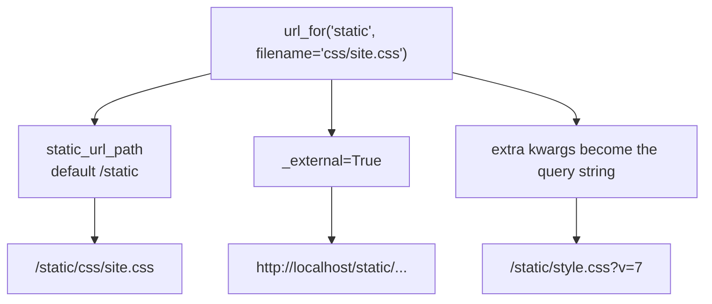

Static files are assets like:

- CSS
- JavaScript
- images

## Where static files live

By default:

- `static/` folder next to your app/package

Example:

```
myapp/
  app.py
  static/
    styles.css
  templates/
    base.html
```

## Link CSS using url_for

In `base.html`:

```html
<link rel="stylesheet" href="{{ url_for('static', filename='styles.css') }}">
```

## Link JavaScript

```html
<script src="{{ url_for('static', filename='app.js') }}"></script>
```

## Why url_for matters here too

- handles URL prefixes (reverse proxy setups)
- avoids hardcoded `/static/...`
- works cleanly with Blueprints and app factories

## Production note

In production, Nginx or a CDN often serves static files more efficiently.

But the URL patterns should still work the same.

## Always build static URLs with `url_for`

A hard-coded `/static/style.css` breaks the moment the app is mounted under a prefix, or
`static_url_path` changes, or you move to a CDN. `url_for` derives the path from the
app's configuration:



Measured:

| call | result |
|:--|:--|
| `url_for('static', filename='style.css')` | `/static/style.css` |
| `url_for('static', filename='css/site.css')` | `/static/css/site.css` |
| `url_for('static', filename='style.css', v=7)` | `/static/style.css?v=7` |
| `url_for('static', filename='s.css', _external=True)` | `http://localhost/static/s.css` |

```text title="base.html"
<link rel="stylesheet" href="{{ url_for('static', filename='css/site.css') }}">
<script src="{{ url_for('static', filename='js/app.js') }}" defer></script>

```

Note that the `static` endpoint exists without you registering it — creating the `Flask`
object adds the rule `/static/<path:filename>` to `url_map`.

## Cache busting is what the extra argument is for

Browsers cache static files aggressively, which is what you want until you ship a change
and users keep the old CSS. Any extra keyword becomes a query parameter:

```python title="cache_bust.py" showLineNumbers{1}
url_for("static", filename="style.css", v=7)
# /static/style.css?v=7
```

Change the value and the URL changes, so the browser treats it as a new resource. Rather
than editing a number by hand, derive it from something that changes with the file:

```python title="auto_version.py" showLineNumbers{1}
import os

@app.context_processor
def static_version():
    def versioned(filename):
        path = os.path.join(app.static_folder, filename)
        stamp = int(os.path.getmtime(path))
        return url_for("static", filename=filename, v=stamp)
    return {"versioned": versioned}
```

```text title="base.html"
<link rel="stylesheet" href="{{ versioned('css/site.css') }}">
```

Now the URL changes exactly when the file does, and never otherwise.

:::caution[The dev server is not how you should serve static files in production]
Werkzeug serves `/static` for convenience. In production, a real web server or CDN
should serve those files directly — it is faster, supports range requests and caching
headers properly, and keeps that traffic away from your application workers.
:::

## See it move

```p5 title="Why a hard-coded path breaks" desc="url_for derives the path from static_url_path and any mount prefix. A literal string does not." height="330"
let prefix = 0;   // 0 = none, 1 = /app, 2 = custom static path
let bust = false;

function setup() {
  createCanvas(600, 330);
  textFont("monospace");
}

function draw() {
  background(13, 17, 23);
  const setups = [
    { n: "mounted at /", sp: "/static" },
    { n: "mounted under /app", sp: "/app/static" },
    { n: "static_url_path='/assets'", sp: "/assets" },
  ];
  const s = setups[prefix];
  const dynamic = s.sp + "/css/site.css" + (bust ? "?v=1733" : "");
  const hard = "/static/css/site.css";
  const ok = hard === s.sp + "/css/site.css";

  noStroke();
  fill(230);
  textSize(13);
  textAlign(LEFT, TOP);
  text("deployment: " + s.n, 24, 18);

  // url_for row
  stroke(120, 190, 130);
  strokeWeight(1);
  fill(20, 34, 24);
  rect(24, 56, 552, 76, 5);
  noStroke();
  fill(110);
  textSize(10);
  textAlign(LEFT, TOP);
  text("{{ url_for('static', filename='css/site.css'" + (bust ? ", v=1733" : "") + ") }}", 38, 68);
  fill(120, 190, 130);
  textSize(14);
  text(dynamic, 38, 94);
  fill(120, 190, 130);
  textSize(10);
  text("resolves correctly in every deployment", 38, 116);

  // hard-coded row
  stroke(ok ? color(120, 190, 130) : color(232, 110, 110));
  strokeWeight(1);
  fill(ok ? color(20, 34, 24) : color(40, 20, 22));
  rect(24, 146, 552, 76, 5);
  noStroke();
  fill(110);
  textSize(10);
  textAlign(LEFT, TOP);
  text("href=\"/static/css/site.css\"   (hard-coded)", 38, 158);
  fill(ok ? color(120, 190, 130) : color(232, 110, 110));
  textSize(14);
  text(hard, 38, 184);
  fill(ok ? color(120, 190, 130) : color(232, 110, 110));
  textSize(10);
  text(ok ? "happens to match here" : "404 - the file is not at this path in this deployment", 38, 206);

  drawBtn(24, 244, 240, "deployment: " + (prefix + 1) + " of 3");
  drawBtn(276, 244, 190, bust ? "cache buster: on" : "cache buster: off");
  fill(90);
  textSize(10);
  textAlign(LEFT, TOP);
  text("the hard-coded path is correct in exactly one of the three", 24, 284);
  text("which is why it survives development and fails on deploy", 24, 300);
}

function drawBtn(x, y, w, label) {
  const hot = mouseX > x && mouseX < x + w && mouseY > y && mouseY < y + 24;
  stroke(hot ? color(255, 211, 67) : color(60, 70, 84));
  strokeWeight(1);
  fill(hot ? color(34, 40, 50) : color(22, 28, 36));
  rect(x, y, w, 24, 4);
  noStroke();
  fill(hot ? color(255, 211, 67) : 200);
  textSize(11);
  textAlign(CENTER, CENTER);
  text(label, x + w / 2, y + 12);
}

function mousePressed() {
  if (mouseY < 244 || mouseY > 268) return;
  if (mouseX > 24 && mouseX < 264) prefix = (prefix + 1) % 3;
  if (mouseX > 276 && mouseX < 466) bust = !bust;
}
```

## Check yourself

<Quiz
  questions={[
    {
      q: "Why prefer url_for('static', filename='css/site.css') to a literal /static/css/site.css?",
      options: [
        "it is shorter",
        "it derives the path from static_url_path and any mount prefix, so it stays correct when the app is deployed under a sub-path",
        "it compresses the file",
        "literal paths are forbidden in Jinja2",
      ],
      answer: 1,
      explain:
        "A hard-coded path is right only for one deployment. Mount the app under /app or change static_url_path and it 404s — after working perfectly in development.",
    },
    {
      q: "What does url_for('static', filename='style.css', v=7) produce?",
      options: [
        "/static/style.css",
        "/static/style.css?v=7",
        "/static/v7/style.css",
        "an error, since v is not a known argument",
      ],
      answer: 1,
      explain:
        "Unrecognised keywords become query parameters. Changing the value changes the URL, so the browser fetches a fresh copy — the standard cache-busting trick.",
    },
    {
      q: "Which route exists in url_map without you writing it?",
      options: [
        "/media/<path:filename>",
        "/static/<path:filename>",
        "/assets/<path:filename>",
        "none; the static route must be registered",
      ],
      answer: 1,
      explain:
        "Creating the Flask object registers the static endpoint, which is why url_for('static', ...) works immediately.",
    },
  ]}
/>
