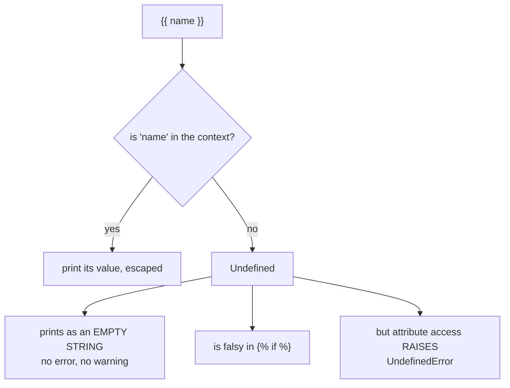

Templates become powerful when you pass data to them.

:::note[A misspelled variable renders as nothing, not as an error]
Jinja's default `Undefined` is deliberately quiet. Verified:

| Template | Result |
| --- | --- |
| `{{ missing }}` | `''` — empty string |
| `{{ d['nope'] }}` | `''` — empty string |
| `{{ missing.attr }}` | raises `UndefinedError` |

So a typo in a variable name produces a blank space on the page and nothing in the log, and the
page looks *almost* right — which is why it survives review. Only reaching an attribute *on*
the missing name raises.

If you would rather find out immediately, switch the environment to strict:

```python
from jinja2 import StrictUndefined
app.jinja_env.undefined = StrictUndefined
```

Then every undefined name raises, which is usually what you want in development.
:::

## Passing variables from Flask

```python
from flask import Flask, render_template

app = Flask(__name__)


@app.route("/hello/<name>")
def hello(name):
    return render_template("hello.html", name=name)
```

Template `templates/hello.html`:

```html
<!doctype html>
<html>
  <body>
    <h1>Hello, {{ name }}!</h1>
  </body>
</html>
```

## Passing dictionaries and lists

```python
@app.route("/users")
def users():
    data = [
        {"username": "ravi", "role": "admin"},
        {"username": "alex", "role": "user"},
    ]
    return render_template("users.html", users=data)
```

In Jinja you can access:

- `{{ user.username }}` or `{{ user['username'] }}`

## Good practice

- Keep templates focused on presentation.
- Do validation/computation in Python, then pass already-clean data to the template.

This makes templates simpler and safer.


## 🧪 Try It Yourself

### Exercise 1 – Create a Flask App

<DataCampExercise
  lang="python"
  hint={`Import Flask, create \`app = Flask(__name__)\`, then define a route.`}
  code={`# Task: Exercise 1 – Create a Flask App
# (Simulated – we run the route function directly)
from flask import Flask

app = ___(  __name__  )   # replace ___ with Flask

@app.route("/")
def home():
    return "Hello, Flask!"

# Simulate calling the route
with app.test_client() as client:
    r = client.get("/")
    print(r.data.decode())

# ── Expected Output ───────────────────────────────────────────
# Hello, Flask!
# ──────────────────────────────────────────────────────────────`}
  solution={`from flask import Flask

app = Flask(__name__)

@app.route("/")
def home():
    return "Hello, Flask!"

with app.test_client() as client:
    r = client.get("/")
    print(r.data.decode())`}
  sct={`test_output_contains("Hello, Flask!")
success_msg("First Flask route works!")`}
  height={148}
/>

### Exercise 2 – Dynamic Route

<DataCampExercise
  lang="python"
  hint={`Use \`<name>\` in the route path and add it as a function parameter.`}
  code={`# Task: Exercise 2 – Dynamic Route
from flask import Flask

app = Flask(__name__)

# Hint: add a <name> variable to the route
@app.route("/greet/<___>")   # replace ___ with name
def greet(name):
    return f"Hello, {name}!"

with app.test_client() as c:
    print(c.get("/greet/Alice").data.decode())

# ── Expected Output ───────────────────────────────────────────
# Hello, Alice!
# ──────────────────────────────────────────────────────────────`}
  solution={`from flask import Flask

app = Flask(__name__)

@app.route("/greet/<name>")
def greet(name):
    return f"Hello, {name}!"

with app.test_client() as c:
    print(c.get("/greet/Alice").data.decode())`}
  sct={`test_output_contains("Hello, Alice!")
success_msg("Dynamic routes work!")`}
  height={140}
/>

### Exercise 3 – Return JSON

<DataCampExercise
  lang="python"
  hint={`Use \`flask.jsonify(data)\` to return a JSON response.`}
  code={`# Task: Exercise 3 – Return JSON
from flask import Flask, jsonify

app = Flask(__name__)

@app.route("/status")
def status():
    # Hint: use jsonify to return a dict as JSON
    return ___({"ok": True, "code": 200})   # replace ___ with jsonify

with app.test_client() as c:
    import json
    data = json.loads(c.get("/status").data)
    print("ok:", data["ok"])
    print("code:", data["code"])

# ── Expected Output ───────────────────────────────────────────
# ok: True
# code: 200
# ──────────────────────────────────────────────────────────────`}
  solution={`from flask import Flask, jsonify
import json

app = Flask(__name__)

@app.route("/status")
def status():
    return jsonify({"ok": True, "code": 200})

with app.test_client() as c:
    data = json.loads(c.get("/status").data)
    print("ok:", data["ok"])
    print("code:", data["code"])`}
  sct={`test_output_contains("ok: True")
test_output_contains("code: 200")
success_msg("jsonify returns JSON responses!")`}
  height={152}
/>

## An undefined variable is not an error

This is the behaviour that makes template bugs so hard to see. A name that does not
exist renders as **nothing at all**:



Measured:

```python title="undefined.py" showLineNumbers{1}
render_template_string("start[{{ nope }}]end")
# 'start[]end'                       <- silent

render_template_string("yesno")
# 'no'                               <- undefined is falsy

render_template_string("{{ nope.attr }}")
# jinja2.exceptions.UndefinedError: 'nope' is undefined
```

So a typo in a variable name produces a blank space on the page, while a typo in an
*attribute* produces a loud error. The first is the one that reaches production.

:::note[Make it loud during development]
```python title="strict.py" showLineNumbers{1}
from jinja2 import StrictUndefined
app.jinja_env.undefined = StrictUndefined
```
Now `{{ nope }}` raises instead of rendering empty. Worth enabling in development and in
tests; consider leaving it off in production so one missing value cannot take down a
page.
:::

## What is already available without passing it

Flask injects a few names into every template context:

| name | what it is |
|:--|:--|
| `url_for` | build a URL from an endpoint name |
| `request` | the current request object |
| `session` | the session dict |
| `g` | the per-request global object |
| `config` | the app config |

```python title="views.py" showLineNumbers{1}
return render_template("profile.html", user=user, posts=posts)
```

```text title="profile.html"
<h1>{{ user.name }}</h1>

  <a href="{{ url_for('post', id=p.id) }}">{{ p.title }}</a>

```

To add your own name to every template without passing it each time, use a context
processor:

```python title="context.py" showLineNumbers{1}
@app.context_processor
def inject_year():
    return {"year": datetime.now().year}       # {{ year }} now works everywhere
```

## See it move

```p5 title="What happens to a name the context does not have" desc="An undefined name prints as empty and is falsy, but touching an attribute on it raises. The quiet case is the dangerous one." height="330"
let sel = 0;
const CASES = [
  { t: "{{ user.name }}", ctx: true, out: "'ada'", kind: "ok" },
  { t: "{{ nope }}", ctx: false, out: "''  (empty, silent)", kind: "quiet" },
  { t: "AB", ctx: false, out: "'B'  (undefined is falsy)", kind: "quiet" },
  { t: "{{ nope.attr }}", ctx: false, out: "UndefinedError: 'nope' is undefined", kind: "loud" },
];

function setup() {
  createCanvas(600, 330);
  textFont("monospace");
}

function colOf(k) {
  if (k === "ok") return color(120, 190, 130);
  if (k === "quiet") return color(255, 211, 67);
  return color(232, 110, 110);
}

function draw() {
  background(13, 17, 23);
  noStroke();
  fill(230);
  textSize(13);
  textAlign(LEFT, TOP);
  text("context = { user: {name: 'ada'} }", 24, 16);
  fill(120);
  textSize(11);
  text("'nope' was never passed", 24, 36);

  for (let i = 0; i < CASES.length; i++) {
    const y = 64 + i * 34;
    const on = i === sel;
    const c = colOf(CASES[i].kind);
    stroke(on ? c : color(40, 48, 58));
    strokeWeight(on ? 2 : 1);
    fill(on ? color(26, 32, 42) : color(17, 22, 29));
    rect(24, y, 340, 28, 3);
    noStroke();
    fill(on ? 220 : 120);
    textSize(11);
    textAlign(LEFT, CENTER);
    text(CASES[i].t, 34, y + 14);
  }

  const cs = CASES[sel];
  const c = colOf(cs.kind);
  stroke(c);
  strokeWeight(1);
  fill(18, 23, 30);
  rect(24, 214, 552, 66, 5);
  noStroke();
  fill(110);
  textSize(10);
  textAlign(LEFT, TOP);
  text("renders as", 38, 226);
  fill(c);
  textSize(14);
  text(cs.out, 38, 246);

  fill(c);
  textSize(11);
  textAlign(LEFT, TOP);
  const msg = cs.kind === "ok" ? "the value was in the context"
    : (cs.kind === "quiet" ? "SILENT - a typo here becomes a blank space on the page"
                           : "LOUD - attribute access on Undefined raises");
  text(msg, 24, 292);
}

function mousePressed() {
  for (let i = 0; i < CASES.length; i++) {
    const y = 64 + i * 34;
    if (mouseX > 24 && mouseX < 364 && mouseY > y && mouseY < y + 28) sel = i;
  }
}
```

## Check yourself

<Quiz
  questions={[
    {
      q: "A template contains {{ usr }} but the view passed user=. What is rendered?",
      options: [
        "an UndefinedError",
        "the literal text {{ usr }}",
        "an empty string, with no error or warning",
        "the value of user, by fuzzy matching",
      ],
      answer: 2,
      explain:
        "Undefined renders as empty. Measured: 'start[{{ nope }}]end' gave 'start[]end'. A typo in a variable name becomes a blank space, which is why it reaches production.",
    },
    {
      q: "Why does {{ nope }} render silently while {{ nope.attr }} raises?",
      options: [
        "attribute access is checked at compile time",
        "printing Undefined is defined as empty, but getting an attribute from Undefined is an error",
        "the second form has a syntax error",
        "Jinja2 only validates nested expressions",
      ],
      answer: 1,
      explain:
        "Undefined has a string form (empty) and is falsy, but attribute access on it raises UndefinedError. Set app.jinja_env.undefined = StrictUndefined to make the quiet case loud in development.",
    },
    {
      q: "Which name is available in every template without being passed by the view?",
      options: [
        "user",
        "url_for",
        "db",
        "form",
      ],
      answer: 1,
      explain:
        "Flask injects url_for, request, session, g and config. Anything else must be passed to render_template or added with a @app.context_processor.",
    },
  ]}
/>
