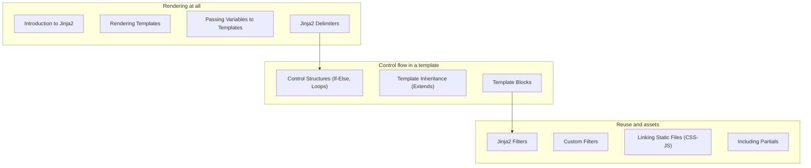

import Quiz from "../../../../components/Quiz.astro";

So far, our routes returned plain strings or JSON.

Most websites need HTML pages, and hand-building HTML in Python strings doesn’t scale.

Flask uses **Jinja2** as its templating engine.

## You’ll learn

- How templates work (rendering context → HTML)
- Variables, delimiters, and control flow
- Template inheritance (base layout + pages)
- Reusable partials (includes)
- Filters (built-in and custom)
- Linking static files (CSS/JS/images) properly with `url_for("static", ...)`

## Phase checklist

1. Introduction to Jinja2
2. Rendering Templates
3. Passing Variables to Templates
4. Jinja2 Delimiters
5. Control Structures (If/Else, Loops)
6. Template Inheritance (Extends)
7. Template Blocks
8. Jinja2 Filters
9. Custom Filters
10. Linking Static Files (CSS/JS)
11. Including Partials

## The phase at a glance

This phase exists to **produce HTML without building strings by hand**. It assumes routes that return values, and once it is done you can build a real multi-page site with a shared layout.



## Where this sits in the track

```p5 title="The track, and what each phase unlocks" desc="Each phase assumes the one before it. Click a phase to see what you can build once it is done." height="330"
let sel = 2;
const NAMES = ['Fundamentals', 'Routing', 'Templating', 'Forms', 'Databases', 'Auth', 'Architecture', 'REST APIs', 'Deployment'];
const BUILDS = ['a page that says hello', 'a site with several URLs and a JSON endpoint', 'a real multi-page site with a shared layout', 'a site that accepts and validates input', 'a site whose data survives a restart', 'a site with accounts and private pages', 'an app split into modules, configurable per environment', 'an API other programs can call', 'all of it, running on a public server'];

function setup() {
  createCanvas(600, 330);
  textFont('monospace');
}

function draw() {
  background(13, 17, 23);
  noStroke();
  fill(230);
  textSize(13);
  textAlign(LEFT, TOP);
  text('the Flask track', 24, 16);
  fill(120);
  textSize(11);
  text('click a phase', 24, 36);

  for (let i = 0; i < NAMES.length; i++) {
    const col = i % 3;
    const row = floor(i / 3);
    const x = 24 + col * 186;
    const y = 62 + row * 56;
    const done = i < sel;
    const on = i === sel;
    stroke(on ? color(255, 211, 67) : (done ? color(120, 190, 130) : color(48, 56, 68)));
    strokeWeight(on ? 2 : 1);
    fill(on ? color(38, 34, 18) : (done ? color(18, 28, 22) : color(17, 22, 29)));
    rect(x, y, 174, 46, 4);
    noStroke();
    fill(on ? color(255, 211, 67) : (done ? color(120, 190, 130) : 110));
    textSize(11);
    textAlign(LEFT, TOP);
    text('Phase ' + (i + 1), x + 12, y + 8);
    fill(on ? color(255, 211, 67) : (done ? 150 : 90));
    textSize(11);
    text(NAMES[i], x + 12, y + 26);
  }

  stroke(48, 56, 68);
  strokeWeight(1);
  fill(18, 23, 30);
  rect(24, 240, 552, 62, 5);
  noStroke();
  fill(110);
  textSize(10);
  textAlign(LEFT, TOP);
  text('after Phase ' + (sel + 1) + ' you can build', 38, 250);
  fill(120, 190, 130);
  textSize(13);
  text(BUILDS[sel], 38, 272);

  fill(90);
  textSize(10);
  textAlign(LEFT, TOP);
  text('green = assumed knowledge by the time you reach the highlighted phase', 24, 312);
}

function mousePressed() {
  for (let i = 0; i < NAMES.length; i++) {
    const col = i % 3;
    const row = floor(i / 3);
    const x = 24 + col * 186;
    const y = 62 + row * 56;
    if (mouseX > x && mouseX < x + 174 && mouseY > y && mouseY < y + 46) sel = i;
  }
}
```

## The pages, in reading order

| # | page |
|--:|:--|
| 1 | Introduction to Jinja2 |
| 2 | Rendering Templates |
| 3 | Passing Variables to Templates |
| 4 | Jinja2 Delimiters |
| 5 | Control Structures (If-Else, Loops) |
| 6 | Template Inheritance (Extends) |
| 7 | Template Blocks |
| 8 | Jinja2 Filters |
| 9 | Custom Filters |
| 10 | Linking Static Files (CSS-JS) |
| 11 | Including Partials |

11 pages. They are ordered so that each one only uses ideas from the pages above it — reading out of order mostly works, but the examples assume what came before.

## Check yourself

<Quiz
  questions={[
    {
      q: "What problem does this phase solve?",
      options: [
        "storing user data",
        "building HTML without concatenating strings in Python",
        "authenticating users",
        "running the app in production",
      ],
      answer: 1,
      explain:
        "Templates separate markup from view logic, and add inheritance and includes so a layout is written once.",
    },
    {
      q: "Why do Linking Static Files and Custom Filters belong in the same phase as loops and inheritance?",
      options: [
        "they are unrelated and grouped arbitrarily",
        "they are all part of producing a finished page: markup, reuse, and the CSS and JS that page needs",
        "filters are required to render templates",
        "static files can only be served from templates",
      ],
      answer: 1,
      explain:
        "The phase covers everything between a view returning data and a browser receiving a complete page.",
    },
    {
      q: "What do the phase overview pages give you that the individual pages do not?",
      options: [
        "the full code for each topic",
        "the reading order, what the phase assumes, and what you can build once it is done",
        "a downloadable project template",
        "the deployment configuration",
      ],
      answer: 1,
      explain:
        "Each overview lists its pages in sidebar order and names the phase's prerequisites and outcome, so you can tell whether you are ready for it.",
    },
  ]}
/>
