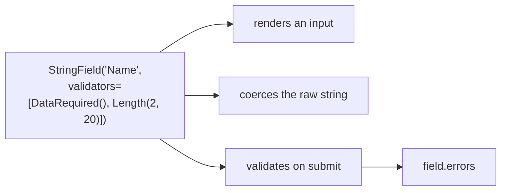

A Flask-WTF form class defines:

- fields
- validators
- default values

## Example: Contact form

```python
from flask_wtf import FlaskForm
from wtforms import StringField, EmailField, SubmitField
from wtforms.validators import DataRequired, Email, Length


class ContactForm(FlaskForm):
    name = StringField("Name", validators=[DataRequired(), Length(min=2, max=50)])
    email = EmailField("Email", validators=[DataRequired(), Email()])
    submit = SubmitField("Send")
```

## Using the form in a view

```python
from flask import Flask, render_template, redirect, url_for

app = Flask(__name__)
app.config["SECRET_KEY"] = "dev-key"


@app.route("/contact", methods=["GET", "POST"])
def contact():
    form = ContactForm()

    if form.validate_on_submit():
        # Access clean field values:
        name = form.name.data
        email = form.email.data
        # ...save/send email...
        return redirect(url_for("contact_success"))

    return render_template("contact.html", form=form)
```

### Why validate_on_submit()?

It’s shorthand for:

- request is POST
- AND form validates

This keeps your route clean.

## A form is a class, and the fields are its schema

```python title="forms.py" showLineNumbers{1}
from flask_wtf import FlaskForm
from wtforms import StringField, IntegerField, SelectField, SubmitField
from wtforms.validators import DataRequired, Length, NumberRange, Optional

class SignupForm(FlaskForm):
    name = StringField("Name", validators=[DataRequired(), Length(min=2, max=20)])
    age = IntegerField("Age", validators=[Optional(), NumberRange(min=0, max=130)])
    role = SelectField("Role", choices=[("u", "User"), ("a", "Admin")])
    go = SubmitField("Sign up")
```

Each attribute declares three things at once — the HTML control, the Python type the
value is coerced to, and the rules it must satisfy:



## Validators run in order and accumulate

Measured error dictionaries for a form with `name`, `age` and `email`:

| submitted | `form.errors` |
|:--|:--|
| `name='a'`, bad email | `name: ['Field must be between 2 and 20 characters long.']`, `email: ['Invalid email address.']` |
| `age='999'` | `age: ['Number must be between 0 and 130.']` |
| `age='abc'` | `age: ['Not a valid integer value.', 'Number must be between 0 and 130.']` |
| `name` missing | `name: ['This field is required.']` |

Two details worth reading off that table:

- Errors are collected **per field**, and a field can hold more than one. `age='abc'`
  produced two, because coercion failed *and* the range check then ran against the
  resulting `None`.
- Validation does not stop at the first failing field. `form.errors` is the complete
  picture, which is what lets you re-render every problem at once.

:::caution[`Optional()` must come first]
`Optional()` stops the chain when the field is empty. Written after `NumberRange`, the
range check runs on an empty value first and reports a spurious error. Order in the list
is execution order.
:::

## `DataRequired` is not `InputRequired`

```python title="required.py" showLineNumbers{1}
DataRequired()    # fails if the coerced value is FALSY: '', 0, False, None
InputRequired()   # fails only if nothing was submitted for the field
```

For a number that may legitimately be `0`, or a checkbox that may legitimately be
unchecked, `DataRequired` rejects a valid answer. Use `InputRequired` when the question
is "did they send this field", and `DataRequired` when it is "is there a meaningful
value".

## Custom validation

```python title="custom.py" showLineNumbers{1}
from wtforms.validators import ValidationError

class SignupForm(FlaskForm):
    name = StringField("Name", validators=[DataRequired()])

    def validate_name(self, field):          # validate_<fieldname>
        if User.query.filter_by(name=field.data).first():
            raise ValidationError("That name is taken.")
```

A method called `validate_<fieldname>` is picked up automatically and runs after that
field's validator list. Raising `ValidationError` appends to `field.errors` exactly like
a built-in.

## See it move

```p5 title="How one submission becomes form.errors" desc="Each field runs its validators in order. Failures accumulate per field, and validation never stops at the first bad field." height="340"
let caseIdx = 0;
const CASES = [
  { n: 'name=ada, age=42, email ok', errs: {} },
  { n: 'name=a, email=nope', errs: { name: ['Field must be between 2 and 20 characters long.'], email: ['Invalid email address.'] } },
  { n: 'age=999', errs: { age: ['Number must be between 0 and 130.'] } },
  { n: 'age=abc', errs: { age: ['Not a valid integer value.', 'Number must be between 0 and 130.'] } },
  { n: 'name missing', errs: { name: ['This field is required.'] } },
];
const FIELDS = ['name', 'age', 'email'];

function setup() {
  createCanvas(600, 340);
  textFont('monospace');
}

function draw() {
  background(13, 17, 23);
  const c = CASES[caseIdx];
  const keys = Object.keys(c.errs);

  noStroke();
  fill(230);
  textSize(12);
  textAlign(LEFT, TOP);
  text('submitted: ' + c.n, 24, 18);

  let y = 52;
  for (let i = 0; i < FIELDS.length; i++) {
    const f = FIELDS[i];
    const errs = c.errs[f] || [];
    const bad = errs.length > 0;
    stroke(bad ? color(232, 110, 110) : color(120, 190, 130));
    strokeWeight(1);
    fill(bad ? color(34, 20, 22) : color(20, 30, 24));
    const h = 30 + errs.length * 18;
    rect(24, y, 552, h, 4);
    noStroke();
    fill(bad ? color(232, 110, 110) : color(120, 190, 130));
    textSize(12);
    textAlign(LEFT, TOP);
    text(f, 38, y + 9);
    fill(bad ? color(232, 110, 110) : color(120, 190, 130));
    textSize(10);
    textAlign(RIGHT, TOP);
    text(bad ? errs.length + ' error(s)' : 'ok', 562, y + 10);
    for (let k = 0; k < errs.length; k++) {
      noStroke();
      fill(200);
      textSize(10);
      textAlign(LEFT, TOP);
      text('- ' + errs[k], 44, y + 28 + k * 18);
    }
    y += h + 8;
  }

  noStroke();
  fill(keys.length ? color(255, 211, 67) : color(120, 190, 130));
  textSize(11);
  textAlign(LEFT, TOP);
  text(keys.length
    ? 'validate() returned False - every failing field is reported at once'
    : 'validate() returned True - validate_on_submit() proceeds', 24, 272);

  drawBtn(24, 296, 190, 'next submission');
}

function drawBtn(x, y, w, label) {
  const hot = mouseX > x && mouseX < x + w && mouseY > y && mouseY < y + 24;
  stroke(hot ? color(255, 211, 67) : color(60, 70, 84));
  strokeWeight(1);
  fill(hot ? color(34, 40, 50) : color(22, 28, 36));
  rect(x, y, w, 24, 4);
  noStroke();
  fill(hot ? color(255, 211, 67) : 200);
  textSize(11);
  textAlign(CENTER, CENTER);
  text(label, x + w / 2, y + 12);
}

function mousePressed() {
  if (mouseY > 296 && mouseY < 320 && mouseX > 24 && mouseX < 214) caseIdx = (caseIdx + 1) % CASES.length;
}
```

## Check yourself

<Quiz
  questions={[
    {
      q: "Submitting age=abc to an IntegerField with NumberRange(0, 130) produced two errors on that field. Why two?",
      options: [
        "the validator list was declared twice",
        "coercion to int failed, and the range validator then ran against the resulting None",
        "wtforms retries validation once",
        "one error is a warning rather than a failure",
      ],
      answer: 1,
      explain:
        "Measured: ['Not a valid integer value.', 'Number must be between 0 and 130.']. Errors accumulate per field rather than stopping at the first.",
    },
    {
      q: "Why should Optional() be first in a validators list?",
      options: [
        "validators are sorted alphabetically anyway",
        "it stops the chain when the field is empty, so later validators do not fire on an empty value",
        "it is required by wtforms syntax",
        "it makes the field render as optional in HTML",
      ],
      answer: 1,
      explain:
        "List order is execution order. Placed after NumberRange, the range check runs first on an empty value and reports a spurious error.",
    },
    {
      q: "Which validator should guard a number field where 0 is a legitimate answer?",
      options: [
        "DataRequired, since the field must be present",
        "InputRequired, because DataRequired rejects falsy values including 0",
        "either, they behave identically",
        "NumberRange alone is enough",
      ],
      answer: 1,
      explain:
        "DataRequired fails on any falsy coerced value, so it rejects 0, an empty string and an unchecked box. InputRequired only asks whether the field was submitted.",
    },
  ]}
/>
