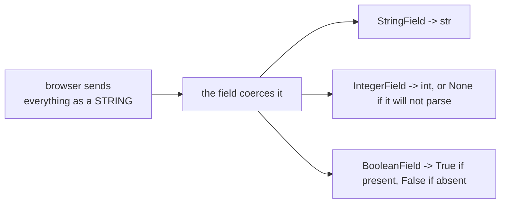

import Quiz from "../../../../components/Quiz.astro";

WTForms provides many field types.

Here are the most common ones you’ll use in Flask apps.

## Text inputs

- `StringField`
- `TextAreaField`
- `PasswordField`

## Numeric/date

- `IntegerField`
- `DecimalField`
- `DateField`

## Email

- `EmailField` (WTForms) or `StringField` + `Email()` validator

## Choices

- `SelectField`
- `RadioField`
- `SelectMultipleField`

Example:

```python
from wtforms import SelectField

role = SelectField(
    "Role",
    choices=[("user", "User"), ("admin", "Admin")],
)
```

## Checkboxes

- `BooleanField`

## File uploads

- `FileField`

File uploads require `enctype="multipart/form-data"` in the HTML form.

## Submit buttons

- `SubmitField`

Tip: keep only one submit field per form unless you really need multiple actions.

## Each field type decides the HTML and the Python type

Measured — the exact HTML each field renders, and what `field.data` holds after a valid
submission:

| field | rendered HTML | raw submitted | `.data` |
|:--|:--|:--|:--|
| `StringField` | `<input type="text">` | `'ada'` | `'ada'` (`str`) |
| `IntegerField` | `<input type="number">` | `'42'` | `42` (`int`) |
| `PasswordField` | `<input type="password">` | `'s3cret'` | `'s3cret'` (`str`) |
| `BooleanField` | `<input type="checkbox" value="y">` | `'y'` | `True` (`bool`) |
| `SelectField` | `<select><option>...` | `'a'` | `'a'` (`str`) |
| `TextAreaField` | `<textarea>` | text | `str` |



The whole point of the field type is that HTTP has no types. Every value arrives as a
string, and the field is what turns `'42'` into `42` — and what reports
`'Not a valid integer value.'` when it cannot.

:::caution[An unchecked box sends nothing at all]
A `BooleanField` renders `<input type="checkbox" value="y">`. When the user leaves it
unchecked the browser omits the field entirely, so `.data` is `False`. This is why a
`BooleanField` with `DataRequired()` can never be submitted as unchecked-but-valid — and
why "I agree" checkboxes use `DataRequired()` deliberately.
:::

## Validators become HTML attributes

```python title="attrs.py" showLineNumbers{1}
name = StringField("Your name", validators=[DataRequired(), Length(min=2)])
```

renders, measured:

```html title="output"
<input id="name" minlength="2" name="name" required type="text" value="">
```

`DataRequired()` produced `required` and `Length(min=2)` produced `minlength="2"`. The
browser will now enforce both before the request is sent.

:::danger[Client-side validation is a convenience, never a control]
Those attributes only help honest users. Anyone can strip them, or send the POST with
`curl`. The server-side validators are the real check — the HTML attributes are
generated *from* them, not instead of them.
:::

## Passing extra attributes at render time

```python title="render.py" showLineNumbers{1}
form.name(class_="input", placeholder="Ada")
```

```html title="measured"
<input class="input" id="name" minlength="2" name="name"
       placeholder="Ada" required type="text" value="">
```

`class_` has the trailing underscore because `class` is a Python keyword — the same
convention `for_` uses on labels.

## See it move

```p5 title="From HTML control to Python value" desc="Every value arrives as a string. The field type decides both the control rendered and the type the value is coerced to." height="340"
let sel = 0;
const F = [
  { n: 'StringField', html: 'input type=text', raw: "'ada'", data: "'ada'", t: 'str' },
  { n: 'IntegerField', html: 'input type=number', raw: "'42'", data: '42', t: 'int' },
  { n: 'BooleanField', html: 'input type=checkbox', raw: "'y'", data: 'True', t: 'bool' },
  { n: 'BooleanField (unchecked)', html: 'input type=checkbox', raw: 'not sent at all', data: 'False', t: 'bool' },
  { n: 'SelectField', html: 'select + options', raw: "'a'", data: "'a'", t: 'str' },
  { n: 'IntegerField (bad input)', html: 'input type=number', raw: "'abc'", data: 'None + error', t: 'NoneType' },
];

function setup() {
  createCanvas(600, 340);
  textFont('monospace');
}

function draw() {
  background(13, 17, 23);
  const f = F[sel];
  const bad = f.data.indexOf('error') >= 0;

  noStroke();
  fill(230);
  textSize(13);
  textAlign(LEFT, TOP);
  text('pick a field type', 24, 16);

  for (let i = 0; i < F.length; i++) {
    const y = 44 + i * 26;
    const on = i === sel;
    stroke(on ? color(255, 211, 67) : color(40, 48, 58));
    strokeWeight(1);
    fill(on ? color(28, 34, 44) : color(17, 22, 29));
    rect(24, y, 230, 22, 3);
    noStroke();
    fill(on ? color(255, 211, 67) : 130);
    textSize(10);
    textAlign(LEFT, CENTER);
    text(F[i].n, 34, y + 11);
  }

  const bx = 280;
  const steps = [
    { l: 'renders', v: f.html, c: [75, 139, 190] },
    { l: 'browser sends', v: f.raw, c: [255, 211, 67] },
    { l: 'field.data', v: f.data + '   (' + f.t + ')', c: bad ? [232, 110, 110] : [120, 190, 130] },
  ];
  for (let i = 0; i < steps.length; i++) {
    const y = 52 + i * 72;
    const s = steps[i];
    stroke(s.c[0], s.c[1], s.c[2]);
    strokeWeight(1);
    fill(18, 23, 30);
    rect(bx, y, 296, 56, 4);
    noStroke();
    fill(110);
    textSize(9);
    textAlign(LEFT, TOP);
    text(s.l, bx + 12, y + 8);
    fill(s.c[0], s.c[1], s.c[2]);
    textSize(12);
    textAlign(LEFT, CENTER);
    text(s.v, bx + 12, y + 34);
    if (i < 2) {
      stroke(60, 70, 84);
      strokeWeight(1);
      line(bx + 148, y + 56, bx + 148, y + 72);
    }
  }

  noStroke();
  fill(90);
  textSize(10);
  textAlign(LEFT, TOP);
  text('HTTP has no types - the field is what creates them', 24, 300);
}

function mousePressed() {
  for (let i = 0; i < F.length; i++) {
    const y = 44 + i * 26;
    if (mouseX > 24 && mouseX < 254 && mouseY > y && mouseY < y + 22) sel = i;
  }
}
```

## Check yourself

<Quiz
  questions={[
    {
      q: "A user leaves a BooleanField checkbox unchecked and submits. What does field.data hold?",
      options: [
        "None, since nothing was sent",
        "False, because an unchecked box is omitted from the request entirely",
        "an empty string",
        "True, the default",
      ],
      answer: 1,
      explain:
        "The browser sends nothing for an unchecked box, and BooleanField maps absence to False. That is also why DataRequired on a checkbox forces the user to tick it.",
    },
    {
      q: "StringField with DataRequired() and Length(min=2) renders required and minlength=2 in the HTML. What does that mean for security?",
      options: [
        "the server no longer needs to validate that field",
        "nothing changes on the server; those attributes are generated from the validators and can be stripped or bypassed by any client",
        "the browser signs the field so it cannot be altered",
        "validation moves entirely to the browser",
      ],
      answer: 1,
      explain:
        "The attributes are a convenience for honest users. A POST from curl ignores them completely, so the server-side validators remain the only real check.",
    },
    {
      q: "Why is the render-time keyword class_ spelled with a trailing underscore?",
      options: [
        "to distinguish CSS classes from Python classes in the output",
        "because class is a reserved Python keyword and cannot be used as an argument name",
        "wtforms strips the underscore for all attributes",
        "it marks the attribute as optional",
      ],
      answer: 1,
      explain:
        "class is one of the 35 reserved keywords, so the trailing-underscore convention is used, exactly as for_ on labels. It renders as class in the HTML.",
    },
  ]}
/>
