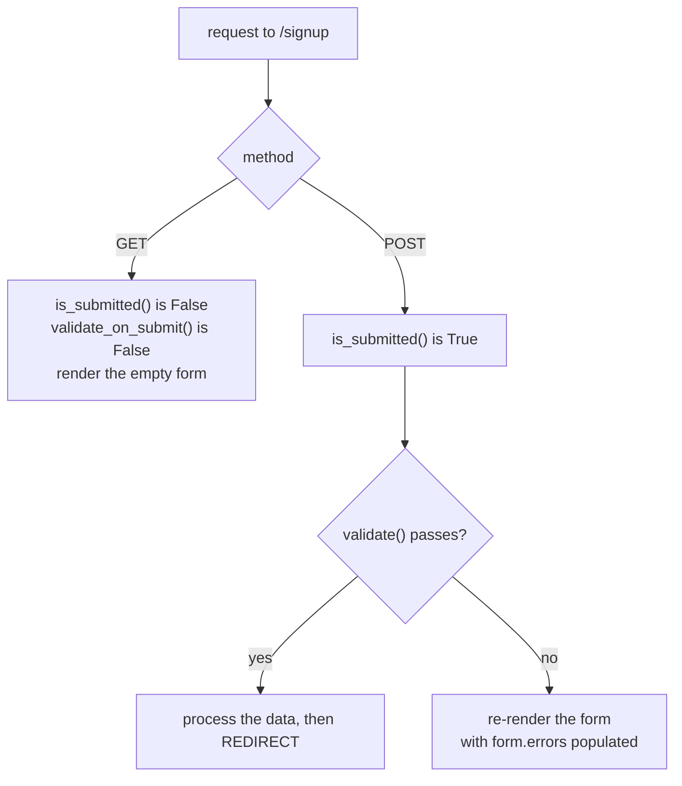
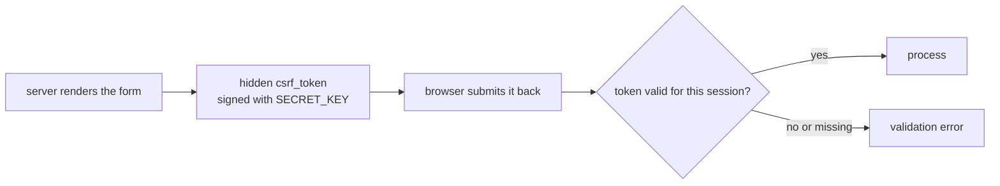

import Quiz from "../../../../components/Quiz.astro";

Reading `request.form` manually works, but it gets repetitive and error-prone.

**Flask-WTF** is a popular extension that provides:

- form classes
- built-in validators
- CSRF protection
- easy rendering helpers

Under the hood it builds on **WTForms**.

## Install

```bash
pip install Flask-WTF
```

## Configure a secret key

CSRF protection requires a `SECRET_KEY`.

```python
from flask import Flask

app = Flask(__name__)
app.config["SECRET_KEY"] = "change-this-in-real-apps"
```

In production, set `SECRET_KEY` from an environment variable.

## Key idea

Instead of reading arbitrary strings from `request.form`, you work with a **Form object**:

- fields are defined in Python
- validators run consistently
- errors are structured and easy to display

This dramatically improves maintainability.

import DataCampExercise from "../../../../components/DataCampExercise.astro";

## 🧪 Try It Yourself

### Exercise 1 – Create a Flask App

<DataCampExercise
  lang="python"
  hint={`Import Flask, create \`app = Flask(__name__)\`, then define a route.`}
  code={`# Task: Exercise 1 – Create a Flask App
# (Simulated – we run the route function directly)
from flask import Flask

app = ___(  __name__  )   # replace ___ with Flask

@app.route("/")
def home():
    return "Hello, Flask!"

# Simulate calling the route
with app.test_client() as client:
    r = client.get("/")
    print(r.data.decode())

# ── Expected Output ───────────────────────────────────────────
# Hello, Flask!
# ──────────────────────────────────────────────────────────────`}
  solution={`from flask import Flask

app = Flask(__name__)

@app.route("/")
def home():
    return "Hello, Flask!"

with app.test_client() as client:
    r = client.get("/")
    print(r.data.decode())`}
  sct={`test_output_contains("Hello, Flask!")
success_msg("First Flask route works!")`}
  height={148}
/>

### Exercise 2 – Dynamic Route

<DataCampExercise
  lang="python"
  hint={`Use \`<name>\` in the route path and add it as a function parameter.`}
  code={`# Task: Exercise 2 – Dynamic Route
from flask import Flask

app = Flask(__name__)

# Hint: add a <name> variable to the route
@app.route("/greet/<___>")   # replace ___ with name
def greet(name):
    return f"Hello, {name}!"

with app.test_client() as c:
    print(c.get("/greet/Alice").data.decode())

# ── Expected Output ───────────────────────────────────────────
# Hello, Alice!
# ──────────────────────────────────────────────────────────────`}
  solution={`from flask import Flask

app = Flask(__name__)

@app.route("/greet/<name>")
def greet(name):
    return f"Hello, {name}!"

with app.test_client() as c:
    print(c.get("/greet/Alice").data.decode())`}
  sct={`test_output_contains("Hello, Alice!")
success_msg("Dynamic routes work!")`}
  height={140}
/>

### Exercise 3 – Return JSON

<DataCampExercise
  lang="python"
  hint={`Use \`flask.jsonify(data)\` to return a JSON response.`}
  code={`# Task: Exercise 3 – Return JSON
from flask import Flask, jsonify

app = Flask(__name__)

@app.route("/status")
def status():
    # Hint: use jsonify to return a dict as JSON
    return ___({"ok": True, "code": 200})   # replace ___ with jsonify

with app.test_client() as c:
    import json
    data = json.loads(c.get("/status").data)
    print("ok:", data["ok"])
    print("code:", data["code"])

# ── Expected Output ───────────────────────────────────────────
# ok: True
# code: 200
# ──────────────────────────────────────────────────────────────`}
  solution={`from flask import Flask, jsonify
import json

app = Flask(__name__)

@app.route("/status")
def status():
    return jsonify({"ok": True, "code": 200})

with app.test_client() as c:
    data = json.loads(c.get("/status").data)
    print("ok:", data["ok"])
    print("code:", data["code"])`}
  sct={`test_output_contains("ok: True")
test_output_contains("code: 200")
success_msg("jsonify returns JSON responses!")`}
  height={152}
/>

## The request cycle a form actually goes through

One view handles both showing the form and receiving it. What separates the two is
whether the request was a submission:



```python title="signup.py" showLineNumbers{1}
@app.route("/signup", methods=["GET", "POST"])
def signup():
    form = SignupForm()
    if form.validate_on_submit():          # False on GET, so this is the whole test
        create_user(form.name.data)
        return redirect(url_for("done"))   # redirect after a successful POST
    return render_template("signup.html", form=form)
```

Measured:

| request | `is_submitted()` | `validate_on_submit()` |
|:--|:--|:--|
| `GET /signup` | `False` | `False` |
| `POST /signup` | `True` | runs validation, then True or False |

`validate_on_submit()` is exactly `is_submitted() and validate()`. That is why the single
`if` handles both directions, and why you never need to inspect `request.method` yourself.

## CSRF protection is the reason to use Flask-WTF at all

A `FlaskForm` adds a signed, per-session token to every form. A POST without it fails
validation:

```python title="no_token.py" showLineNumbers{1}
client.post("/signup", data={"name": "ada", "email": "a@b.co"})
# form.errors -> {'csrf_token': ['The CSRF token is missing.']}
```

Note what that is **not**: it is not a crash and not a 403 by default. It is an ordinary
validation error alongside any other, so your existing error-rendering handles it.



Without a token, any other site can make a logged-in user's browser POST to your app.
The token defeats that because a third-party page cannot read it.

:::danger[`SECRET_KEY` is what makes the token mean anything]
The token is signed with `app.config["SECRET_KEY"]`. A missing key raises; a hard-coded
one in a public repository is equivalent to having none, since anyone can then forge
tokens and session cookies. Load it from the environment, and use a different value in
each deployment.
:::

## A dependency that is not declared

```python title="email_validator.py" showLineNumbers{1}
from wtforms.validators import Email

class SignupForm(FlaskForm):
    email = StringField("Email", validators=[Email()])
```

This imports and defines fine, then fails when a form is first validated:

```text title="measured"
Exception: Install 'email_validator' for email validation support.
```

`wtforms` does not depend on `email_validator`, and `Email()` imports it lazily inside
the validator. So the failure appears on the first POST rather than at startup — install
it explicitly (`pip install email_validator`) and pin it with the rest.

## See it move

```p5 title="One view, two paths" desc="validate_on_submit is is_submitted() and validate(). GET short-circuits on the first half, so the same view renders the form and processes it." height="330"
let stage = 0;    // 0 = GET, 1 = POST invalid, 2 = POST valid

function setup() {
  createCanvas(600, 330);
  textFont('monospace');
}

function draw() {
  background(13, 17, 23);
  const names = ['GET /signup', 'POST /signup  (name too short)', 'POST /signup  (valid)'];
  const submitted = stage > 0;
  const valid = stage === 2;

  noStroke();
  fill(230);
  textSize(13);
  textAlign(LEFT, TOP);
  text(names[stage], 24, 18);

  const rows = [
    { label: 'is_submitted()', val: submitted ? 'True' : 'False', good: submitted },
    { label: 'validate()', val: !submitted ? 'not reached' : (valid ? 'True' : 'False'), good: valid },
    { label: 'validate_on_submit()', val: (submitted && valid) ? 'True' : 'False', good: submitted && valid },
  ];
  for (let i = 0; i < rows.length; i++) {
    const y = 54 + i * 44;
    const r = rows[i];
    stroke(48, 56, 68);
    strokeWeight(1);
    fill(18, 23, 30);
    rect(24, y, 400, 36, 4);
    noStroke();
    fill(150);
    textSize(11);
    textAlign(LEFT, CENTER);
    text(r.label, 38, y + 18);
    fill(r.good ? color(120, 190, 130) : color(232, 110, 110));
    textSize(12);
    textAlign(LEFT, CENTER);
    text(r.val, 250, y + 18);
  }

  const outcome = !submitted ? 'render the empty form'
    : (valid ? 'process, then redirect' : 're-render with form.errors');
  const oc = !submitted ? color(75, 139, 190) : (valid ? color(120, 190, 130) : color(255, 211, 67));
  stroke(oc);
  strokeWeight(1);
  fill(18, 23, 30);
  rect(24, 196, 552, 56, 5);
  noStroke();
  fill(110);
  textSize(10);
  textAlign(LEFT, TOP);
  text('the view does', 38, 208);
  fill(oc);
  textSize(14);
  text(outcome, 38, 228);

  if (stage === 1) {
    fill(255, 211, 67);
    textSize(10);
    textAlign(LEFT, TOP);
    text("form.errors -> {'name': ['Field must be at least 2 characters long.']}", 24, 264);
  }

  drawBtn(24, 288, 200, 'next request');
}

function drawBtn(x, y, w, label) {
  const hot = mouseX > x && mouseX < x + w && mouseY > y && mouseY < y + 24;
  stroke(hot ? color(255, 211, 67) : color(60, 70, 84));
  strokeWeight(1);
  fill(hot ? color(34, 40, 50) : color(22, 28, 36));
  rect(x, y, w, 24, 4);
  noStroke();
  fill(hot ? color(255, 211, 67) : 200);
  textSize(11);
  textAlign(CENTER, CENTER);
  text(label, x + w / 2, y + 12);
}

function mousePressed() {
  if (mouseY > 288 && mouseY < 312 && mouseX > 24 && mouseX < 224) stage = (stage + 1) % 3;
}
```

## Check yourself

<Quiz
  questions={[
    {
      q: "What exactly does form.validate_on_submit() evaluate?",
      options: [
        "whether the request method is POST",
        "is_submitted() and validate(), so it is False on a GET without running validators",
        "whether every field has a value",
        "whether the CSRF token is present",
      ],
      answer: 1,
      explain:
        "Measured: on GET, is_submitted() is False and validate_on_submit() is False. That short-circuit is why one view can both render and process the form.",
    },
    {
      q: "A POST arrives with no CSRF token. What happens by default?",
      options: [
        "the request raises a 500",
        "a 403 is returned immediately",
        "an ordinary validation error appears as form.errors with the key csrf_token",
        "the token is regenerated and the request proceeds",
      ],
      answer: 2,
      explain:
        "Measured form.errors was a dict containing csrf_token mapped to 'The CSRF token is missing.'. It flows through the same error rendering as any other field.",
    },
    {
      q: "Using the Email() validator raises 'Install email_validator for email validation support' on the first POST. Why not at import?",
      options: [
        "the validator is only constructed when a form is submitted",
        "Email() imports email_validator lazily inside the validator call, and wtforms does not depend on it",
        "flask-wtf removes the dependency at startup",
        "the error is a warning that is escalated later",
      ],
      answer: 1,
      explain:
        "The import happens when the validator runs, so a form class defines cleanly and fails on first use. Install and pin email_validator explicitly.",
    },
  ]}
/>
