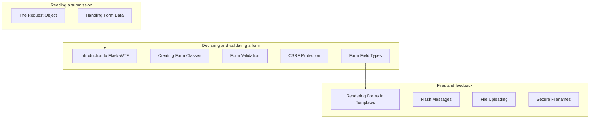

import Quiz from "../../../../components/Quiz.astro";

Forms are the bridge between users and your backend.

Phase 4 teaches you how to:

- read data from requests (query, form body, files)
- validate input correctly
- prevent CSRF attacks
- show feedback to users (flash messages)
- upload files safely

## You’ll learn

- The `request` object
- Handling form data
- Flask-WTF fundamentals
- Form classes and validation
- CSRF protection
- Field types and rendering
- Flash messages
- File uploading + secure filenames

## Phase checklist

1. The Request Object
2. Handling Form Data
3. Introduction to Flask-WTF
4. Creating Form Classes
5. Form Validation
6. CSRF Protection
7. Form Field Types
8. Rendering Forms in Templates
9. Flash Messages
10. File Uploading
11. Secure Filenames

## The phase at a glance

This phase exists to **accept input from users without trusting it**. It assumes templates that can render a form, and once it is done you can build a site that accepts and validates input.



## Where this sits in the track

```p5 title="The track, and what each phase unlocks" desc="Each phase assumes the one before it. Click a phase to see what you can build once it is done." height="330"
let sel = 3;
const NAMES = ['Fundamentals', 'Routing', 'Templating', 'Forms', 'Databases', 'Auth', 'Architecture', 'REST APIs', 'Deployment'];
const BUILDS = ['a page that says hello', 'a site with several URLs and a JSON endpoint', 'a real multi-page site with a shared layout', 'a site that accepts and validates input', 'a site whose data survives a restart', 'a site with accounts and private pages', 'an app split into modules, configurable per environment', 'an API other programs can call', 'all of it, running on a public server'];

function setup() {
  createCanvas(600, 330);
  textFont('monospace');
}

function draw() {
  background(13, 17, 23);
  noStroke();
  fill(230);
  textSize(13);
  textAlign(LEFT, TOP);
  text('the Flask track', 24, 16);
  fill(120);
  textSize(11);
  text('click a phase', 24, 36);

  for (let i = 0; i < NAMES.length; i++) {
    const col = i % 3;
    const row = floor(i / 3);
    const x = 24 + col * 186;
    const y = 62 + row * 56;
    const done = i < sel;
    const on = i === sel;
    stroke(on ? color(255, 211, 67) : (done ? color(120, 190, 130) : color(48, 56, 68)));
    strokeWeight(on ? 2 : 1);
    fill(on ? color(38, 34, 18) : (done ? color(18, 28, 22) : color(17, 22, 29)));
    rect(x, y, 174, 46, 4);
    noStroke();
    fill(on ? color(255, 211, 67) : (done ? color(120, 190, 130) : 110));
    textSize(11);
    textAlign(LEFT, TOP);
    text('Phase ' + (i + 1), x + 12, y + 8);
    fill(on ? color(255, 211, 67) : (done ? 150 : 90));
    textSize(11);
    text(NAMES[i], x + 12, y + 26);
  }

  stroke(48, 56, 68);
  strokeWeight(1);
  fill(18, 23, 30);
  rect(24, 240, 552, 62, 5);
  noStroke();
  fill(110);
  textSize(10);
  textAlign(LEFT, TOP);
  text('after Phase ' + (sel + 1) + ' you can build', 38, 250);
  fill(120, 190, 130);
  textSize(13);
  text(BUILDS[sel], 38, 272);

  fill(90);
  textSize(10);
  textAlign(LEFT, TOP);
  text('green = assumed knowledge by the time you reach the highlighted phase', 24, 312);
}

function mousePressed() {
  for (let i = 0; i < NAMES.length; i++) {
    const col = i % 3;
    const row = floor(i / 3);
    const x = 24 + col * 186;
    const y = 62 + row * 56;
    if (mouseX > x && mouseX < x + 174 && mouseY > y && mouseY < y + 46) sel = i;
  }
}
```

## The pages, in reading order

| # | page |
|--:|:--|
| 1 | The Request Object |
| 2 | Handling Form Data |
| 3 | Introduction to Flask-WTF |
| 4 | Creating Form Classes |
| 5 | Form Validation |
| 6 | CSRF Protection |
| 7 | Form Field Types |
| 8 | Rendering Forms in Templates |
| 9 | Flash Messages |
| 10 | File Uploading |
| 11 | Secure Filenames |

11 pages. They are ordered so that each one only uses ideas from the pages above it — reading out of order mostly works, but the examples assume what came before.

## Check yourself

<Quiz
  questions={[
    {
      q: "What does Phase 4 assume from the previous phase?",
      options: [
        "a database to save submissions into",
        "templates that can render a form",
        "an authentication system",
        "a deployed application",
      ],
      answer: 1,
      explain:
        "Forms are rendered by templates and read by views. Saving what they produce comes in Phase 5.",
    },
    {
      q: "Why are CSRF Protection and Secure Filenames part of the forms phase rather than a security phase?",
      options: [
        "they are only relevant to file uploads",
        "accepting input is exactly where those risks arise, so the defence belongs with the feature",
        "they are optional extras",
        "they belong to Phase 9 and are duplicated here",
      ],
      answer: 1,
      explain:
        "A cross-site request forgery and a malicious filename are both consequences of taking input from a user. Teaching them apart from forms invites forgetting them.",
    },
    {
      q: "What do the phase overview pages give you that the individual pages do not?",
      options: [
        "the full code for each topic",
        "the reading order, what the phase assumes, and what you can build once it is done",
        "a downloadable project template",
        "the deployment configuration",
      ],
      answer: 1,
      explain:
        "Each overview lists its pages in sidebar order and names the phase's prerequisites and outcome, so you can tell whether you are ready for it.",
    },
  ]}
/>
