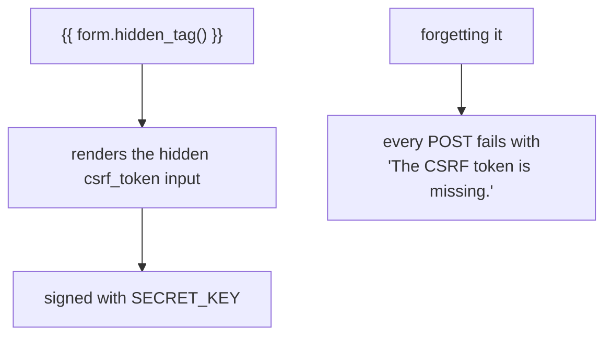

import Quiz from "../../../../components/Quiz.astro";

You can render forms manually (recommended for control) or use quick rendering.

## Manual rendering (recommended)

Template example:

```html
<form method="post">
  {{ form.hidden_tag() }}

  <div>
    {{ form.name.label }}
    {{ form.name() }}
    
      <p class="error">{{ error }}</p>
    
  </div>

  <div>
    {{ form.email.label }}
    {{ form.email() }}
    
      <p class="error">{{ error }}</p>
    
  </div>

  {{ form.submit() }}
</form>
```

## Adding HTML attributes

```html
{{ form.name(class_="input", placeholder="Your name") }}
```

Note: use `class_` (underscore) because `class` is a Python keyword.

## Keeping templates clean

As forms grow, you can move repeated field rendering into a partial:

- `templates/partials/_field.html`

Then include it for each field.

## A field renders itself

You do not write the `<input>` tags. Calling the field produces the HTML, with the id,
name, type and any validator-derived attributes already correct:

```text title="template"
<form method="post">
  {{ form.hidden_tag() }}
  {{ form.name.label }} {{ form.name(class_="input") }}
  <button type="submit">Sign up</button>
</form>
```

Measured output for each field:

```html title="what the fields produce"
<input id="name" minlength="2" name="name" required type="text" value="">
<input id="pw" name="pw" type="password" value="">
<textarea id="bio" name="bio"></textarea>
<input id="age" name="age" type="number" value="">
<input id="agree" name="agree" type="checkbox" value="y">
<select id="role" name="role"><option value="u">User</option>...</select>
<label for="name">Your name</label>
```

Because `id` and the label's `for` match, clicking the label focuses the input — an
accessibility win you get without thinking about it.

## `hidden_tag()` is not optional



```html title="measured"
<input id="csrf_token" name="csrf_token" type="hidden" value="ImUzNjI0ZTdmNWY0Mm...">
```

It renders every hidden field on the form, the CSRF token included. Leaving it out is
the most common reason a form that "looks fine" never submits successfully.

## Showing errors next to the field

```text title="field_with_errors.html"
<div class="field">
  {{ form.name.label }}
  {{ form.name(class_="input") }}
  
    <span class="error">{{ error }}</span>
  
</div>
```

Measured with `name='a'` submitted:

```text title="rendered"
<span class='err'>Field must be at least 2 characters long.</span>
```

`field.errors` is a plain list, empty before validation and on success — so the loop
simply produces nothing when there is nothing to say.

## Looping the whole form

```text title="every field at once"

  <div class="field">
    {{ field.label }} {{ field() }}
    <span class="error">{{ e }}</span>
  </div>

```

A `FlaskForm` is iterable, so a macro like this renders any form you pass it. Measured,
the loop yields the labels in declaration order: `Your name`, `Password`, `Bio`, `Age`,
`Agree`, `Role`. Filtering out hidden inputs keeps the CSRF token from getting a label
and a wrapper `div` of its own — render it separately with `hidden_tag()`.

:::note[Redirect after a successful POST]
On success, redirect rather than rendering. Otherwise the browser's reload button
resubmits the form, creating a duplicate record. The pattern has a name — Post/Redirect/Get
— and `form.validate_on_submit()` is where the redirect belongs.
:::

## See it move

```p5 title="Building the form markup piece by piece" desc="Each call adds one part of the form. Leaving out hidden_tag removes the CSRF token, and every submission then fails validation." height="340"
let parts = [true, true, true, false];

function setup() {
  createCanvas(600, 340);
  textFont('monospace');
}

function draw() {
  background(13, 17, 23);
  const names = ['form.hidden_tag()', 'form.name.label', 'form.name(class_=...)', 'errors loop'];
  const outs = [
    '<input type=hidden name=csrf_token value=ImUzNjI0...>',
    '<label for=name>Your name</label>',
    '<input id=name minlength=2 name=name required type=text>',
    '<span class=error>Field must be at least 2 characters long.</span>',
  ];

  noStroke();
  fill(230);
  textSize(13);
  textAlign(LEFT, TOP);
  text('what your template calls', 24, 16);

  for (let i = 0; i < 4; i++) {
    const y = 44 + i * 30;
    stroke(parts[i] ? color(120, 190, 130) : color(60, 70, 84));
    strokeWeight(1);
    fill(parts[i] ? color(20, 32, 24) : color(17, 22, 29));
    rect(24, y, 220, 25, 3);
    noStroke();
    fill(parts[i] ? color(120, 190, 130) : 80);
    textSize(11);
    textAlign(LEFT, CENTER);
    text((parts[i] ? 'on   ' : 'off  ') + names[i], 34, y + 12);
  }

  stroke(48, 56, 68);
  strokeWeight(1);
  fill(16, 20, 26);
  rect(24, 172, 552, 100, 4);
  noStroke();
  fill(110);
  textSize(9);
  textAlign(LEFT, TOP);
  text('rendered markup', 38, 180);
  let y = 198;
  for (let i = 0; i < 4; i++) {
    if (!parts[i]) continue;
    fill(i === 3 ? color(232, 110, 110) : 190);
    textSize(9);
    text(outs[i].length > 66 ? outs[i].slice(0, 65) + '.' : outs[i], 38, y);
    y += 18;
  }

  noStroke();
  if (!parts[0]) {
    fill(232, 110, 110);
    textSize(11);
    textAlign(LEFT, TOP);
    text('no csrf_token in the form -> every POST fails validation', 24, 284);
  } else {
    fill(120, 190, 130);
    textSize(11);
    textAlign(LEFT, TOP);
    text('the form will submit and validate normally', 24, 284);
  }

  fill(90);
  textSize(10);
  textAlign(LEFT, TOP);
  text('click a row to toggle it', 300, 40);
}

function mousePressed() {
  for (let i = 0; i < 4; i++) {
    const y = 44 + i * 30;
    if (mouseX > 24 && mouseX < 244 && mouseY > y && mouseY < y + 25) parts[i] = !parts[i];
  }
}
```

## Check yourself

<Quiz
  questions={[
    {
      q: "What does form.hidden_tag() render, and what breaks without it?",
      options: [
        "nothing visible; without it the form still submits normally",
        "the hidden CSRF token input; without it every POST fails with 'The CSRF token is missing.'",
        "the submit button",
        "the form element itself",
      ],
      answer: 1,
      explain:
        "It renders every hidden field, the signed csrf_token included. Omitting it is the most common reason a form that looks correct never validates.",
    },
    {
      q: "Why does clicking a field's label focus its input without any extra work?",
      options: [
        "browsers guess based on position",
        "wtforms renders matching id and for attributes on the input and label",
        "flask-wtf adds JavaScript",
        "it only works if you set them manually",
      ],
      answer: 1,
      explain:
        "Measured: <input id=\u0022name\u0022 ...> and <label for=\u0022name\u0022>. The matching pair is what makes the label clickable, which is an accessibility requirement you get by default.",
    },
    {
      q: "After a successful POST, why redirect rather than render the result directly?",
      options: [
        "rendering is slower",
        "so the browser reload button does not resubmit the form and duplicate the record",
        "because validate_on_submit clears the form",
        "redirects are required for CSRF to work",
      ],
      answer: 1,
      explain:
        "This is the Post/Redirect/Get pattern. Without the redirect, refreshing the result page repeats the POST.",
    },
  ]}
/>
