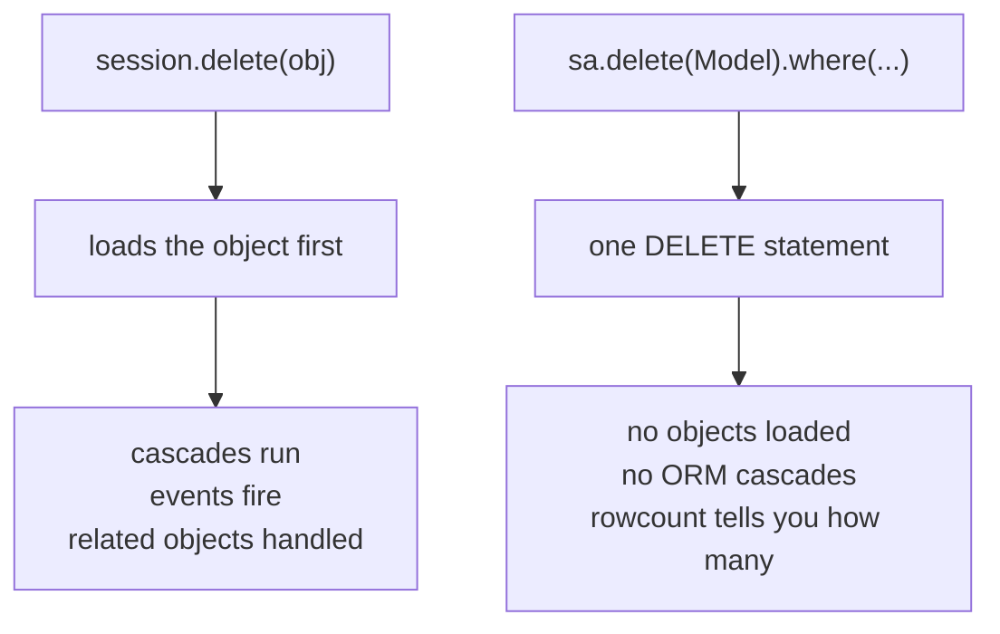

Deleting records should be done carefully (data loss is permanent).

## Example

```python
with app.app_context():
    user = User.query.get(1)
    if user:
        db.session.delete(user)
        db.session.commit()
```

## Soft deletes (common pattern)

Many applications avoid hard delete.

Instead they add a flag:

- `is_deleted`

And filter it out by default.

This helps:

- auditing
- recovery

## Cascades

If other tables depend on the record (foreign keys), deleting may:

- fail due to integrity constraints, or
- delete child records (if cascade is configured)

Understand your relationships before enabling cascade delete.

## Two ways to delete, with different consequences

```python title="orm_delete.py" showLineNumbers{1}
victim = db.session.scalar(sa.select(User).where(User.name == "bob"))
db.session.delete(victim)
db.session.commit()
```

```python title="bulk_delete.py" showLineNumbers{1}
result = db.session.execute(sa.delete(User).where(User.name == "cy"))
db.session.commit()
result.rowcount          # 1
```

Measured: 3 rows, ORM-deleting `bob` left 2; the bulk delete matched **1** row and left 1.



The ORM form is the safe default: it knows about relationships and will cascade
according to how you configured them. The bulk form is for deleting many rows at once,
and it does exactly what the SQL says — nothing more.

## Deleting something that is not there

```python title="missing.py" showLineNumbers{1}
victim = db.session.scalar(sa.select(User).where(User.id == 999))
db.session.delete(victim)      # AttributeError if victim is None
```

`scalar()` returns `None` when nothing matches, so guard it. In a view, the idiomatic
form turns the miss into a 404:

```python title="view.py" showLineNumbers{1}
from flask import abort

user = db.session.get(User, user_id)
if user is None:
    abort(404)
db.session.delete(user)
db.session.commit()
```

`db.session.get(Model, pk)` is the right call for a primary-key lookup — it checks the
identity map first and only queries if it must.

:::danger[Delete belongs behind POST, never a plain link]
A `<a href="/delete/5">` can be followed by a crawler, a link prefetcher, or a browser
preloading what it thinks you will click. Use a form that POSTs (with the CSRF token), or
`DELETE` from JavaScript. This is a real cause of data loss, not a formality.
:::

## Soft delete is often what you actually want

```python title="soft.py" showLineNumbers{1}
class User(db.Model):
    deleted_at: Mapped[datetime | None]

user.deleted_at = datetime.now(timezone.utc)
db.session.commit()
```

Nothing is destroyed, the row can be restored, and references from other tables stay
valid. The cost is that every query must now exclude soft-deleted rows — easy to forget,
so centralise it in one helper rather than repeating the filter.

## See it move

```p5 title="ORM delete against bulk delete" desc="session.delete loads the object and runs cascades. sa.delete issues one statement and reports rowcount, with no ORM involvement." height="340"
let mode = 0;
let done = false;

function setup() {
  createCanvas(600, 340);
  textFont('monospace');
}

function draw() {
  background(13, 17, 23);
  const orm = mode === 0;

  noStroke();
  fill(230);
  textSize(12);
  textAlign(LEFT, TOP);
  text(orm ? 'db.session.delete(obj)  then  commit()' : 'db.session.execute(sa.delete(User).where(...))', 24, 16);

  const steps = orm
    ? ['SELECT the row', 'build the object', 'run cascades and events', 'DELETE that row']
    : ['one DELETE statement', 'no objects loaded', 'no cascades, no events', 'rowcount reported'];
  for (let i = 0; i < 4; i++) {
    const y = 50 + i * 38;
    const active = done || i === 0;
    stroke(orm ? color(120, 190, 130) : color(75, 139, 190));
    strokeWeight(1);
    fill(done ? (orm ? color(18, 30, 22) : color(18, 26, 36)) : color(17, 22, 29));
    rect(24, y, 400, 32, 4);
    noStroke();
    fill(done ? (orm ? color(120, 190, 130) : color(75, 139, 190)) : 90);
    textSize(11);
    textAlign(LEFT, CENTER);
    text(steps[i], 38, y + 16);
  }

  stroke(48, 56, 68);
  strokeWeight(1);
  fill(18, 23, 30);
  rect(440, 50, 136, 146, 5);
  noStroke();
  fill(110);
  textSize(10);
  textAlign(LEFT, TOP);
  text('rows', 452, 60);
  const rows = done ? 2 : 3;
  for (let i = 0; i < 3; i++) {
    const gone = done && i === 1;
    fill(gone ? 60 : 200);
    textSize(12);
    text((gone ? 'x ' : '  ') + ['ada', 'bob', 'cy'][i], 452, 82 + i * 22);
  }
  fill(255, 211, 67);
  textSize(11);
  text(rows + ' row(s)', 452, 160);
  if (done && !orm) {
    fill(75, 139, 190);
    textSize(10);
    text('rowcount = 1', 452, 178);
  }

  noStroke();
  fill(150);
  textSize(11);
  textAlign(LEFT, TOP);
  text(orm ? 'safe default: relationships are handled as configured'
           : 'fast on many rows: does exactly what the SQL says, nothing more', 24, 214);

  drawBtn(24, 250, 230, orm ? 'mode: ORM delete' : 'mode: bulk delete');
  drawBtn(266, 250, 130, done ? 'reset' : 'run it');
  fill(90);
  textSize(10);
  textAlign(LEFT, TOP);
  text('measured: 3 rows, delete bob, 2 remain; bulk matched rowcount 1', 24, 292);
}

function drawBtn(x, y, w, label) {
  const hot = mouseX > x && mouseX < x + w && mouseY > y && mouseY < y + 24;
  stroke(hot ? color(255, 211, 67) : color(60, 70, 84));
  strokeWeight(1);
  fill(hot ? color(34, 40, 50) : color(22, 28, 36));
  rect(x, y, w, 24, 4);
  noStroke();
  fill(hot ? color(255, 211, 67) : 200);
  textSize(11);
  textAlign(CENTER, CENTER);
  text(label, x + w / 2, y + 12);
}

function mousePressed() {
  if (mouseY < 250 || mouseY > 274) return;
  if (mouseX > 24 && mouseX < 254) { mode = 1 - mode; done = false; }
  if (mouseX > 266 && mouseX < 396) done = !done;
}
```

## Check yourself

<Quiz
  questions={[
    {
      q: "What does db.session.delete(obj) do that sa.delete(Model).where(...) does not?",
      options: [
        "it is faster on large numbers of rows",
        "it loads the object and runs ORM cascades and events for related rows",
        "it can be rolled back",
        "it reports how many rows were removed",
      ],
      answer: 1,
      explain:
        "The ORM form knows about relationships. The bulk form is one statement with no objects loaded, which is why it is fast and why it reports rowcount instead.",
    },
    {
      q: "Why should a delete action never be a plain link?",
      options: [
        "links cannot carry a record id",
        "crawlers, prefetchers and link preloading can follow a GET and destroy data without a user ever clicking",
        "links are slower than forms",
        "browsers block GET requests to delete endpoints",
      ],
      answer: 1,
      explain:
        "This is a real cause of data loss. Use a form that POSTs with a CSRF token, or send DELETE from JavaScript.",
    },
    {
      q: "db.session.scalar(select(User).where(User.id == 999)) returns None and you pass it to session.delete. What happens?",
      options: [
        "nothing; deleting None is a no-op",
        "an AttributeError, so the lookup must be guarded — in a view, with abort(404)",
        "the first user is deleted instead",
        "an IntegrityError",
      ],
      answer: 1,
      explain:
        "scalar returns None when nothing matches. Use db.session.get(Model, pk) for a primary-key lookup and check for None before acting.",
    },
  ]}
/>
