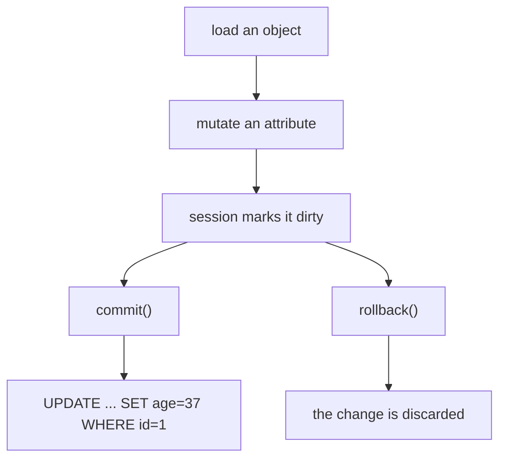

Updating a record is straightforward:

1. query the row
2. modify attributes
3. commit

## Example

```python
with app.app_context():
    user = User.query.filter_by(username="ravi").first()
    if user:
        user.username = "ravik"
        db.session.commit()
```

## Common patterns

- Update timestamps on every change
- Validate before saving (especially on user-editable fields)

## Handling missing rows

If a record doesn’t exist, decide your behavior:

- return 404 for web routes
- return 400 or 404 for APIs

Example in a route:

```python
user = User.query.get_or_404(user_id)
user.username = new_username
db.session.commit()
```

## Partial updates

In APIs, you often implement PATCH semantics.

Be careful to only update provided fields and validate them.

## Updating is assignment plus commit

There is no `update()` call for a loaded object. You change the attribute and the session
notices:

```python title="update.py" showLineNumbers{1}
row = db.session.scalar(sa.select(User).where(User.name == "ada"))
row.age = 37

db.session.dirty        # IdentitySet([<User 1>])   <- the session is tracking it
db.session.commit()     # issues the UPDATE
```

Measured: `db.session.dirty` was non-empty before the commit, and the stored age was
**37** afterwards.



The unit-of-work pattern is what makes this work: the session compares each tracked
object against the values it loaded, and writes only the columns that actually changed.

## Bulk updates skip the objects entirely

```python title="bulk.py" showLineNumbers{1}
result = db.session.execute(
    sa.update(User).where(User.age < 18).values(active=False)
)
db.session.commit()
result.rowcount        # how many rows the database matched
```

This is one statement, so it is far faster than loading rows and mutating them. The
trade-off is that it bypasses the ORM: objects already in the session keep their old
values, and any Python-level defaults or validation on the model do not run.

:::caution[After a bulk update, loaded objects are stale]
Measured: an object loaded with `views = 1`, then a raw `UPDATE note SET views = 99`,
still reported `views = 1`. The session returns the instance it already has, from its
identity map — it does not re-query.

```python title="refresh.py" showLineNumbers{1}
db.session.expire(obj)      # next attribute access re-reads from the database
# obj.views -> 99
db.session.expire_all()     # same, for every object in the session
```
:::

## Update-or-create

```python title="upsert.py" showLineNumbers{1}
user = db.session.scalar(sa.select(User).where(User.name == name))
if user is None:
    user = User(name=name)
    db.session.add(user)
user.age = age
db.session.commit()
```

Correct for a single writer, and racy under concurrency — two requests can both find
`None`. A `unique` constraint turns the race into an `IntegrityError` you can catch and
retry, which is the difference between a duplicate row and a handled collision.

## See it move

```p5 title="Loaded, mutated, committed" desc="The session tracks a loaded object and writes only what changed. A bulk update bypasses it, leaving loaded objects stale until they are expired." height="340"
let step = 0;
const STEPS = [
  { n: 'load', obj: 1, db: 1, dirty: false, note: 'the session now tracks this object' },
  { n: 'row.age = 37', obj: 37, db: 1, dirty: true, note: 'in memory only - the database is unchanged' },
  { n: 'commit()', obj: 37, db: 37, dirty: false, note: 'UPDATE issued for the changed column only' },
  { n: 'raw UPDATE ... = 99', obj: 37, db: 99, dirty: false, note: 'the loaded object is now STALE' },
  { n: 'session.expire(obj)', obj: 99, db: 99, dirty: false, note: 'the next attribute read re-queries' },
];

function setup() {
  createCanvas(600, 340);
  textFont('monospace');
}

function draw() {
  background(13, 17, 23);
  const s = STEPS[step];
  const agree = s.obj === s.db;

  noStroke();
  fill(230);
  textSize(13);
  textAlign(LEFT, TOP);
  text('step ' + (step + 1) + ' of 5:  ' + s.n, 24, 16);

  const boxes = [
    { t: 'the Python object', v: s.obj, x: 24 },
    { t: 'the database row', v: s.db, x: 310 },
  ];
  for (let i = 0; i < 2; i++) {
    const b = boxes[i];
    stroke(agree ? color(120, 190, 130) : color(255, 211, 67));
    strokeWeight(1);
    fill(18, 23, 30);
    rect(b.x, 52, 266, 86, 5);
    noStroke();
    fill(110);
    textSize(10);
    textAlign(LEFT, TOP);
    text(b.t, b.x + 14, 64);
    fill(agree ? color(120, 190, 130) : color(255, 211, 67));
    textSize(26);
    text(b.v, b.x + 14, 90);
  }

  noStroke();
  if (!agree) {
    fill(255, 211, 67);
    textSize(12);
    textAlign(CENTER, CENTER);
    text('they disagree', 300, 156);
  } else {
    fill(120, 190, 130);
    textSize(12);
    textAlign(CENTER, CENTER);
    text('in sync', 300, 156);
  }

  stroke(48, 56, 68);
  strokeWeight(1);
  fill(18, 23, 30);
  rect(24, 178, 552, 62, 5);
  noStroke();
  fill(110);
  textSize(10);
  textAlign(LEFT, TOP);
  text('session.dirty', 38, 190);
  fill(s.dirty ? color(255, 211, 67) : 120);
  textSize(12);
  text(s.dirty ? 'IdentitySet([<User 1>])' : 'empty', 38, 210);

  fill(150);
  textSize(11);
  textAlign(LEFT, TOP);
  text(s.note, 24, 256);

  drawBtn(24, 288, 160, 'next step');
  drawBtn(196, 288, 110, 'restart');
}

function drawBtn(x, y, w, label) {
  const hot = mouseX > x && mouseX < x + w && mouseY > y && mouseY < y + 24;
  stroke(hot ? color(255, 211, 67) : color(60, 70, 84));
  strokeWeight(1);
  fill(hot ? color(34, 40, 50) : color(22, 28, 36));
  rect(x, y, w, 24, 4);
  noStroke();
  fill(hot ? color(255, 211, 67) : 200);
  textSize(11);
  textAlign(CENTER, CENTER);
  text(label, x + w / 2, y + 12);
}

function mousePressed() {
  if (mouseY < 288 || mouseY > 312) return;
  if (mouseX > 24 && mouseX < 184) step = min(STEPS.length - 1, step + 1);
  if (mouseX > 196 && mouseX < 306) step = 0;
}
```

## Check yourself

<Quiz
  questions={[
    {
      q: "How do you update a loaded ORM object?",
      options: [
        "call obj.update(age=37)",
        "assign to the attribute and commit; the session tracks the change and issues the UPDATE",
        "call db.session.update(obj)",
        "delete the row and insert a new one",
      ],
      answer: 1,
      explain:
        "Measured db.session.dirty holding the object after the assignment. The unit-of-work pattern compares against the loaded values and writes only the columns that changed.",
    },
    {
      q: "An object is loaded with views = 1, then a raw UPDATE sets views = 99. What does obj.views report?",
      options: [
        "99, because the session re-queries on access",
        "1, because the session returns the instance from its identity map",
        "None, because the value is invalidated",
        "it raises a StaleDataError",
      ],
      answer: 1,
      explain:
        "Measured 1. Call db.session.expire(obj) — or expire_all() — so the next attribute access re-reads from the database, which then measured 99.",
    },
    {
      q: "What is the trade-off of sa.update(...) as a bulk statement?",
      options: [
        "it cannot use a WHERE clause",
        "it is much faster but bypasses the ORM, so loaded objects go stale and model-level defaults or validation do not run",
        "it only works inside a transaction",
        "it always updates every row",
      ],
      answer: 1,
      explain:
        "One statement replaces load-and-mutate, which is a large win on many rows. The cost is that nothing at the Python level participates.",
    },
  ]}
/>
