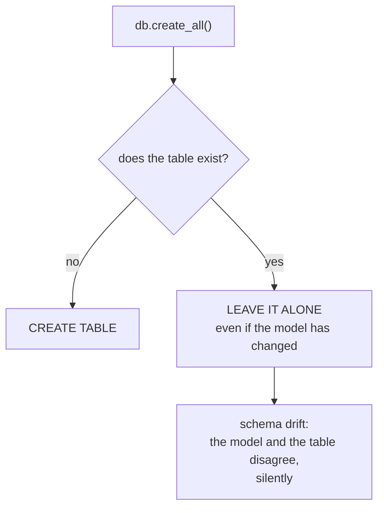

import Quiz from "../../../../components/Quiz.astro";

When you have models, you need to create tables.

For quick demos, you can use `db.create_all()`.

## Example

```python
from flask import Flask
from flask_sqlalchemy import SQLAlchemy

app = Flask(__name__)
app.config["SQLALCHEMY_DATABASE_URI"] = "sqlite:///app.db"
app.config["SQLALCHEMY_TRACK_MODIFICATIONS"] = False

db = SQLAlchemy(app)


class User(db.Model):
    id = db.Column(db.Integer, primary_key=True)
    username = db.Column(db.String(80), unique=True, nullable=False)


with app.app_context():
    db.create_all()
```

### Why app.app_context()?

Database operations often need the Flask application context.

## Important warning

`db.create_all()`:

- creates missing tables
- does **not** handle schema changes safely over time

That’s why real apps use migrations (Flask-Migrate).

Use `create_all()` for:

- learning
- small prototypes

Use migrations for:

- anything you deploy

## `create_all()` creates what is missing, and nothing else

```python title="create.py" showLineNumbers{1}
with app.app_context():
    db.create_all()
```

Measured behaviour:

```text title="first run"
tables now: ['user']
columns: id INTEGER not-null pk, name VARCHAR(20) not-null, age INTEGER not-null
```

```text title="running it a second time"
no error, no change
```

It is safe to call on every start. It issues `CREATE TABLE IF NOT EXISTS` for each model
it knows about, so existing tables are left alone.

That last part is also its limitation:



## The silent failure that follows

Measured: a column was added to the model, `create_all()` was run again, and the table
was unchanged.

```text title="measured"
added a column to the model, ran create_all() -> columns still ['id','title','body','views']
no ALTER TABLE, no error, no warning
```

The application then fails at query time with something like *no such column:
note.author*, far from the change that caused it.

:::danger[`create_all()` is not a migration tool]
It cannot add, drop, rename or retype a column. As soon as a schema outlives its first
deployment you need real migrations — `Flask-Migrate`, which wraps Alembic:

```bash title="migrations"
flask db init
flask db migrate -m "add author to note"
flask db upgrade
```

Alembic diffs the models against the database and generates the `ALTER TABLE` steps, and
each one is a file you can review and roll back.
:::

For a development reset, dropping is explicit and obviously destructive:

```python title="reset.py" showLineNumbers{1}
with app.app_context():
    db.drop_all()      # deletes every table and everything in them
    db.create_all()
```

## See it move

```p5 title="Why create_all cannot fix a changed model" desc="create_all issues CREATE TABLE IF NOT EXISTS. An existing table is skipped entirely, so a model change never reaches the schema." height="340"
let modelCols = 3;
let created = false;
let dbCols = 0;

function setup() {
  createCanvas(600, 340);
  textFont('monospace');
}

const NAMES = ['id', 'title', 'body', 'author', 'tags'];

function draw() {
  background(13, 17, 23);
  const drift = created && dbCols < modelCols;

  noStroke();
  fill(230);
  textSize(13);
  textAlign(LEFT, TOP);
  text('the model', 24, 16);
  for (let i = 0; i < modelCols; i++) {
    const y = 42 + i * 30;
    stroke(75, 139, 190);
    strokeWeight(1);
    fill(20, 30, 42);
    rect(24, y, 220, 26, 3);
    noStroke();
    fill(75, 139, 190);
    textSize(11);
    textAlign(LEFT, CENTER);
    text(NAMES[i], 36, y + 13);
  }

  fill(230);
  textSize(13);
  textAlign(LEFT, TOP);
  text('the table', 320, 16);
  if (!created) {
    noStroke();
    fill(90);
    textSize(11);
    textAlign(LEFT, TOP);
    text('does not exist yet', 320, 44);
  }
  for (let i = 0; i < dbCols; i++) {
    const y = 42 + i * 30;
    stroke(120, 190, 130);
    strokeWeight(1);
    fill(18, 30, 22);
    rect(320, y, 220, 26, 3);
    noStroke();
    fill(120, 190, 130);
    textSize(11);
    textAlign(LEFT, CENTER);
    text(NAMES[i], 332, y + 13);
  }
  for (let i = dbCols; i < modelCols; i++) {
    const y = 42 + i * 30;
    stroke(232, 110, 110);
    strokeWeight(1);
    fill(30, 18, 20);
    rect(320, y, 220, 26, 3);
    noStroke();
    fill(232, 110, 110);
    textSize(11);
    textAlign(LEFT, CENTER);
    text('(missing)', 332, y + 13);
  }

  noStroke();
  textSize(11);
  textAlign(LEFT, TOP);
  if (drift) {
    fill(232, 110, 110);
    text('SCHEMA DRIFT - create_all() skipped the existing table', 24, 200);
    fill(150);
    textSize(10);
    text('queries fail later with: no such column: note.' + NAMES[dbCols], 24, 220);
    text('the fix is a migration, not another create_all()', 24, 238);
  } else if (created) {
    fill(120, 190, 130);
    text('model and table agree', 24, 200);
  } else {
    fill(120);
    text('nothing created yet', 24, 200);
  }

  drawBtn(24, 268, 170, 'add a column to model');
  drawBtn(206, 268, 150, 'run create_all()');
  drawBtn(368, 268, 130, 'drop_all()');
  fill(90);
  textSize(10);
  textAlign(LEFT, TOP);
  text('add a column AFTER creating, then run create_all() again', 24, 304);
}

function drawBtn(x, y, w, label) {
  const hot = mouseX > x && mouseX < x + w && mouseY > y && mouseY < y + 24;
  stroke(hot ? color(255, 211, 67) : color(60, 70, 84));
  strokeWeight(1);
  fill(hot ? color(34, 40, 50) : color(22, 28, 36));
  rect(x, y, w, 24, 4);
  noStroke();
  fill(hot ? color(255, 211, 67) : 200);
  textSize(11);
  textAlign(CENTER, CENTER);
  text(label, x + w / 2, y + 12);
}

function mousePressed() {
  if (mouseY < 268 || mouseY > 292) return;
  if (mouseX > 24 && mouseX < 194) modelCols = min(5, modelCols + 1);
  if (mouseX > 206 && mouseX < 356) { if (!created) { created = true; dbCols = modelCols; } }
  if (mouseX > 368 && mouseX < 498) { created = false; dbCols = 0; }
}
```

## Check yourself

<Quiz
  questions={[
    {
      q: "You add a column to a model and run db.create_all() again. What happens to the existing table?",
      options: [
        "the column is added with ALTER TABLE",
        "the table is dropped and recreated",
        "nothing at all: create_all skips tables that already exist, with no error or warning",
        "an exception is raised warning of schema drift",
      ],
      answer: 2,
      explain:
        "Measured: the columns were unchanged. The mismatch surfaces much later as a query error such as no such column. create_all is not a migration tool.",
    },
    {
      q: "Is it safe to call db.create_all() every time the app starts?",
      options: [
        "no, it recreates the tables and loses data",
        "yes: it only creates tables that do not exist, and running it twice measured no error and no change",
        "only in development",
        "only if you call drop_all first",
      ],
      answer: 1,
      explain:
        "It issues CREATE TABLE IF NOT EXISTS for each known model. It is harmless to repeat — and equally powerless to update anything.",
    },
    {
      q: "What should you use once a schema needs to change after its first deployment?",
      options: [
        "drop_all followed by create_all",
        "Flask-Migrate, which wraps Alembic to generate reviewable ALTER TABLE steps",
        "call create_all with a force flag",
        "edit the database by hand and update the model to match",
      ],
      answer: 1,
      explain:
        "flask db migrate diffs models against the database and writes a migration file you can review and roll back. drop_all would destroy production data.",
    },
  ]}
/>
