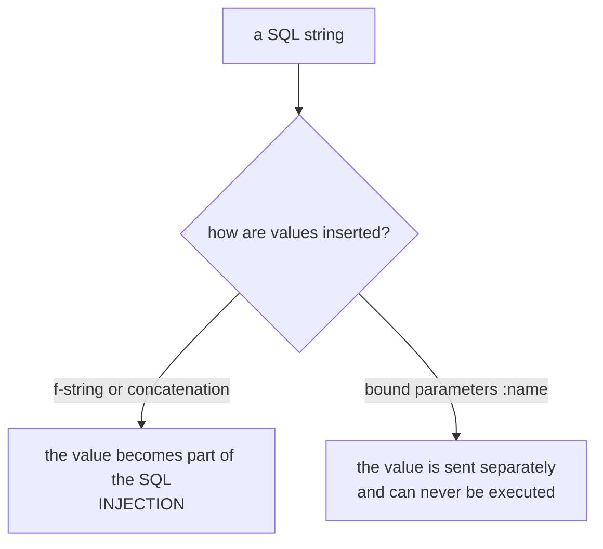

Sometimes raw SQL is the simplest solution:

- complex reporting queries
- bulk updates
- vendor-specific SQL features

The ORM is great, but you can mix approaches.

## Executing SQL with SQLAlchemy

In modern SQLAlchemy, you typically use `text()`.

```python
from sqlalchemy import text

with db.engine.connect() as conn:
    result = conn.execute(text("SELECT 1"))
    print(result.scalar())
```

## Parameter binding (important)

Never build SQL by string concatenation.

```python
from sqlalchemy import text

sql = text("SELECT * FROM users WHERE username = :username")
result = db.session.execute(sql, {"username": "ravi"})
rows = result.fetchall()
```

This prevents SQL injection.

## When to prefer ORM

Use ORM when:

- you’re doing normal CRUD
- you want relationships and model validation

Use raw SQL when:

- query is complex and ORM becomes unreadable
- you need performance tuning (carefully)

Best approach: be pragmatic and keep code understandable.

## Raw SQL must be wrapped in `text()`

```python title="raw.py" showLineNumbers{1}
db.session.execute("SELECT 1")
# ArgumentError: Textual SQL expression 'SELECT 1' should be explicitly declared as text('SELECT 1')

db.session.execute(sa.text("SELECT COUNT(*) AS n FROM note")).one()
# (1,)      row.n -> 1
```

Measured both. The requirement is not bureaucracy: it makes every string that reaches the
database visible at the call site, so a reviewer can see exactly where raw SQL is used.



## The injection, measured

```python title="injection.py" showLineNumbers{1}
name = "a' OR '1'='1"

# parameterised — the value is data
db.session.execute(sa.text("SELECT COUNT(*) FROM note WHERE title = :t"), {"t": name})
# -> 0 rows        the whole string was compared as a literal title

# f-string — the value becomes code
db.session.execute(sa.text(f"SELECT COUNT(*) FROM note WHERE title = '{name}'"))
# -> 1 row         the injected OR matched everything
```

The same input, the same table: **0 rows against 1 row**. In a `WHERE` on a login query
that difference is the whole authentication check. Parameters are not an optimisation —
they are the boundary between data and code, and an f-string erases it.

:::danger[There is no safe way to interpolate a value into SQL]
Not escaping it yourself, not quoting it, not validating it first. Use bound parameters
every time. If part of the query itself must vary — a column to sort by, say — pick it
from an allow-list of known-good names rather than passing user input through.
:::

## Reading results

```python title="results.py" showLineNumbers{1}
row = db.session.execute(sa.text("SELECT COUNT(*) AS n FROM note")).one()
row.n                # attribute access by label
row[0]               # or by position

db.session.execute(sa.text("SELECT * FROM note")).all()       # list of rows
db.session.scalar(sa.text("SELECT COUNT(*) FROM note"))       # a single value
```

## Raw SQL and the session do not automatically agree

```python title="stale.py" showLineNumbers{1}
obj = db.session.scalar(sa.select(Note))     # views = 1
db.session.execute(sa.text("UPDATE note SET views = 99"))
obj.views                                     # 1   <- still the loaded value
db.session.expire(obj)
obj.views                                     # 99
```

Measured. The session hands back the object it already has; a raw statement it did not
issue through the ORM does not invalidate anything. Expire what you touched, or re-query.

## When raw SQL is the right answer

- A query the ORM expresses awkwardly — window functions, recursive CTEs, `EXPLAIN`.
- Bulk work where loading objects would be wasteful.
- Database-specific features with no portable equivalent.

For everything else the ORM gives you parameterisation for free, composes safely, and
survives a schema rename. Reach for `text()` deliberately, not by default.

## See it move

```p5 title="Bound parameter against f-string" desc="A bound parameter is sent separately from the SQL and can never be executed. An f-string makes the value part of the statement." height="340"
let param = true;

function setup() {
  createCanvas(600, 340);
  textFont('monospace');
}

function draw() {
  background(13, 17, 23);
  const evil = "a' OR '1'='1";

  noStroke();
  fill(230);
  textSize(12);
  textAlign(LEFT, TOP);
  text('user supplied:  ' + evil, 24, 16);

  const c = param ? color(120, 190, 130) : color(232, 110, 110);
  stroke(c);
  strokeWeight(1);
  fill(18, 23, 30);
  rect(24, 48, 552, 74, 5);
  noStroke();
  fill(110);
  textSize(10);
  textAlign(LEFT, TOP);
  text('the SQL the database receives', 38, 58);
  fill(c);
  textSize(12);
  if (param) {
    text('SELECT COUNT(*) FROM note WHERE title = :t', 38, 80);
    fill(120);
    textSize(10);
    text("with parameters {t: \u0022a' OR '1'='1\u0022}  - sent separately", 38, 102);
  } else {
    text("SELECT COUNT(*) FROM note WHERE title = 'a' OR '1'='1'", 38, 80);
    fill(232, 110, 110);
    textSize(10);
    text('the quote closed the literal and OR became part of the query', 38, 102);
  }

  stroke(c);
  strokeWeight(1);
  fill(18, 23, 30);
  rect(24, 138, 552, 76, 5);
  noStroke();
  fill(110);
  textSize(10);
  textAlign(LEFT, TOP);
  text('result', 38, 148);
  fill(c);
  textSize(24);
  text(param ? '0 rows' : '1 row', 38, 168);
  fill(150);
  textSize(10);
  text(param ? 'the whole string was compared as a title' : 'the injected OR matched every row', 150, 178);

  noStroke();
  fill(param ? color(120, 190, 130) : color(232, 110, 110));
  textSize(11);
  textAlign(LEFT, TOP);
  text(param ? 'the value was data' : 'the value became code', 24, 230);

  drawBtn(24, 262, 250, param ? 'using: bound parameter' : 'using: f-string');
  fill(90);
  textSize(10);
  textAlign(LEFT, TOP);
  text('same input, same table, different answer', 24, 300);
}

function drawBtn(x, y, w, label) {
  const hot = mouseX > x && mouseX < x + w && mouseY > y && mouseY < y + 24;
  stroke(hot ? color(255, 211, 67) : color(60, 70, 84));
  strokeWeight(1);
  fill(hot ? color(34, 40, 50) : color(22, 28, 36));
  rect(x, y, w, 24, 4);
  noStroke();
  fill(hot ? color(255, 211, 67) : 200);
  textSize(11);
  textAlign(CENTER, CENTER);
  text(label, x + w / 2, y + 12);
}

function mousePressed() {
  if (mouseY > 262 && mouseY < 286 && mouseX > 24 && mouseX < 274) param = !param;
}
```

## Check yourself

<Quiz
  questions={[
    {
      q: "db.session.execute('SELECT 1') raises ArgumentError. What does SQLAlchemy require?",
      options: [
        "the statement must be uppercase",
        "the string must be wrapped in sa.text(), which makes every raw SQL site visible at the call",
        "raw SQL is not supported at all",
        "a connection must be opened manually first",
      ],
      answer: 1,
      explain:
        "The measured message asks for text('SELECT 1') explicitly. Requiring the wrapper means a reviewer can grep for exactly where raw SQL enters the codebase.",
    },
    {
      q: "With the input a' OR '1'='1, a parameterised query returned 0 rows and an f-string query returned 1. Why?",
      options: [
        "the parameterised version had a syntax error",
        "a bound parameter is sent separately from the statement and compared as a literal, while the f-string made the input part of the SQL",
        "the f-string version was faster and matched a cached row",
        "the two queries targeted different tables",
      ],
      answer: 1,
      explain:
        "The quote in the input closed the string literal and the OR became part of the query. On a login check that difference is the entire authentication.",
    },
    {
      q: "Part of a query must vary — the column to ORDER BY comes from the user. What is the correct approach?",
      options: [
        "bind it as a parameter like any value",
        "escape the value and interpolate it",
        "map the input against an allow-list of known column names",
        "validate that it contains no quotes, then interpolate",
      ],
      answer: 2,
      explain:
        "Bound parameters carry values, not identifiers, so a column name cannot be bound. An allow-list means user input selects from names you wrote rather than supplying any.",
    },
  ]}
/>
