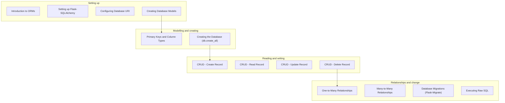

Most real apps need persistent data.

In Flask, the most common approach is:

- **Flask-SQLAlchemy** (integration layer)
- **SQLAlchemy** (ORM)
- **Flask-Migrate** (migrations via Alembic)

## You’ll learn

- What an ORM is and why it matters
- Setting up Flask-SQLAlchemy
- Defining models and data types
- Creating tables with `db.create_all()` (dev only)
- CRUD operations (create/read/update/delete)
- Relationships (one-to-many, many-to-many)
- Migrations (Flask-Migrate)
- Raw SQL when you need it

## Phase checklist

1. Introduction to ORMs
2. Setting up Flask-SQLAlchemy
3. Configuring Database URI
4. Creating Database Models
5. Primary Keys and Column Types
6. Creating the Database (db.create_all)
7. CRUD - Create Record
8. CRUD - Read Record
9. CRUD - Update Record
10. CRUD - Delete Record
11. One-to-Many Relationships
12. Many-to-Many Relationships
13. Database Migrations (Flask-Migrate)
14. Executing Raw SQL

## The phase at a glance

This phase exists to **store data that outlives the request**. It assumes forms producing validated values, and once it is done you can build a site whose data survives a restart.



## Where this sits in the track

```p5 title="The track, and what each phase unlocks" desc="Each phase assumes the one before it. Click a phase to see what you can build once it is done." height="330"
let sel = 4;
const NAMES = ['Fundamentals', 'Routing', 'Templating', 'Forms', 'Databases', 'Auth', 'Architecture', 'REST APIs', 'Deployment'];
const BUILDS = ['a page that says hello', 'a site with several URLs and a JSON endpoint', 'a real multi-page site with a shared layout', 'a site that accepts and validates input', 'a site whose data survives a restart', 'a site with accounts and private pages', 'an app split into modules, configurable per environment', 'an API other programs can call', 'all of it, running on a public server'];

function setup() {
  createCanvas(600, 330);
  textFont('monospace');
}

function draw() {
  background(13, 17, 23);
  noStroke();
  fill(230);
  textSize(13);
  textAlign(LEFT, TOP);
  text('the Flask track', 24, 16);
  fill(120);
  textSize(11);
  text('click a phase', 24, 36);

  for (let i = 0; i < NAMES.length; i++) {
    const col = i % 3;
    const row = floor(i / 3);
    const x = 24 + col * 186;
    const y = 62 + row * 56;
    const done = i < sel;
    const on = i === sel;
    stroke(on ? color(255, 211, 67) : (done ? color(120, 190, 130) : color(48, 56, 68)));
    strokeWeight(on ? 2 : 1);
    fill(on ? color(38, 34, 18) : (done ? color(18, 28, 22) : color(17, 22, 29)));
    rect(x, y, 174, 46, 4);
    noStroke();
    fill(on ? color(255, 211, 67) : (done ? color(120, 190, 130) : 110));
    textSize(11);
    textAlign(LEFT, TOP);
    text('Phase ' + (i + 1), x + 12, y + 8);
    fill(on ? color(255, 211, 67) : (done ? 150 : 90));
    textSize(11);
    text(NAMES[i], x + 12, y + 26);
  }

  stroke(48, 56, 68);
  strokeWeight(1);
  fill(18, 23, 30);
  rect(24, 240, 552, 62, 5);
  noStroke();
  fill(110);
  textSize(10);
  textAlign(LEFT, TOP);
  text('after Phase ' + (sel + 1) + ' you can build', 38, 250);
  fill(120, 190, 130);
  textSize(13);
  text(BUILDS[sel], 38, 272);

  fill(90);
  textSize(10);
  textAlign(LEFT, TOP);
  text('green = assumed knowledge by the time you reach the highlighted phase', 24, 312);
}

function mousePressed() {
  for (let i = 0; i < NAMES.length; i++) {
    const col = i % 3;
    const row = floor(i / 3);
    const x = 24 + col * 186;
    const y = 62 + row * 56;
    if (mouseX > x && mouseX < x + 174 && mouseY > y && mouseY < y + 46) sel = i;
  }
}
```

## The pages, in reading order

| # | page |
|--:|:--|
| 1 | Introduction to ORMs |
| 2 | Setting up Flask-SQLAlchemy |
| 3 | Configuring Database URI |
| 4 | Creating Database Models |
| 5 | Primary Keys and Column Types |
| 6 | Creating the Database (db.create_all) |
| 7 | CRUD - Create Record |
| 8 | CRUD - Read Record |
| 9 | CRUD - Update Record |
| 10 | CRUD - Delete Record |
| 11 | One-to-Many Relationships |
| 12 | Many-to-Many Relationships |
| 13 | Database Migrations (Flask-Migrate) |
| 14 | Executing Raw SQL |

14 pages. They are ordered so that each one only uses ideas from the pages above it — reading out of order mostly works, but the examples assume what came before.

## Check yourself

<Quiz
  questions={[
    {
      q: "What is the largest phase in the track about?",
      options: [
        "making data outlive the request, and modelling relationships between it",
        "improving performance",
        "styling database output",
        "deploying a database server",
      ],
      answer: 0,
      explain:
        "Fourteen pages cover setup, modelling, CRUD, relationships and migrations — the point at which an app stops being stateless.",
    },
    {
      q: "Why does Database Migrations appear near the end of this phase rather than next to db.create_all?",
      options: [
        "migrations are optional",
        "create_all is enough until the schema changes, and migrations are the answer to that specific later problem",
        "Flask-Migrate cannot be installed earlier",
        "migrations only work on relationships",
      ],
      answer: 1,
      explain:
        "create_all creates missing tables and never alters existing ones. Migrations exist for the moment a schema has to change after it has been deployed.",
    },
    {
      q: "What do the phase overview pages give you that the individual pages do not?",
      options: [
        "the full code for each topic",
        "the reading order, what the phase assumes, and what you can build once it is done",
        "a downloadable project template",
        "the deployment configuration",
      ],
      answer: 1,
      explain:
        "Each overview lists its pages in sidebar order and names the phase's prerequisites and outcome, so you can tell whether you are ready for it.",
    },
  ]}
/>
