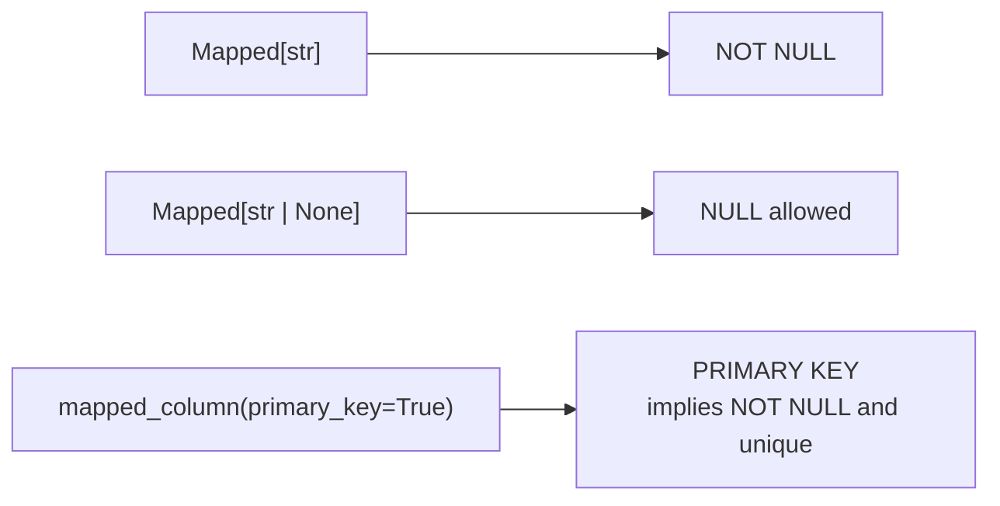

## Primary keys

A **primary key** uniquely identifies a row.

Most tables use an auto-incrementing integer `id`:

```python
id = db.Column(db.Integer, primary_key=True)
```

## Common column types

- `db.Integer`
- `db.String(length)`
- `db.Text`
- `db.Boolean`
- `db.DateTime`
- `db.Float`
- `db.Numeric`

Example:

```python
created_at = db.Column(db.DateTime, nullable=False)
```

## Constraints

- `nullable=False` (required)
- `unique=True` (unique constraint)
- `index=True` (create an index for faster lookups)

Example:

```python
email = db.Column(db.String(120), unique=True, index=True, nullable=False)
```

## Defaults

You can set default values:

```python
is_active = db.Column(db.Boolean, default=True, nullable=False)
```

For timestamps, you typically use a callable (not a fixed time):

```python
import datetime
created_at = db.Column(db.DateTime, default=datetime.datetime.utcnow, nullable=False)
```

## Foreign keys (preview)

Relationships depend on foreign keys:

```python
user_id = db.Column(db.Integer, db.ForeignKey("users.id"), nullable=False)
```

We’ll build relationships later in this phase.

## The type annotation decides nullability

In SQLAlchemy 2.0 style, `Mapped[T]` is not documentation — the compiler of your schema
reads it:

```python title="models.py" showLineNumbers{1}
class Note(db.Model):
    id: Mapped[int] = mapped_column(primary_key=True)
    title: Mapped[str]                    # NOT NULL
    body: Mapped[str | None]              # nullable
    views: Mapped[int] = mapped_column(default=0)
```

Measured schema:

| column | type | nullable | primary key |
|:--|:--|:--|:--|
| `id` | `INTEGER` | no | **yes** |
| `title` | `VARCHAR` | **no** | no |
| `body` | `VARCHAR` | **yes** | no |
| `views` | `INTEGER` | no | no |



Adding `| None` is the whole difference between a column that must have a value and one
that may not. It is easy to miss in review, and the database will enforce whichever you
wrote.

## Primary keys

An integer primary key is assigned **by the database**, which is why it does not exist
until the row is written:

```python title="pk.py" showLineNumbers{1}
u = User(name="ada", age=36)
db.session.add(u)
print(u.id)          # None    <- nothing has been INSERTed yet
db.session.commit()
print(u.id)          # 1       <- the database assigned it
```

Measured exactly that. Code that needs the id — to build a URL, to write a related row —
must commit (or `flush()`) first.

## Types worth choosing deliberately

| SQLAlchemy | use for | note |
|:--|:--|:--|
| `String(n)` | short text | the length is enforced by most databases, ignored by SQLite |
| `Text` | long text | no length limit |
| `Integer` | counts, ids | |
| `Numeric(10, 2)` | **money** | exact decimal arithmetic |
| `Float` | measurements | binary floating point, do not use for currency |
| `Boolean` | flags | stored as an integer in SQLite |
| `DateTime(timezone=True)` | timestamps | store UTC, convert on display |

:::danger[Never store money in a Float]
`Float` is binary floating point: 0.1 + 0.2 is not 0.3. Use `Numeric(10, 2)`, which maps
to an exact decimal type and returns `Decimal` in Python. A rounding error in a currency
column is a bug you cannot fix retrospectively, because the wrong value is what was
saved.
:::

:::note[`String(20)` is not enforced by SQLite]
SQLite treats the length as advisory, so a 500-character name inserts happily in
development and fails in PostgreSQL in production. Validate lengths in your form as well
as declaring them in the model.
:::

## Constraints belong in the database

```python title="constraints.py" showLineNumbers{1}
name: Mapped[str] = mapped_column(sa.String(20), unique=True)
```

```text title="measured, inserting a duplicate"
IntegrityError: UNIQUE constraint failed: user.name
```

An application check ("does this name exist?") races with other requests — two can both
find nothing and both insert. The database constraint is the only check that cannot be
raced. Keep the friendly check for a good error message, and let the constraint be the
guarantee.

## See it move

```p5 title="What the annotation compiles to" desc="Mapped[T] is NOT NULL, Mapped[T | None] is nullable, and a primary key is assigned by the database on commit." height="340"
let sel = 0;
const COLS = [
  { py: 'id: Mapped[int] = mapped_column(primary_key=True)', sql: 'INTEGER NOT NULL PRIMARY KEY', note: 'assigned by the database on commit' },
  { py: 'title: Mapped[str]', sql: 'VARCHAR NOT NULL', note: 'no | None, so a value is required' },
  { py: 'body: Mapped[str | None]', sql: 'VARCHAR', note: 'the | None is the whole difference' },
  { py: 'price: Mapped[Decimal] = mapped_column(Numeric(10,2))', sql: 'NUMERIC(10, 2) NOT NULL', note: 'exact decimal - the right type for money' },
  { py: 'name: Mapped[str] = mapped_column(String(20), unique=True)', sql: 'VARCHAR(20) NOT NULL UNIQUE', note: 'a duplicate raises IntegrityError' },
];

function setup() {
  createCanvas(600, 340);
  textFont('monospace');
}

function draw() {
  background(13, 17, 23);
  const c = COLS[sel];

  noStroke();
  fill(230);
  textSize(13);
  textAlign(LEFT, TOP);
  text('the model says', 24, 16);

  for (let i = 0; i < COLS.length; i++) {
    const y = 42 + i * 28;
    const on = i === sel;
    stroke(on ? color(75, 139, 190) : color(40, 48, 58));
    strokeWeight(on ? 2 : 1);
    fill(on ? color(20, 30, 42) : color(17, 22, 29));
    rect(24, y, 552, 24, 3);
    noStroke();
    fill(on ? color(75, 139, 190) : 110);
    textSize(10);
    textAlign(LEFT, CENTER);
    const t = COLS[i].py;
    text(t.length > 62 ? t.slice(0, 61) + '.' : t, 34, y + 12);
  }

  stroke(60, 70, 84);
  strokeWeight(1);
  line(300, 190, 300, 208);
  noStroke();
  fill(90);
  textSize(9);
  textAlign(LEFT, CENTER);
  text('compiles to', 308, 199);

  stroke(120, 190, 130);
  strokeWeight(1);
  fill(18, 30, 22);
  rect(24, 214, 552, 62, 5);
  noStroke();
  fill(120, 190, 130);
  textSize(14);
  textAlign(LEFT, TOP);
  text(c.sql, 38, 230);
  fill(150);
  textSize(10);
  text(c.note, 38, 254);

  fill(90);
  textSize(10);
  textAlign(LEFT, TOP);
  text('click a column', 24, 296);
}

function mousePressed() {
  for (let i = 0; i < COLS.length; i++) {
    const y = 42 + i * 28;
    if (mouseX > 24 && mouseX < 576 && mouseY > y && mouseY < y + 24) sel = i;
  }
}
```

## Check yourself

<Quiz
  questions={[
    {
      q: "What is the difference between title: Mapped[str] and body: Mapped[str | None]?",
      options: [
        "nothing; the annotation is only for type checkers",
        "the first compiles to NOT NULL and the second allows NULL",
        "the second creates an index",
        "the first is a primary key",
      ],
      answer: 1,
      explain:
        "Measured: title came out nullable=False and body nullable=True. The annotation drives the schema, so adding or omitting | None changes what the database enforces.",
    },
    {
      q: "After db.session.add(u) but before commit, what is u.id for an integer primary key?",
      options: [
        "0",
        "None, because no INSERT has run and the database assigns the value",
        "a temporary negative number",
        "it raises AttributeError",
      ],
      answer: 1,
      explain:
        "Measured None before commit and 1 after. Anything needing the id — a URL, a related row — must commit or flush first.",
    },
    {
      q: "Why store a currency amount in Numeric(10, 2) rather than Float?",
      options: [
        "Numeric is faster",
        "Float is binary floating point and cannot represent decimal fractions exactly, so amounts drift",
        "Float has a smaller maximum value",
        "Numeric automatically formats the currency symbol",
      ],
      answer: 1,
      explain:
        "0.1 + 0.2 is not 0.3 in binary floating point. Numeric maps to an exact decimal type and returns Decimal in Python. A rounding error in stored money cannot be corrected after the fact.",
    },
    {
      q: "Why rely on a UNIQUE constraint rather than checking for an existing row first?",
      options: [
        "the check is slower",
        "two concurrent requests can both find nothing and both insert; only the database constraint cannot be raced",
        "the constraint gives a friendlier error message",
        "application checks do not work with SQLite",
      ],
      answer: 1,
      explain:
        "Measured the constraint firing as IntegrityError: UNIQUE constraint failed: user.name. Keep the application check for a good message, and let the constraint be the guarantee.",
    },
  ]}
/>
