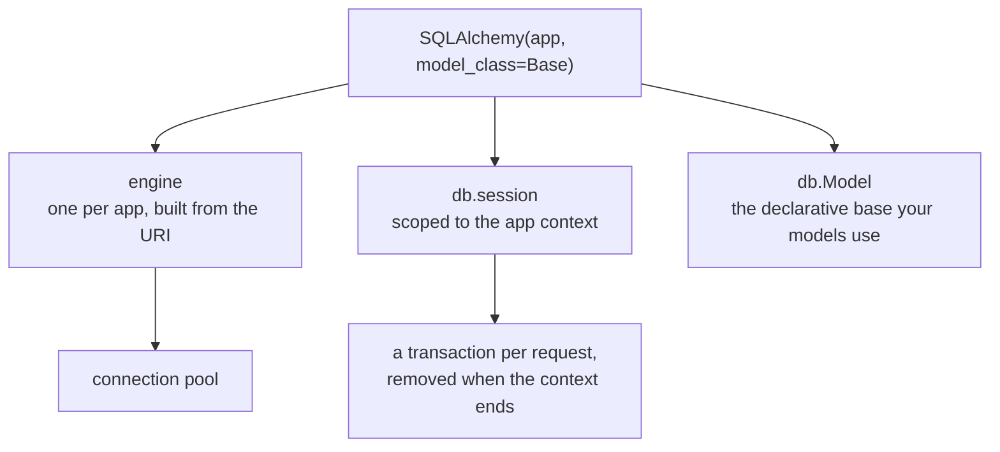

import Quiz from "../../../../components/Quiz.astro";

## Install

```bash
pip install Flask-SQLAlchemy
```

## Minimal setup example

```python
from flask import Flask
from flask_sqlalchemy import SQLAlchemy

app = Flask(__name__)
app.config["SQLALCHEMY_DATABASE_URI"] = "sqlite:///app.db"

# recommended: disable noisy signaling
app.config["SQLALCHEMY_TRACK_MODIFICATIONS"] = False

db = SQLAlchemy(app)
```

This creates a `db` object that provides:

- `db.Model` base class for models
- `db.session` for transactions
- typed columns like `db.Column`, `db.String`, `db.Integer`

## Where should db live in larger apps?

For scalable structure, you’ll often do:

- `db = SQLAlchemy()` (no app yet)
- later: `db.init_app(app)` inside an app factory

We’ll go deeper in the architecture phase (Blueprints + factory).

import DataCampExercise from "../../../../components/DataCampExercise.astro";

## 🧪 Try It Yourself

### Exercise 1 – Create a Flask App

<DataCampExercise
  lang="python"
  hint={`Import Flask, create \`app = Flask(__name__)\`, then define a route.`}
  code={`# Task: Exercise 1 – Create a Flask App
# (Simulated – we run the route function directly)
from flask import Flask

app = ___(  __name__  )   # replace ___ with Flask

@app.route("/")
def home():
    return "Hello, Flask!"

# Simulate calling the route
with app.test_client() as client:
    r = client.get("/")
    print(r.data.decode())

# ── Expected Output ───────────────────────────────────────────
# Hello, Flask!
# ──────────────────────────────────────────────────────────────`}
  solution={`from flask import Flask

app = Flask(__name__)

@app.route("/")
def home():
    return "Hello, Flask!"

with app.test_client() as client:
    r = client.get("/")
    print(r.data.decode())`}
  sct={`test_output_contains("Hello, Flask!")
success_msg("First Flask route works!")`}
  height={148}
/>

### Exercise 2 – Dynamic Route

<DataCampExercise
  lang="python"
  hint={`Use \`<name>\` in the route path and add it as a function parameter.`}
  code={`# Task: Exercise 2 – Dynamic Route
from flask import Flask

app = Flask(__name__)

# Hint: add a <name> variable to the route
@app.route("/greet/<___>")   # replace ___ with name
def greet(name):
    return f"Hello, {name}!"

with app.test_client() as c:
    print(c.get("/greet/Alice").data.decode())

# ── Expected Output ───────────────────────────────────────────
# Hello, Alice!
# ──────────────────────────────────────────────────────────────`}
  solution={`from flask import Flask

app = Flask(__name__)

@app.route("/greet/<name>")
def greet(name):
    return f"Hello, {name}!"

with app.test_client() as c:
    print(c.get("/greet/Alice").data.decode())`}
  sct={`test_output_contains("Hello, Alice!")
success_msg("Dynamic routes work!")`}
  height={140}
/>

### Exercise 3 – Return JSON

<DataCampExercise
  lang="python"
  hint={`Use \`flask.jsonify(data)\` to return a JSON response.`}
  code={`# Task: Exercise 3 – Return JSON
from flask import Flask, jsonify

app = Flask(__name__)

@app.route("/status")
def status():
    # Hint: use jsonify to return a dict as JSON
    return ___({"ok": True, "code": 200})   # replace ___ with jsonify

with app.test_client() as c:
    import json
    data = json.loads(c.get("/status").data)
    print("ok:", data["ok"])
    print("code:", data["code"])

# ── Expected Output ───────────────────────────────────────────
# ok: True
# code: 200
# ──────────────────────────────────────────────────────────────`}
  solution={`from flask import Flask, jsonify
import json

app = Flask(__name__)

@app.route("/status")
def status():
    return jsonify({"ok": True, "code": 200})

with app.test_client() as c:
    data = json.loads(c.get("/status").data)
    print("ok:", data["ok"])
    print("code:", data["code"])`}
  sct={`test_output_contains("ok: True")
test_output_contains("code: 200")
success_msg("jsonify returns JSON responses!")`}
  height={152}
/>

## What the extension adds

`SQLAlchemy(app)` wires three things together: an engine per app, a scoped session tied
to the request, and a `Model` base your classes inherit from.



```python title="app.py" showLineNumbers{1}
import sqlalchemy as sa
from flask import Flask
from flask_sqlalchemy import SQLAlchemy
from sqlalchemy.orm import DeclarativeBase, Mapped, mapped_column

class Base(DeclarativeBase):
    pass

app = Flask(__name__)
app.config["SQLALCHEMY_DATABASE_URI"] = "sqlite:///demo.db"
db = SQLAlchemy(app, model_class=Base)

class User(db.Model):
    id: Mapped[int] = mapped_column(primary_key=True)
    name: Mapped[str] = mapped_column(sa.String(20), unique=True)
    age: Mapped[int] = mapped_column(default=0)
```

The table name is derived from the class name, lowercased — `User` became **`user`**,
measured. Set `__tablename__` explicitly when you want something else, and note that
some names (`user` in PostgreSQL) are reserved words worth avoiding.

## Almost everything needs an application context

```python title="context.py" showLineNumbers{1}
db.engine
# RuntimeError: Working outside of application context.
```

Measured exactly that. The engine is resolved from `current_app`, so it only exists
while a context is active. Inside a view there is always one; in a script, a shell or a
test you push it yourself:

```python title="script.py" showLineNumbers{1}
with app.app_context():
    db.create_all()
    db.session.add(User(name="ada"))
    db.session.commit()
```

`flask shell` pushes a context for you, which is why the same lines work there without
the `with`.

:::note[The session is per-context, not global]
`db.session` is a scoped session: each application context gets its own, and it is
removed when the context ends. That is what stops one request's uncommitted work from
leaking into another, and why background threads need their own context.
:::

## See it move

```p5 title="What SQLAlchemy(app) gives you" desc="An engine per app, a session scoped to the application context, and the declarative base your models inherit from." height="330"
let sel = 0;
const PARTS = [
  { n: 'db.engine', d: 'one engine per app, built from SQLALCHEMY_DATABASE_URI', ctx: true, note: 'holds the connection pool' },
  { n: 'db.session', d: 'scoped to the current application context', ctx: true, note: 'a transaction per request, removed at teardown' },
  { n: 'db.Model', d: 'the declarative base your models subclass', ctx: false, note: 'usable at import time - no context needed' },
];

function setup() {
  createCanvas(600, 330);
  textFont('monospace');
}

function draw() {
  background(13, 17, 23);
  const p = PARTS[sel];

  noStroke();
  fill(230);
  textSize(13);
  textAlign(LEFT, TOP);
  text('db = SQLAlchemy(app, model_class=Base)', 24, 16);

  for (let i = 0; i < PARTS.length; i++) {
    const x = 24 + i * 186;
    const on = i === sel;
    stroke(on ? color(255, 211, 67) : color(48, 56, 68));
    strokeWeight(on ? 2 : 1);
    fill(on ? color(30, 36, 46) : color(17, 22, 29));
    rect(x, 50, 174, 40, 4);
    noStroke();
    fill(on ? color(255, 211, 67) : 140);
    textSize(12);
    textAlign(CENTER, CENTER);
    text(PARTS[i].n, x + 87, 70);
  }

  stroke(60, 70, 84);
  strokeWeight(1);
  fill(18, 23, 30);
  rect(24, 112, 552, 92, 5);
  noStroke();
  fill(200);
  textSize(12);
  textAlign(LEFT, TOP);
  text(p.d, 38, 126);
  fill(120);
  textSize(10);
  text(p.note, 38, 150);

  fill(p.ctx ? color(232, 110, 110) : color(120, 190, 130));
  textSize(11);
  text(p.ctx ? 'needs an application context' : 'no application context needed', 38, 176);

  if (p.ctx) {
    stroke(232, 110, 110);
    strokeWeight(1);
    fill(30, 18, 20);
    rect(24, 216, 552, 52, 4);
    noStroke();
    fill(232, 110, 110);
    textSize(11);
    textAlign(LEFT, TOP);
    text('outside one:  RuntimeError: Working outside of application context.', 38, 228);
    fill(150);
    textSize(10);
    text('fix:  with app.app_context():  ...', 38, 248);
  } else {
    stroke(120, 190, 130);
    strokeWeight(1);
    fill(18, 30, 22);
    rect(24, 216, 552, 52, 4);
    noStroke();
    fill(120, 190, 130);
    textSize(11);
    textAlign(LEFT, TOP);
    text('models can be declared at module import time', 38, 228);
    fill(150);
    textSize(10);
    text('the table is only CREATED later, inside a context', 38, 248);
  }

  fill(90);
  textSize(10);
  textAlign(LEFT, TOP);
  text('click a part', 24, 292);
}

function mousePressed() {
  for (let i = 0; i < PARTS.length; i++) {
    const x = 24 + i * 186;
    if (mouseX > x && mouseX < x + 174 && mouseY > 50 && mouseY < 90) sel = i;
  }
}
```

## Check yourself

<Quiz
  questions={[
    {
      q: "Accessing db.engine at module level raises RuntimeError: Working outside of application context. Why?",
      options: [
        "the database file does not exist yet",
        "the engine is resolved from current_app, which only exists while an application context is active",
        "SQLAlchemy must be initialised after the first request",
        "the URI was not configured",
      ],
      answer: 1,
      explain:
        "Views always run inside a context. In a script or test you push one yourself with app.app_context(); flask shell pushes one for you.",
    },
    {
      q: "A model class is named User and no __tablename__ is set. What is the table called?",
      options: [
        "User",
        "user",
        "users",
        "tbl_user",
      ],
      answer: 1,
      explain:
        "Measured: the table was created as user, the class name lowercased. Set __tablename__ explicitly when you want a different name — note that user is a reserved word in PostgreSQL.",
    },
    {
      q: "What does it mean that db.session is scoped to the application context?",
      options: [
        "there is one global session shared by every request",
        "each application context gets its own session, removed when the context ends, so requests cannot see each other's uncommitted work",
        "the session is recreated for every query",
        "sessions are shared between threads automatically",
      ],
      answer: 1,
      explain:
        "That isolation is why one request's rollback cannot affect another, and why a background thread needs to push its own context to get a session.",
    },
  ]}
/>
