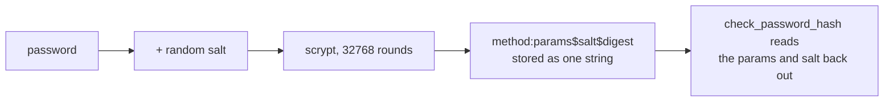

import Quiz from "../../../../components/Quiz.astro";

A login view typically:

1. shows a login form (GET)
2. validates credentials (POST)
3. calls `login_user(user)`
4. redirects to a protected page

## Example (simplified)

```python
from flask import render_template, redirect, url_for, request, flash
from flask_login import login_user
from werkzeug.security import check_password_hash

@app.route("/login", methods=["GET", "POST"])
def login():
    if request.method == "POST":
        username = request.form.get("username", "")
        password = request.form.get("password", "")

        user = User.query.filter_by(username=username).first()
        if not user or not check_password_hash(user.password_hash, password):
            flash("Invalid username or password", "error")
            return redirect(url_for("login"))

        login_user(user)
        return redirect(url_for("dashboard"))

    return render_template("login.html")
```

## Remember to use PRG

After POST, redirect to avoid double submissions.

## Next improvements

In real apps, you’ll typically:

- use Flask-WTF for login form
- rate-limit login attempts
- add "next" parameter support for redirects

## Never store a password. Store a slow hash of it.

```python title="hashing.py" showLineNumbers{1}
from werkzeug.security import generate_password_hash, check_password_hash

h = generate_password_hash("hunter2")
# 'scrypt:32768:8:1$20NQrWQMGlecVTll$aedb65c008a339462616d32e...'

check_password_hash(h, "hunter2")     # True
check_password_hash(h, "hunter3")     # False
```

Measured, hashing the same password twice:

```text title="two hashes of 'hunter2'"
scrypt:32768:8:1$20NQrWQMGlecVTll$aedb65c008a339462616d32e
scrypt:32768:8:1$EpddHvz7mboBCHp1$954dfa0e5a2c040cf84845ef
```

**Different results for the same password.** Each hash carries its own random *salt*, so
identical passwords do not produce identical hashes — which means an attacker cannot see
which users share a password, and cannot precompute a table of common hashes.



The stored string contains everything needed to verify it — algorithm, parameters, salt,
digest — which is why upgrading the algorithm later does not invalidate old hashes.

:::note[The slowness is the feature]
Measured at roughly **300 ms per hash** on this machine. That is deliberate: an attacker
who steals the table must spend the same 300 ms per guess, per user. Never replace it
with something fast like SHA-256 — a fast hash is a fast attack.
:::

## The login view

```python title="login.py" showLineNumbers{1}
@app.route("/login", methods=["GET", "POST"])
def login():
    form = LoginForm()
    if form.validate_on_submit():
        user = db.session.scalar(
            sa.select(User).where(User.email == form.email.data))

        if user is None or not check_password_hash(user.pw_hash, form.password.data):
            flash("Invalid email or password.")        # deliberately vague
            return redirect(url_for("login"))

        session.clear()                                 # drop the anonymous session
        session["user_id"] = user.id
        return redirect(url_for("dashboard"))

    return render_template("login.html", form=form)
```

Four decisions in that block are worth naming:

- **One error message for both failures.** Saying "no such account" tells an attacker
  which addresses are registered — that is an account-enumeration hole.
- **`session.clear()` before setting `user_id`.** This is session fixation defence: if an
  attacker planted a session id before login, it is discarded rather than promoted to a
  logged-in one.
- **Redirect after success**, so a refresh does not repost the credentials.
- **Look up by a unique column** and let the constraint guarantee there is at most one.

## Protecting the pages behind it

```python title="require_login.py" showLineNumbers{1}
from functools import wraps

def login_required(view):
    @wraps(view)
    def wrapped(*args, **kwargs):
        if session.get("user_id") is None:
            return redirect(url_for("login", next=request.path))
        return view(*args, **kwargs)
    return wrapped

@app.route("/dashboard")
@login_required
def dashboard():
    ...
```

`@wraps` matters: without it every decorated view is named `wrapped`, and Flask raises on
the second one because two endpoints would share a name.

:::danger[Validate the `next` parameter before redirecting to it]
`redirect(request.args["next"])` with `next=https://evil.example` sends your users
somewhere else after a successful login — an open redirect, often used to make phishing
links look legitimate. Accept only paths that start with a single `/`, or match against
known endpoints.
:::

## See it move

```p5 title="What a login attempt actually checks" desc="The stored hash carries its own salt, so verification recomputes rather than compares. Both failure paths return the same message." height="340"
let scenario = 0;
const S = [
  { n: 'correct password', found: true, ok: true },
  { n: 'wrong password', found: true, ok: false },
  { n: 'no such account', found: false, ok: false },
];

function setup() {
  createCanvas(600, 340);
  textFont('monospace');
}

function draw() {
  background(13, 17, 23);
  const s = S[scenario];

  noStroke();
  fill(230);
  textSize(13);
  textAlign(LEFT, TOP);
  text('login attempt: ' + s.n, 24, 16);

  const steps = [
    { t: 'look up the user by email', ok: s.found, f: 'no row' },
    { t: 'recompute scrypt with the stored salt', ok: s.found, f: 'skipped' },
    { t: 'compare the digests', ok: s.ok, f: 'differ' },
  ];
  for (let i = 0; i < 3; i++) {
    const y = 50 + i * 46;
    const good = steps[i].ok;
    stroke(good ? color(120, 190, 130) : color(232, 110, 110));
    strokeWeight(1);
    fill(good ? color(18, 30, 22) : color(30, 18, 20));
    rect(24, y, 400, 38, 4);
    noStroke();
    fill(good ? color(120, 190, 130) : color(232, 110, 110));
    textSize(11);
    textAlign(LEFT, CENTER);
    text(steps[i].t, 38, y + 19);
    fill(good ? color(120, 190, 130) : color(232, 110, 110));
    textSize(10);
    textAlign(LEFT, CENTER);
    text(good ? 'ok' : steps[i].f, 436, y + 19);
  }

  const c = s.ok ? color(120, 190, 130) : color(232, 110, 110);
  stroke(c);
  strokeWeight(1);
  fill(18, 23, 30);
  rect(24, 196, 552, 74, 5);
  noStroke();
  fill(110);
  textSize(10);
  textAlign(LEFT, TOP);
  text('what the user is told', 38, 208);
  fill(c);
  textSize(14);
  text(s.ok ? 'redirect to the dashboard' : 'Invalid email or password.', 38, 230);
  if (!s.ok) {
    fill(150);
    textSize(10);
    text('the SAME message for both failures - otherwise you leak which emails exist', 38, 252);
  }

  drawBtn(24, 288, 200, 'next scenario');
  fill(90);
  textSize(10);
  textAlign(LEFT, TOP);
  text('one hash takes ~300 ms, by design', 240, 294);
}

function drawBtn(x, y, w, label) {
  const hot = mouseX > x && mouseX < x + w && mouseY > y && mouseY < y + 24;
  stroke(hot ? color(255, 211, 67) : color(60, 70, 84));
  strokeWeight(1);
  fill(hot ? color(34, 40, 50) : color(22, 28, 36));
  rect(x, y, w, 24, 4);
  noStroke();
  fill(hot ? color(255, 211, 67) : 200);
  textSize(11);
  textAlign(CENTER, CENTER);
  text(label, x + w / 2, y + 12);
}

function mousePressed() {
  if (mouseY > 288 && mouseY < 312 && mouseX > 24 && mouseX < 224) scenario = (scenario + 1) % 3;
}
```

## Check yourself

<Quiz
  questions={[
    {
      q: "Hashing the same password twice produced two different strings. Why?",
      options: [
        "the hash includes a timestamp",
        "each hash carries its own random salt, so identical passwords do not share a digest",
        "the function is non-deterministic by accident",
        "the second call used a different algorithm",
      ],
      answer: 1,
      explain:
        "The salt is stored inside the hash string alongside the algorithm and parameters. It stops precomputed tables and hides which users share a password.",
    },
    {
      q: "Why should a login failure show the same message whether the email is unknown or the password is wrong?",
      options: [
        "it is simpler to implement",
        "distinct messages let an attacker discover which email addresses have accounts",
        "the framework requires it",
        "it makes the form easier to style",
      ],
      answer: 1,
      explain:
        "That is account enumeration. A vague message costs a little usability and removes a reliable way to harvest valid addresses.",
    },
    {
      q: "Why call session.clear() immediately before setting session['user_id'] on success?",
      options: [
        "to free memory on the server",
        "to discard any session an attacker may have planted before login, rather than promoting it to a logged-in one",
        "because the session is read-only after login",
        "to force the cookie to be resent",
      ],
      answer: 1,
      explain:
        "This is session fixation defence. Starting a fresh session at the moment privileges change means a pre-planted identifier is worthless.",
    },
    {
      q: "Why does a login_required decorator need functools.wraps?",
      options: [
        "to preserve the docstring for documentation",
        "without it every decorated view is named wrapped, so Flask raises when a second view registers the same endpoint name",
        "to make the decorator thread-safe",
        "to allow the view to accept arguments",
      ],
      answer: 1,
      explain:
        "Flask derives the endpoint from the function name. Two views both called wrapped collide on registration.",
    },
  ]}
/>
