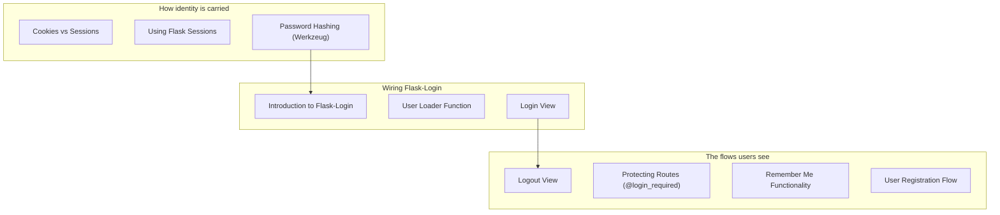

Authentication answers:

- **Who is this user?**

Authorization answers:

- **What is this user allowed to do?**

In this phase you’ll implement the foundational authentication patterns used in real Flask apps.

## You’ll learn

- Cookies vs sessions
- Flask sessions and secure cookies
- Password hashing with Werkzeug
- Flask-Login basics
- user loader
- login/logout views
- protecting routes with `@login_required`
- “remember me”
- user registration flow

## Phase checklist

1. Cookies vs Sessions
2. Using Flask Sessions
3. Password Hashing (Werkzeug)
4. Introduction to Flask-Login
5. User Loader Function
6. Login View
7. Logout View
8. Protecting Routes (@login_required)
9. Remember Me Functionality
10. User Registration Flow

## The phase at a glance

This phase exists to **know who is asking, and what they may do**. It assumes a database with a user table, and once it is done you can build a site with accounts and private pages.



## Where this sits in the track

```p5 title="The track, and what each phase unlocks" desc="Each phase assumes the one before it. Click a phase to see what you can build once it is done." height="330"
let sel = 5;
const NAMES = ['Fundamentals', 'Routing', 'Templating', 'Forms', 'Databases', 'Auth', 'Architecture', 'REST APIs', 'Deployment'];
const BUILDS = ['a page that says hello', 'a site with several URLs and a JSON endpoint', 'a real multi-page site with a shared layout', 'a site that accepts and validates input', 'a site whose data survives a restart', 'a site with accounts and private pages', 'an app split into modules, configurable per environment', 'an API other programs can call', 'all of it, running on a public server'];

function setup() {
  createCanvas(600, 330);
  textFont('monospace');
}

function draw() {
  background(13, 17, 23);
  noStroke();
  fill(230);
  textSize(13);
  textAlign(LEFT, TOP);
  text('the Flask track', 24, 16);
  fill(120);
  textSize(11);
  text('click a phase', 24, 36);

  for (let i = 0; i < NAMES.length; i++) {
    const col = i % 3;
    const row = floor(i / 3);
    const x = 24 + col * 186;
    const y = 62 + row * 56;
    const done = i < sel;
    const on = i === sel;
    stroke(on ? color(255, 211, 67) : (done ? color(120, 190, 130) : color(48, 56, 68)));
    strokeWeight(on ? 2 : 1);
    fill(on ? color(38, 34, 18) : (done ? color(18, 28, 22) : color(17, 22, 29)));
    rect(x, y, 174, 46, 4);
    noStroke();
    fill(on ? color(255, 211, 67) : (done ? color(120, 190, 130) : 110));
    textSize(11);
    textAlign(LEFT, TOP);
    text('Phase ' + (i + 1), x + 12, y + 8);
    fill(on ? color(255, 211, 67) : (done ? 150 : 90));
    textSize(11);
    text(NAMES[i], x + 12, y + 26);
  }

  stroke(48, 56, 68);
  strokeWeight(1);
  fill(18, 23, 30);
  rect(24, 240, 552, 62, 5);
  noStroke();
  fill(110);
  textSize(10);
  textAlign(LEFT, TOP);
  text('after Phase ' + (sel + 1) + ' you can build', 38, 250);
  fill(120, 190, 130);
  textSize(13);
  text(BUILDS[sel], 38, 272);

  fill(90);
  textSize(10);
  textAlign(LEFT, TOP);
  text('green = assumed knowledge by the time you reach the highlighted phase', 24, 312);
}

function mousePressed() {
  for (let i = 0; i < NAMES.length; i++) {
    const col = i % 3;
    const row = floor(i / 3);
    const x = 24 + col * 186;
    const y = 62 + row * 56;
    if (mouseX > x && mouseX < x + 174 && mouseY > y && mouseY < y + 46) sel = i;
  }
}
```

## The pages, in reading order

| # | page |
|--:|:--|
| 1 | Cookies vs Sessions |
| 2 | Using Flask Sessions |
| 3 | Password Hashing (Werkzeug) |
| 4 | Introduction to Flask-Login |
| 5 | User Loader Function |
| 6 | Login View |
| 7 | Logout View |
| 8 | Protecting Routes (@login_required) |
| 9 | Remember Me Functionality |
| 10 | User Registration Flow |

10 pages. They are ordered so that each one only uses ideas from the pages above it — reading out of order mostly works, but the examples assume what came before.

## Check yourself

<Quiz
  questions={[
    {
      q: "What does this phase assume already exists?",
      options: [
        "a deployed app",
        "a database with a user table",
        "an API",
        "a Blueprint layout",
      ],
      answer: 1,
      explain:
        "Authentication stores and checks credentials, so it needs the persistence from Phase 5.",
    },
    {
      q: "Why does the phase begin with Cookies vs Sessions before any Flask-Login page?",
      options: [
        "Flask-Login is deprecated",
        "the extension is a convenience over a mechanism, and the mechanism is what you debug when something goes wrong",
        "cookies are unrelated to login",
        "Flask-Login requires cookies to be disabled",
      ],
      answer: 1,
      explain:
        "Knowing the session is a signed cookie explains why a changed secret logs everyone out, and why the session may hold identity but never secrets.",
    },
    {
      q: "What do the phase overview pages give you that the individual pages do not?",
      options: [
        "the full code for each topic",
        "the reading order, what the phase assumes, and what you can build once it is done",
        "a downloadable project template",
        "the deployment configuration",
      ],
      answer: 1,
      explain:
        "Each overview lists its pages in sidebar order and names the phase's prerequisites and outcome, so you can tell whether you are ready for it.",
    },
  ]}
/>
