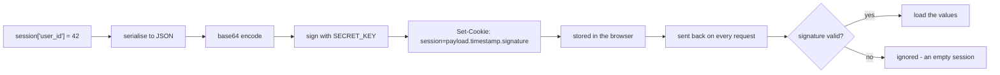

Flask exposes a session dict-like object:

```python
from flask import session
```

:::caution[The client can read a Flask session — it just cannot change it]
Verified with Flask 3.1.3. A session containing `{"user_id": 7, "role": "admin"}` becomes this
cookie:

```text
eyJ1c2VyX2lkIjo3LCJyb2xlIjoiYWRtaW4ifQ.ana4rA.BKDzGipqjYwKdqU6qEo_JnyM0TQ
```

Base64-decoding the first segment gives back, exactly:

```text
{"user_id":7,"role":"admin"}
```

**Signed is not encrypted.** Anyone holding the cookie can read every value in it. Editing it
and sending it back fails — the load raises `BadTimeSignature` — but that only protects
integrity, not secrecy.

So never put anything in `session` that the user should not see: no API keys, no internal
flags you rely on being hidden, no other person's data. Store an id and look the rest up.
:::

## Requirements

Sessions require:

- `app.config["SECRET_KEY"]`

## Setting and reading values

```python
from flask import Flask, session

app = Flask(__name__)
app.config["SECRET_KEY"] = "dev-key"


@app.route("/set")
def set_value():
    session["favorite_color"] = "blue"
    return "ok"


@app.route("/get")
def get_value():
    return {"favorite_color": session.get("favorite_color")}
```

## Removing values

```python
session.pop("favorite_color", None)
```

## Important constraints

Because Flask’s default session is stored in a cookie:

- keep session data small
- don’t store secrets in sessions (client can read)
- sign integrity is provided, confidentiality is not

## How Flask-Login uses session

Flask-Login stores:

- the logged-in user id

in the session so it persists across requests.

## The session is a signed cookie, not server storage

Flask keeps the whole session **in the cookie**, on the user's machine. Nothing is
stored on the server:



Measured on a live response:

```text title="Set-Cookie"
session=eyJyb2xlIjoiYWRtaW4iLCJ1c2VyX2lkIjo0Mn0.anhgvw.p1ahivGni_gpokhyDbSbrS2-QhY; HttpOnly; Path=/
```

Three dot-separated segments: **payload**, **timestamp**, **signature**.

## Anyone can read it

```python title="decode.py" showLineNumbers{1}
import base64
payload = cookie_value.split(".")[0]
base64.urlsafe_b64decode(payload + "==")
# b'{"role":"admin","user_id":42}'
```

Measured — that is the actual decoded content, with no key and no effort. The payload is
base64, which is an *encoding*, not encryption.

:::danger[The session is readable, so never put a secret in it]
No API tokens, no password hashes, no internal notes, no personal data you would not
show the user. Storing `user_id` is fine — the user already knows who they are. Storing
`is_admin` is fine too, because they cannot change it. Storing `card_last4` or
`internal_risk_score` hands it to them.
:::

## They cannot change it

The signature covers the payload, so a modified payload no longer verifies:

```python title="forge.py" showLineNumbers{1}
# swap the payload for {"user_id": 1, "role": "admin"}, keep the original signature
client.set_cookie("session", forged)
client.get("/whoami")      # -> 'None None'
```

Measured: the forged cookie was **rejected entirely** and the session came back empty —
not an error, just no values. Tampering downgrades an attacker to an anonymous visitor.

That guarantee rests entirely on `SECRET_KEY`:

```python title="rotate.py" showLineNumbers{1}
app.config["SECRET_KEY"] = "a-different-key"
client.get("/whoami")      # -> 'None None'   every existing session is now invalid
```

Measured. Rotating the key logs everybody out — which is the emergency response if it
ever leaks, and the reason it must be stable across restarts and identical across every
worker process. A key generated at startup means users are logged out whenever you
deploy.

## Working with it

```python title="views.py" showLineNumbers{1}
from flask import session

session["user_id"] = user.id      # set
session.get("user_id")            # read, None if absent
session.pop("user_id", None)      # remove one key
session.clear()                   # log out completely

session.permanent = True          # honour PERMANENT_SESSION_LIFETIME
app.config["PERMANENT_SESSION_LIFETIME"] = timedelta(days=7)
```

Without `session.permanent`, the cookie is a session cookie: it disappears when the
browser closes.

```python title="cookie_flags.py" showLineNumbers{1}
app.config.update(
    SESSION_COOKIE_HTTPONLY=True,   # default: JavaScript cannot read it
    SESSION_COOKIE_SECURE=True,     # HTTPS only — set this in production
    SESSION_COOKIE_SAMESITE="Lax",  # limits cross-site sending
)
```

`HttpOnly` is on by default, and appeared in the measured header above. `Secure` is not —
without it the cookie is sent over plain HTTP, where anyone on the network can copy it
and use it, since a stolen cookie is as good as the password.

## See it move

```p5 title="What is actually in your session cookie" desc="The payload is base64, readable by anyone holding the cookie. The signature stops it being changed, but does not hide it." height="340"
let view = 0;   // 0 = encoded, 1 = decoded, 2 = tampered

function setup() {
  createCanvas(600, 340);
  textFont('monospace');
}

function draw() {
  background(13, 17, 23);
  noStroke();
  fill(230);
  textSize(13);
  textAlign(LEFT, TOP);
  text('session[\u0027user_id\u0027] = 42;  session[\u0027role\u0027] = \u0027admin\u0027', 24, 16);

  const segs = [
    { n: 'payload', v: 'eyJyb2xlIjoiYWRtaW4iLCJ1c2VyX2lkIjo0Mn0', c: [75, 139, 190] },
    { n: 'timestamp', v: 'anhgvw', c: [255, 211, 67] },
    { n: 'signature', v: 'p1ahivGni_gpokhyDbSbrS2-QhY', c: [232, 110, 110] },
  ];
  let x = 24;
  for (let i = 0; i < 3; i++) {
    const s = segs[i];
    const w = [230, 90, 200][i];
    stroke(s.c[0], s.c[1], s.c[2]);
    strokeWeight(1);
    fill(s.c[0] * 0.16, s.c[1] * 0.16, s.c[2] * 0.16);
    rect(x, 50, w, 44, 4);
    noStroke();
    fill(s.c[0], s.c[1], s.c[2]);
    textSize(9);
    textAlign(LEFT, TOP);
    text(s.n, x + 8, 56);
    fill(200);
    textSize(9);
    const t = s.v;
    text(t.length > w / 6 ? t.slice(0, floor(w / 6)) + '.' : t, x + 8, 74);
    x += w + 8;
  }

  stroke(48, 56, 68);
  strokeWeight(1);
  fill(18, 23, 30);
  rect(24, 116, 552, 110, 5);
  noStroke();

  if (view === 0) {
    fill(110);
    textSize(10);
    textAlign(LEFT, TOP);
    text('as stored in the browser', 38, 128);
    fill(200);
    textSize(11);
    text('looks opaque - but only the SIGNATURE is cryptographic', 38, 152);
    fill(120);
    textSize(10);
    text('base64 is an encoding, not encryption', 38, 176);
  } else if (view === 1) {
    fill(110);
    textSize(10);
    textAlign(LEFT, TOP);
    text('base64-decode the first segment - no key needed', 38, 128);
    fill(232, 110, 110);
    textSize(15);
    text('{\u0022role\u0022:\u0022admin\u0022,\u0022user_id\u0022:42}', 38, 154);
    fill(232, 110, 110);
    textSize(10);
    text('every value is visible to whoever holds the cookie', 38, 186);
  } else {
    fill(110);
    textSize(10);
    textAlign(LEFT, TOP);
    text('attacker swaps the payload, keeps the signature', 38, 128);
    fill(120, 190, 130);
    textSize(15);
    text('/whoami -> None None', 38, 154);
    fill(120, 190, 130);
    textSize(10);
    text('rejected: the signature no longer matches the payload', 38, 186);
  }

  const labels = ['as sent', 'decoded by anyone', 'tampered with'];
  for (let i = 0; i < 3; i++) {
    const bx = 24 + i * 186;
    const on = i === view;
    stroke(on ? color(255, 211, 67) : color(60, 70, 84));
    strokeWeight(1);
    fill(on ? color(34, 40, 50) : color(22, 28, 36));
    rect(bx, 248, 174, 26, 4);
    noStroke();
    fill(on ? color(255, 211, 67) : 170);
    textSize(11);
    textAlign(CENTER, CENTER);
    text(labels[i], bx + 87, 261);
  }

  fill(90);
  textSize(10);
  textAlign(LEFT, TOP);
  text('readable but not forgeable - so store identity, never secrets', 24, 296);
}

function mousePressed() {
  for (let i = 0; i < 3; i++) {
    const bx = 24 + i * 186;
    if (mouseX > bx && mouseX < bx + 174 && mouseY > 248 && mouseY < 274) view = i;
  }
}
```

## Check yourself

<Quiz
  questions={[
    {
      q: "Where does Flask store the contents of the session by default?",
      options: [
        "in server memory, keyed by a session id in the cookie",
        "in the cookie itself, serialised and signed with SECRET_KEY",
        "in the configured database",
        "in a temporary file per user",
      ],
      answer: 1,
      explain:
        "The cookie carries payload, timestamp and signature. Nothing is kept server-side, which is why the session survives a restart and why its size is limited by the 4 KB cookie limit.",
    },
    {
      q: "The first segment of a session cookie base64-decodes to the JSON with role admin and user_id 42. What follows?",
      options: [
        "the cookie is broken; it should be unreadable",
        "the session is signed but not encrypted, so anyone holding the cookie can read every value in it",
        "the signature failed to apply",
        "only the server can perform that decode",
      ],
      answer: 1,
      explain:
        "base64 is an encoding, not encryption. Store identity such as user_id, never anything the user should not see.",
    },
    {
      q: "An attacker replaces the payload with their own JSON and keeps the original signature. What does the app see?",
      options: [
        "the forged values, since the signature is not checked on every request",
        "an empty session; the signature no longer matches the payload, so the cookie is ignored",
        "a 400 Bad Request",
        "the original values from before the change",
      ],
      answer: 1,
      explain:
        "Measured: the forged cookie produced None for every key. Tampering reduces an attacker to an anonymous visitor rather than raising an error.",
    },
    {
      q: "What happens to existing sessions when SECRET_KEY changes?",
      options: [
        "nothing; the key is only used for new sessions",
        "every existing session becomes invalid, so all users are logged out",
        "sessions are re-signed automatically on the next request",
        "only sessions created since the last restart are affected",
      ],
      answer: 1,
      explain:
        "Measured: the same client read None after the key changed. That is the emergency response if the key leaks, and the reason a key generated at startup logs everyone out on each deploy.",
    },
  ]}
/>
