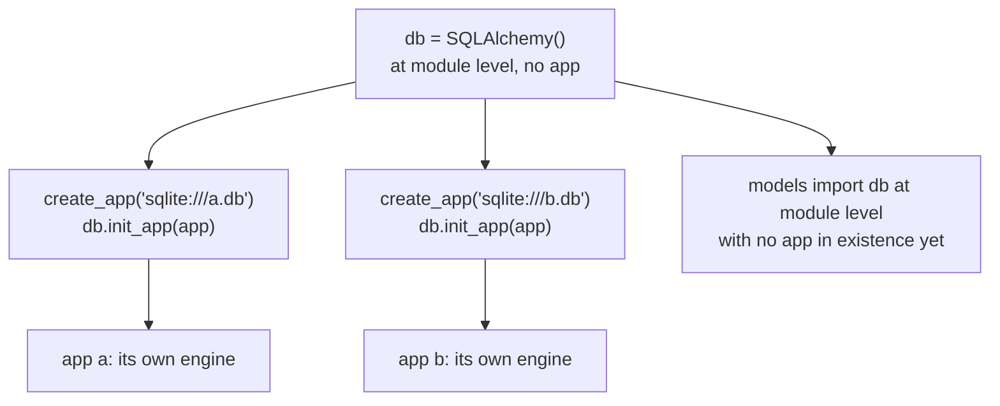

Flask stays minimal by design.

Extensions add features like:

- databases (Flask-SQLAlchemy)
- migrations (Flask-Migrate)
- login/session management (Flask-Login)
- forms (Flask-WTF)
- mail, caching, rate limiting, etc.

## The extension pattern

Most extensions support this pattern:

```python
# extensions.py
from flask_sqlalchemy import SQLAlchemy
from flask_login import LoginManager


db = SQLAlchemy()
login_manager = LoginManager()
```

Then inside your factory:

```python
from .extensions import db, login_manager

db.init_app(app)
login_manager.init_app(app)
```

## Why this matters

It avoids circular imports and allows:

- creating multiple app instances
- independent testing

## Common extensions

- Flask-Login
- Flask-WTF
- Flask-Migrate
- Flask-Mail
- Flask-Admin
- Flask-Limiter (rate limiting)
- Flask-Caching

Pick extensions carefully and keep them consistent with your architecture.

## The `init_app` pattern is what makes extensions work with factories

Almost every Flask extension supports being constructed **without** an app and bound
later. That two-phase setup is what lets a single extension object serve several apps:



```python title="extensions.py" showLineNumbers{1}
from flask_sqlalchemy import SQLAlchemy

db = SQLAlchemy(model_class=Base)      # no app — importable anywhere

def create_app(uri):
    app = Flask(__name__)
    app.config["SQLALCHEMY_DATABASE_URI"] = uri
    db.init_app(app)                    # bound here, once per app
    return app
```

Measured — one `db` object, two apps:

```text title="measured"
app a: engine -> instance/a.db
app b: engine -> instance/b.db
the same db object served both: True
```

This solves the circular-import problem that otherwise dominates Flask projects. Models
need `db`; `db` would need the app; the app needs the models. Constructing the extension
with no app breaks the cycle — `models.py` imports `db` from `extensions.py`, and nothing
imports the app.

## Extensions register themselves on the app

```python title="registry.py" showLineNumbers{1}
with app.app_context():
    sorted(app.extensions)      # ['sqlalchemy']
```

`app.extensions` is a plain dict where each extension stores its per-app state. That is
how one shared object keeps two apps apart — the state lives on the app, not on the
extension.

Forget the binding and the error says so plainly:

```text title="measured"
RuntimeError: The current Flask app is not registered with this 'SQLAlchemy' instance.
```

## The extensions worth knowing

| extension | what it does | replaces |
|:--|:--|:--|
| **Flask-SQLAlchemy** | ORM, scoped session, engine per app | wiring SQLAlchemy by hand |
| **Flask-Migrate** | Alembic migrations, `flask db upgrade` | `create_all` once the schema changes |
| **Flask-WTF** | forms, validation, CSRF | parsing `request.form` yourself |
| **Flask-Login** | `current_user`, `@login_required`, remember-me | a hand-rolled session check |
| **Flask-Mail** | SMTP with the app config | `smtplib` boilerplate |
| **Flask-Limiter** | rate limits per route | nothing built in |
| **Flask-Caching** | response and function caching | ad-hoc dictionaries |

:::caution[Every extension is a dependency you are agreeing to maintain]
Flask's small core is the reason to choose it, and an extension for each concern quietly
rebuilds a large framework out of parts that version independently. Before adding one,
check when it was last released and whether it supports the Flask version you are on — an
abandoned extension is much harder to remove later than it was to add.
:::

## See it move

```p5 title="One extension object, two applications" desc="Constructing an extension without an app and binding it with init_app is what makes application factories and testing possible." height="340"
let bound = [false, false];

function setup() {
  createCanvas(600, 340);
  textFont('monospace');
}

function draw() {
  background(13, 17, 23);
  noStroke();
  fill(230);
  textSize(13);
  textAlign(LEFT, TOP);
  text('db = SQLAlchemy()      # module level, no app', 24, 16);

  stroke(255, 211, 67);
  strokeWeight(2);
  fill(38, 34, 18);
  rect(228, 44, 144, 36, 5);
  noStroke();
  fill(255, 211, 67);
  textSize(13);
  textAlign(CENTER, CENTER);
  text('db', 300, 62);

  const apps = [
    { n: 'app a', uri: 'sqlite:///a.db', x: 24 },
    { n: 'app b', uri: 'sqlite:///b.db', x: 312 },
  ];
  for (let i = 0; i < 2; i++) {
    const a = apps[i];
    if (bound[i]) {
      stroke(120, 190, 130);
      strokeWeight(1);
      line(300, 80, a.x + 132, 130);
    }
    stroke(bound[i] ? color(120, 190, 130) : color(60, 70, 84));
    strokeWeight(1);
    fill(bound[i] ? color(18, 30, 22) : color(17, 22, 29));
    rect(a.x, 130, 264, 96, 5);
    noStroke();
    fill(bound[i] ? color(120, 190, 130) : 90);
    textSize(12);
    textAlign(LEFT, TOP);
    text(a.n, a.x + 14, 142);
    fill(120);
    textSize(10);
    text(a.uri, a.x + 14, 164);
    if (bound[i]) {
      fill(120, 190, 130);
      textSize(10);
      text('app.extensions -> [sqlalchemy]', a.x + 14, 188);
      text('db.engine resolves here', a.x + 14, 206);
    } else {
      fill(232, 110, 110);
      textSize(10);
      text('RuntimeError: not registered', a.x + 14, 188);
      text('with this SQLAlchemy instance', a.x + 14, 206);
    }
  }

  noStroke();
  fill(bound[0] && bound[1] ? color(120, 190, 130) : 120);
  textSize(11);
  textAlign(LEFT, TOP);
  text(bound[0] && bound[1]
    ? 'the same db object serves both, with separate engines'
    : 'each app must be bound with db.init_app(app)', 24, 248);

  drawBtn(24, 282, 200, bound[0] ? 'app a: bound' : 'db.init_app(app a)');
  drawBtn(312, 282, 200, bound[1] ? 'app b: bound' : 'db.init_app(app b)');
}

function drawBtn(x, y, w, label) {
  const hot = mouseX > x && mouseX < x + w && mouseY > y && mouseY < y + 24;
  stroke(hot ? color(255, 211, 67) : color(60, 70, 84));
  strokeWeight(1);
  fill(hot ? color(34, 40, 50) : color(22, 28, 36));
  rect(x, y, w, 24, 4);
  noStroke();
  fill(hot ? color(255, 211, 67) : 200);
  textSize(11);
  textAlign(CENTER, CENTER);
  text(label, x + w / 2, y + 12);
}

function mousePressed() {
  if (mouseY < 282 || mouseY > 306) return;
  if (mouseX > 24 && mouseX < 224) bound[0] = !bound[0];
  if (mouseX > 312 && mouseX < 512) bound[1] = !bound[1];
}
```

## Check yourself

<Quiz
  questions={[
    {
      q: "Why do extensions support being constructed without an app and bound later with init_app?",
      options: [
        "to make imports faster",
        "so one extension object can serve several apps, and so models can import it without importing the app — which breaks the circular import",
        "because the app is not available until the first request",
        "to allow extensions to be swapped at runtime",
      ],
      answer: 1,
      explain:
        "Measured one db object serving two apps with separate engines. models.py imports db from extensions.py and nothing imports the app, which is what makes an application factory practical.",
    },
    {
      q: "Where does an extension keep its per-app state when one object serves several apps?",
      options: [
        "on the extension object, keyed by app name",
        "in app.extensions, a dict on each application",
        "in a thread-local variable",
        "in the application config",
      ],
      answer: 1,
      explain:
        "Measured sorted(app.extensions) as ['sqlalchemy']. Because the state lives on the app rather than the extension, two apps cannot interfere with each other.",
    },
    {
      q: "You create a Flask app but never call db.init_app(app). What happens when a view touches the database?",
      options: [
        "it silently uses the previous app's engine",
        "RuntimeError saying the current Flask app is not registered with this SQLAlchemy instance",
        "a new engine is created automatically",
        "the request returns a 500 with no message",
      ],
      answer: 1,
      explain:
        "The extension looks itself up in app.extensions, does not find its state, and says so. The message names the fix directly.",
    },
  ]}
/>
