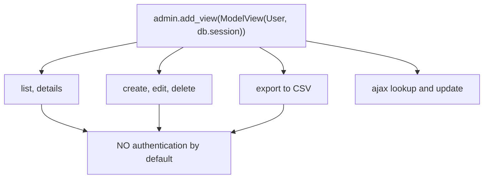

import Quiz from "../../../../components/Quiz.astro";

Admin panels are useful for:

- managing users
- managing content
- viewing tables quickly

Django includes admin by default, Flask does not.

Flask-Admin provides a flexible admin UI for Flask apps.

## Install

```bash
pip install Flask-Admin
```

## Minimal setup

```python
from flask_admin import Admin
from flask_admin.contrib.sqla import ModelView

admin = Admin(app, name="Admin", template_mode="bootstrap4")
admin.add_view(ModelView(User, db.session))
admin.add_view(ModelView(Post, db.session))
```

## Security warning

Do not expose admin routes publicly without protection.

Common approaches:

- restrict to admin users only
- require login and role checks
- hide admin behind VPN/internal network

## Best practice

Treat admin as a separate feature area:

- its own blueprint/route prefix
- strict access control
- logging/auditing of admin actions

## One line, eleven routes

```python title="admin.py" showLineNumbers{1}
from flask_admin import Admin
from flask_admin.contrib.sqla import ModelView

admin = Admin(app, name="Demo")
admin.add_view(ModelView(User, db.session))
```

Measured — the rules that single `add_view()` registered:

```text title="app.url_map, filtered to /admin"
/admin/
/admin/static/<path:filename>
/admin/user/
/admin/user/action/
/admin/user/ajax/lookup/
/admin/user/ajax/update/
/admin/user/delete/
/admin/user/details/
/admin/user/edit/
/admin/user/export/<export_type>/
/admin/user/new/
```

**Eleven routes**, including `new`, `edit`, `delete` and `export`, from one line. That is
the appeal and the entire risk in the same breath.



## It is not protected

Measured, with no login of any kind configured:

| request | status |
|:--|--:|
| `GET /admin/` | **200** |
| `GET /admin/user/` | **200** |

Anyone who can reach the URL can list, edit, export and **delete every row**. There is no
default credential and no warning at startup.

:::danger[An unprotected Flask-Admin is a full database compromise]
It is not an information leak — `/admin/user/delete/` is registered and works. Add an
access check before the first deploy, not after:

```python title="protected.py" showLineNumbers{1}
from flask import redirect, url_for, request, abort
from flask_login import current_user

class SecureModelView(ModelView):
    def is_accessible(self):
        return current_user.is_authenticated and current_user.is_admin

    def inaccessible_callback(self, name, **kwargs):
        return redirect(url_for("login", next=request.url))

admin.add_view(SecureModelView(User, db.session))
```

`is_accessible` guards **every** view in that class. Overriding only
`inaccessible_callback` does nothing on its own.
:::

## Every column is exposed by default

```python title="columns.py" showLineNumbers{1}
class User(db.Model):
    id: Mapped[int] = mapped_column(primary_key=True)
    name: Mapped[str]
    secret_note: Mapped[str | None]
```

```text title="measured column_list"
[('name', 'Name'), ('secret_note', 'Secret Note')]
```

`secret_note` was listed without being asked for. A password hash, an internal score, a
personal note — all of it appears in the list view and in the CSV export unless you
exclude it:

```python title="restrict.py" showLineNumbers{1}
class UserView(SecureModelView):
    column_list = ("id", "name", "created_at")   # an allow-list
    column_exclude_list = ("pw_hash",)           # or a deny-list
    form_excluded_columns = ("pw_hash",)         # editing is separate from listing
    can_delete = False
    can_export = False
```

Note that `column_list` and `form_excluded_columns` are **different settings**: hiding a
column from the list does not stop it being editable on the form.

## When it is the right tool

| good fit | poor fit |
|:--|:--|
| an internal back office for staff you trust | anything a customer can reach |
| quickly inspecting data during development | a user-facing account area |
| CRUD over a stable, simple schema | workflows with business rules |

It generates a UI directly from your models, so it enforces exactly the constraints the
database has and none of the rules your application has. A user-facing screen wants
validation, permissions and audit trails that a generated admin does not provide.

:::caution[Version note]
Measured against **flask-admin 2.2.0**. The `template_mode="bootstrap4"` argument shown in
much older material has been removed — passing it raises
`TypeError: Admin.__init__() got an unexpected keyword argument 'template_mode'`. Check
the signature against the version you actually installed.
:::

## See it move

```p5 title="What one add_view() exposes" desc="A single line registers eleven routes with no authentication. Adding is_accessible is what turns it into an admin rather than an open door." height="340"
let secured = false;

function setup() {
  createCanvas(600, 340);
  textFont('monospace');
}

const ROUTES = [
  { r: '/admin/', danger: 0 },
  { r: '/admin/user/', danger: 1 },
  { r: '/admin/user/details/', danger: 1 },
  { r: '/admin/user/new/', danger: 2 },
  { r: '/admin/user/edit/', danger: 2 },
  { r: '/admin/user/delete/', danger: 3 },
  { r: '/admin/user/export/<type>/', danger: 3 },
  { r: '/admin/user/action/', danger: 2 },
];

function draw() {
  background(13, 17, 23);
  noStroke();
  fill(230);
  textSize(13);
  textAlign(LEFT, TOP);
  text('admin.add_view(' + (secured ? 'Secure' : '') + 'ModelView(User, db.session))', 24, 16);
  fill(secured ? color(120, 190, 130) : color(232, 110, 110));
  textSize(11);
  text(secured ? 'is_accessible() checks current_user.is_admin'
                : 'no authentication - anyone who can reach the URL', 24, 36);

  for (let i = 0; i < ROUTES.length; i++) {
    const col = i % 2;
    const row = floor(i / 2);
    const x = 24 + col * 282;
    const y = 64 + row * 42;
    const d = ROUTES[i].danger;
    const c = secured ? [120, 190, 130] : (d >= 3 ? [232, 110, 110] : (d >= 2 ? [255, 211, 67] : [140, 150, 165]));
    stroke(c[0], c[1], c[2]);
    strokeWeight(1);
    fill(c[0] * 0.14, c[1] * 0.14, c[2] * 0.14);
    rect(x, y, 270, 34, 4);
    noStroke();
    fill(c[0], c[1], c[2]);
    textSize(10);
    textAlign(LEFT, CENTER);
    text(ROUTES[i].r, x + 12, y + 17);
    textAlign(RIGHT, CENTER);
    textSize(9);
    text(secured ? '302 to login' : '200', x + 258, y + 17);
  }

  stroke(secured ? color(120, 190, 130) : color(232, 110, 110));
  strokeWeight(1);
  fill(18, 23, 30);
  rect(24, 244, 552, 54, 5);
  noStroke();
  fill(secured ? color(120, 190, 130) : color(232, 110, 110));
  textSize(13);
  textAlign(LEFT, TOP);
  text(secured ? 'reachable only by an authenticated admin'
                : 'anyone can list, edit, export and DELETE every row', 38, 258);
  fill(150);
  textSize(10);
  text(secured ? 'is_accessible guards every view in the class'
                : 'measured: GET /admin/ and /admin/user/ both returned 200', 38, 278);

  drawBtn(24, 308, 250, secured ? 'SecureModelView' : 'plain ModelView');
}

function drawBtn(x, y, w, label) {
  const hot = mouseX > x && mouseX < x + w && mouseY > y && mouseY < y + 24;
  stroke(hot ? color(255, 211, 67) : color(60, 70, 84));
  strokeWeight(1);
  fill(hot ? color(34, 40, 50) : color(22, 28, 36));
  rect(x, y, w, 24, 4);
  noStroke();
  fill(hot ? color(255, 211, 67) : 200);
  textSize(11);
  textAlign(CENTER, CENTER);
  text(label, x + w / 2, y + 12);
}

function mousePressed() {
  if (mouseY > 308 && mouseY < 332 && mouseX > 24 && mouseX < 274) secured = !secured;
}
```

## Check yourself

<Quiz
  questions={[
    {
      q: "What protects Flask-Admin views by default?",
      options: [
        "a generated admin password shown at startup",
        "nothing; measured, GET /admin/ and /admin/user/ both returned 200 with no login configured",
        "access is limited to localhost",
        "a CSRF token is required to view them",
      ],
      answer: 1,
      explain:
        "Since /admin/user/delete/ is among the eleven registered routes, an exposed admin is a full database compromise rather than an information leak.",
    },
    {
      q: "How many routes did a single admin.add_view(ModelView(User, db.session)) register?",
      options: [
        "1",
        "3",
        "11",
        "one per HTTP method",
      ],
      answer: 2,
      explain:
        "Measured eleven, including new, edit, delete, export and two ajax endpoints. That leverage is both the appeal and the risk.",
    },
    {
      q: "A model has a pw_hash column. What happens to it in Flask-Admin by default?",
      options: [
        "it is hidden automatically because of the name",
        "it appears in the list view, the edit form and the CSV export unless you exclude it",
        "it is shown but not editable",
        "columns must be added explicitly before they appear",
      ],
      answer: 1,
      explain:
        "Measured column_list included secret_note without being asked. Note that column_list and form_excluded_columns are separate settings — hiding a column from the list does not stop it being editable.",
    },
    {
      q: "Which method must you override to require a login for an admin view?",
      options: [
        "inaccessible_callback alone",
        "is_accessible",
        "before_request",
        "can_view",
      ],
      answer: 1,
      explain:
        "is_accessible guards every view in the class. inaccessible_callback only decides where a refused user is sent, and does nothing on its own.",
    },
  ]}
/>
