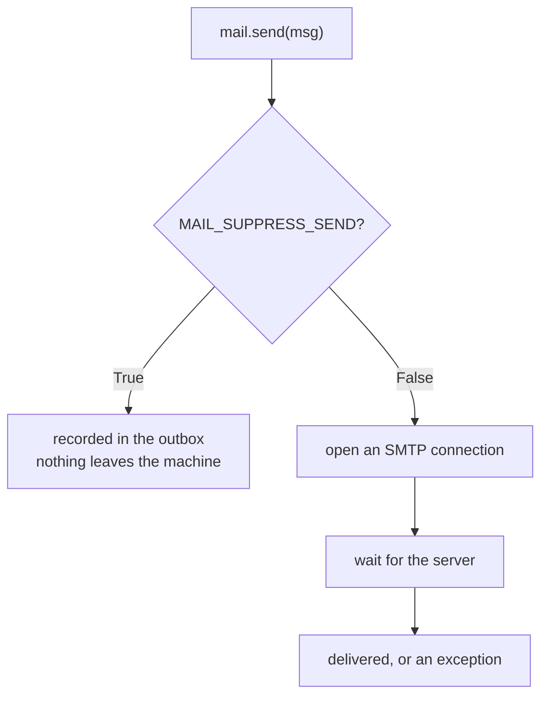

Many apps need email:

- password reset
- email verification
- notifications

Flask-Mail is a popular extension.

## Install

```bash
pip install Flask-Mail
```

## Basic configuration

```python
app.config.update(
    MAIL_SERVER="smtp.gmail.com",
    MAIL_PORT=587,
    MAIL_USE_TLS=True,
    MAIL_USERNAME=os.environ.get("MAIL_USERNAME"),
    MAIL_PASSWORD=os.environ.get("MAIL_PASSWORD"),
)
```

Then:

```python
from flask_mail import Mail

mail = Mail(app)
```

## Sending an email

```python
from flask_mail import Message

msg = Message(
    subject="Welcome",
    sender="noreply@example.com",
    recipients=["user@example.com"],
    body="Hello from Flask!",
)
mail.send(msg)
```

## Production tips

- Don’t send emails synchronously inside web requests (slow)
- Use background jobs (Celery/RQ) for sending
- Use environment variables for credentials
- Prefer transactional email providers (SendGrid/Mailgun)

## Configuration is the whole setup

```python title="config.py" showLineNumbers{1}
app.config.update(
    MAIL_SERVER="smtp.example.com",
    MAIL_PORT=587,
    MAIL_USE_TLS=True,
    MAIL_USERNAME=os.environ["MAIL_USERNAME"],
    MAIL_PASSWORD=os.environ["MAIL_PASSWORD"],   # never in the source
    MAIL_DEFAULT_SENDER="bot@example.com",
)
mail = Mail(app)
```

```python title="send.py" showLineNumbers{1}
msg = Message("Welcome", recipients=["ada@example.com"])
msg.body = "Plain text body"
msg.html = "<p>HTML body</p>"
mail.send(msg)
```

`MAIL_DEFAULT_SENDER` fills in `From` when a message does not set one — measured, the
captured message came back with `sender='bot@example.com'` without it being passed.

## Test without sending anything

```python title="record.py" showLineNumbers{1}
app.config["MAIL_SUPPRESS_SEND"] = True

with mail.record_messages() as outbox:
    send_welcome_email(user)
    assert len(outbox) == 1
    assert outbox[0].subject == "Welcome"
    assert outbox[0].recipients == ["ada@example.com"]
```

Measured: one message captured, with subject, sender, recipients and both bodies intact —
and **no SMTP connection opened**. This is how the rest of this page was verified, and it
is how email should be tested. A suite that really sends mail is slow, flaky, and
eventually mails a real person.



## What is actually transmitted

```text title="measured, msg.as_string()"
Content-Type: text/plain; charset="utf-8"
MIME-Version: 1.0
Content-Transfer-Encoding: 7bit
Subject: Subject line
From: bot@example.com
To: a@b.co
Date: Sun, 09 Aug 2026 19:14:47 +0530
Message-ID: <178628308768.15712...@host>
```

A message carrying both `body` and `html` becomes **`multipart/mixed`** with a generated
boundary — measured. Clients that cannot render HTML fall back to the plain part, which
is why setting both is worth the extra line.

:::danger[Sending is blocking, and it happens inside the request]
`mail.send()` opens a TCP connection and waits for the SMTP server. If that server is
slow, your user watches a spinner; if it is down, their signup fails for a reason that
has nothing to do with signing up. Move it off the request:

```python title="background.py" showLineNumbers{1}
from threading import Thread

def send_async(app, msg):
    with app.app_context():        # a new thread has no context of its own
        mail.send(msg)

Thread(target=send_async, args=(app, msg)).start()
```

A thread is the minimum. A real queue — Celery, RQ, or your platform's — gives you
retries and visibility, which matter once mail is part of a business process.
:::

:::caution[Never put credentials in the code]
`MAIL_PASSWORD` in a committed config is a working credential for anyone with repository
access, including after you delete the line. Read it from the environment. Most providers
also require an app-specific password rather than the account password.
:::

## See it move

```p5 title="Sending inside the request, or off it" desc="mail.send blocks until the SMTP server replies. Moving it to a background thread returns the response immediately." height="340"
let async_ = false;
let t = 0;
let running = false;

function setup() {
  createCanvas(600, 340);
  textFont('monospace');
}

function draw() {
  background(13, 17, 23);
  if (running) { t += 1.4; if (t > 130) { t = 0; running = false; } }
  const respondAt = async_ ? 20 : 105;
  const responded = t >= respondAt;

  noStroke();
  fill(230);
  textSize(13);
  textAlign(LEFT, TOP);
  text(async_ ? 'Thread(target=send_async).start()' : 'mail.send(msg)   inside the view', 24, 16);

  const bars = [
    { n: 'handle the request', from: 0, to: 18, c: [75, 139, 190] },
    { n: 'SMTP connect and send', from: async_ ? 22 : 18, to: async_ ? 128 : 105, c: [255, 211, 67] },
  ];
  for (let i = 0; i < 2; i++) {
    const b = bars[i];
    const y = 56 + i * 52;
    noStroke();
    fill(150);
    textSize(11);
    textAlign(LEFT, TOP);
    text(b.n, 24, y);
    stroke(48, 56, 68);
    strokeWeight(1);
    fill(17, 22, 29);
    rect(24, y + 18, 480, 24, 3);
    const w = constrain((t - b.from) / (b.to - b.from), 0, 1) * 478;
    if (t > b.from) {
      noStroke();
      fill(b.c[0], b.c[1], b.c[2]);
      rect(25, y + 19, w, 22, 2);
    }
    if (i === 1 && async_) {
      noStroke();
      fill(120);
      textSize(9);
      textAlign(LEFT, CENTER);
      text('on another thread', 512, y + 30);
    }
  }

  const rx = 24 + (respondAt / 130) * 478;
  stroke(120, 190, 130);
  strokeWeight(2);
  line(rx, 48, rx, 160);
  noStroke();
  fill(120, 190, 130);
  textSize(10);
  textAlign(LEFT, BOTTOM);
  text('response sent', rx + 6, 48);

  fill(responded ? color(120, 190, 130) : 110);
  textSize(12);
  textAlign(LEFT, TOP);
  text(responded ? 'the user has their page' : 'the user is waiting.', 24, 186);

  fill(async_ ? color(120, 190, 130) : color(232, 110, 110));
  textSize(11);
  text(async_
    ? 'the response does not wait for the mail server'
    : 'a slow or dead SMTP server becomes a slow or failed signup', 24, 212);

  drawBtn(24, 250, 230, async_ ? 'mode: background thread' : 'mode: inside the request');
  drawBtn(266, 250, 130, running ? 'running.' : 'send one');
  fill(90);
  textSize(10);
  textAlign(LEFT, TOP);
  text('a thread is the minimum; a queue adds retries and visibility', 24, 292);
}

function drawBtn(x, y, w, label) {
  const hot = mouseX > x && mouseX < x + w && mouseY > y && mouseY < y + 24;
  stroke(hot ? color(255, 211, 67) : color(60, 70, 84));
  strokeWeight(1);
  fill(hot ? color(34, 40, 50) : color(22, 28, 36));
  rect(x, y, w, 24, 4);
  noStroke();
  fill(hot ? color(255, 211, 67) : 200);
  textSize(11);
  textAlign(CENTER, CENTER);
  text(label, x + w / 2, y + 12);
}

function mousePressed() {
  if (mouseY < 250 || mouseY > 274) return;
  if (mouseX > 24 && mouseX < 254) { async_ = !async_; t = 0; running = false; }
  if (mouseX > 266 && mouseX < 396) { t = 0; running = true; }
}
```

## Check yourself

<Quiz
  questions={[
    {
      q: "How should email be covered in an automated test suite?",
      options: [
        "send to a real inbox and check it manually",
        "set MAIL_SUPPRESS_SEND and use mail.record_messages() to capture messages in memory",
        "mock the socket layer by hand",
        "skip testing email entirely",
      ],
      answer: 1,
      explain:
        "Measured one message captured with subject, sender, recipients and both bodies intact, and no SMTP connection opened. A suite that really sends mail is slow, flaky, and eventually mails a real person.",
    },
    {
      q: "Why move mail.send() out of the request that triggered it?",
      options: [
        "Flask forbids network calls inside a view",
        "it opens an SMTP connection and blocks until the server replies, so a slow or dead mail server becomes a slow or failed user action",
        "sending requires an application context that views lack",
        "it would otherwise send the message twice",
      ],
      answer: 1,
      explain:
        "A background thread is the minimum, and it needs its own app context. A real queue adds retries and visibility once mail is part of a business process.",
    },
    {
      q: "A Message sets both body and html. What Content-Type does the transmitted message use?",
      options: [
        "text/plain, the html is discarded",
        "text/html, the plain body is discarded",
        "multipart/mixed with a generated boundary, so clients can choose",
        "it raises, since only one body may be set",
      ],
      answer: 2,
      explain:
        "Measured multipart with a boundary. Clients that cannot render HTML fall back to the plain part, which is why setting both is worth the extra line.",
    },
  ]}
/>
