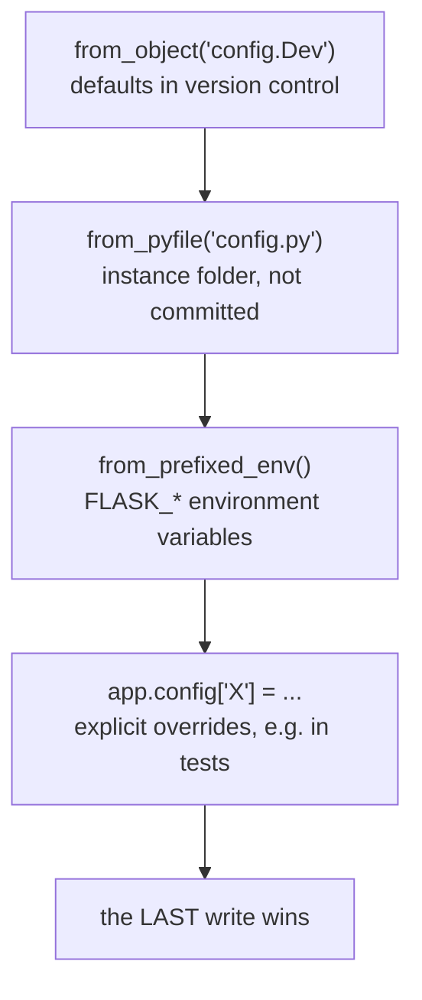

import Quiz from "../../../../components/Quiz.astro";

Configuration is where many Flask apps go wrong.

Good config:

- separates dev vs prod
- uses environment variables for secrets
- keeps defaults sensible

## A common pattern: config classes

`config.py`:

```python
import os


class BaseConfig:
    SECRET_KEY = os.environ.get("SECRET_KEY", "dev-key")
    SQLALCHEMY_TRACK_MODIFICATIONS = False


class DevelopmentConfig(BaseConfig):
    DEBUG = True
    SQLALCHEMY_DATABASE_URI = os.environ.get("DATABASE_URL", "sqlite:///app.db")


class TestingConfig(BaseConfig):
    TESTING = True
    SQLALCHEMY_DATABASE_URI = "sqlite:///:memory:"


class ProductionConfig(BaseConfig):
    DEBUG = False
    SQLALCHEMY_DATABASE_URI = os.environ.get("DATABASE_URL")
```

## Loading config into app

```python
app.config.from_object("config.DevelopmentConfig")
```

Or:

```python
app.config.from_object(config_object)
```

## Secrets

Never commit secrets (SECRET_KEY, DB passwords) to git.

Use:

- `.env` files locally (with python-dotenv)
- CI/hosting environment variables in production

## Four ways to load configuration, and the order matters



Measured: after `from_object("config.Dev")` set `DATABASE = "dev.db"`, a later
`from_pyfile("config.py")` changed it to `instance.db`, and `from_prefixed_env()` then
changed it to `env.db`. Load from least specific to most specific.

## `from_object` only reads UPPERCASE names

```python title="config.py" showLineNumbers{1}
class Base:
    DEBUG = False
    DATABASE = "base.db"
    lowercase_ignored = "not loaded"

class Dev(Base):
    DEBUG = True
    DATABASE = "dev.db"
```

```text title="measured"
DEBUG             True
DATABASE          'dev.db'
lowercase_ignored None      <- silently skipped
inherited DEBUG   present   <- class inheritance works
```

A lowercase name is **not an error** — it simply never arrives, which is a quiet way to
lose a setting. The convention exists so a config module can hold helpers and imports
without them polluting `app.config`.

## `from_pyfile` and the instance folder

```python title="load.py" showLineNumbers{1}
app = Flask(__name__, instance_relative_config=True)
app.config.from_pyfile("config.py")            # reads instance/config.py
```

```text title="measured"
SECRET_KEY  'from-instance-file'
```

A missing file raises:

```python title="silent.py" showLineNumbers{1}
app.config.from_pyfile("nope.py")                 # FileNotFoundError
app.config.from_pyfile("nope.py", silent=True)    # returns False, carries on
```

Use `silent=True` for a genuinely optional local override, and let it raise for a file
that must exist.

## `from_prefixed_env` parses values as JSON

```bash title="environment"
FLASK_DATABASE=env.db
FLASK_MAX_ITEMS=25
FLASK_FEATURE_ON=true
DATABASE=no-prefix-ignored
```

```text title="measured"
DATABASE    'env.db'
MAX_ITEMS   25      (int)     <- parsed as JSON, not left as a string
FEATURE_ON  True    (bool)
unprefixed DATABASE ignored
```

This is the detail people miss: values are run through a JSON parse, so `25` becomes an
`int` and `true` becomes a `bool` rather than the string `'true'` — which would have been
truthy either way and hidden the bug. A value that is not valid JSON stays a string.

:::danger[Secrets belong in the environment, never in a committed file]
`config.py` in version control is the right home for defaults and for anything harmless.
`SECRET_KEY`, database passwords and API tokens belong in `instance/` (git-ignored) or in
environment variables. Anything ever committed should be treated as public and rotated.
:::

## See it move

```p5 title="Precedence: the last load wins" desc="Configuration sources are applied in order. Load defaults first and the most deployment-specific source last." height="340"
let on = [true, false, false, false];
const SRC = [
  { n: 'from_object(config.Dev)', v: 'dev.db', c: [75, 139, 190] },
  { n: 'from_pyfile(instance/config.py)', v: 'instance.db', c: [120, 190, 130] },
  { n: 'from_prefixed_env()', v: 'env.db', c: [255, 211, 67] },
  { n: "app.config['DATABASE'] = ...", v: 'test.db', c: [232, 110, 110] },
];

function setup() {
  createCanvas(600, 340);
  textFont('monospace');
}

function draw() {
  background(13, 17, 23);
  let winner = -1;
  for (let i = 0; i < 4; i++) if (on[i]) winner = i;

  noStroke();
  fill(230);
  textSize(13);
  textAlign(LEFT, TOP);
  text('sources are applied top to bottom', 24, 16);
  fill(120);
  textSize(11);
  text('click to toggle each one', 24, 36);

  for (let i = 0; i < 4; i++) {
    const y = 62 + i * 46;
    const s = SRC[i];
    const isWin = i === winner;
    stroke(on[i] ? color(s.c[0], s.c[1], s.c[2]) : color(40, 48, 58));
    strokeWeight(isWin ? 2 : 1);
    fill(on[i] ? color(s.c[0] * 0.16, s.c[1] * 0.16, s.c[2] * 0.16) : color(17, 22, 29));
    rect(24, y, 400, 38, 4);
    noStroke();
    fill(on[i] ? color(s.c[0], s.c[1], s.c[2]) : 80);
    textSize(11);
    textAlign(LEFT, CENTER);
    text(s.n, 38, y + 19);
    if (on[i]) {
      fill(150);
      textSize(10);
      textAlign(LEFT, CENTER);
      text("DATABASE = '" + s.v + "'", 250, y + 19);
      if (isWin) {
        fill(s.c[0], s.c[1], s.c[2]);
        textAlign(LEFT, CENTER);
        textSize(10);
        text('<- wins', 436, y + 19);
      } else {
        fill(80);
        textAlign(LEFT, CENTER);
        textSize(10);
        text('overwritten', 436, y + 19);
      }
    }
  }

  stroke(48, 56, 68);
  strokeWeight(1);
  fill(18, 23, 30);
  rect(24, 254, 552, 50, 5);
  noStroke();
  fill(110);
  textSize(10);
  textAlign(LEFT, TOP);
  text("app.config['DATABASE']", 38, 264);
  if (winner < 0) {
    fill(232, 110, 110);
    textSize(14);
    text('KeyError - never set', 38, 282);
  } else {
    const s = SRC[winner];
    fill(s.c[0], s.c[1], s.c[2]);
    textSize(14);
    text("'" + s.v + "'", 38, 282);
  }
}

function mousePressed() {
  for (let i = 0; i < 4; i++) {
    const y = 62 + i * 46;
    if (mouseX > 24 && mouseX < 424 && mouseY > y && mouseY < y + 38) on[i] = !on[i];
  }
}
```

## Check yourself

<Quiz
  questions={[
    {
      q: "A config class defines DEBUG = True and lowercase_ignored = 'x'. What does from_object load?",
      options: [
        "both names",
        "only DEBUG; lowercase names are skipped silently",
        "neither, unless the class inherits from a Flask base",
        "only lowercase_ignored, since DEBUG is reserved",
      ],
      answer: 1,
      explain:
        "Measured: lowercase_ignored came back None. The convention lets a config module hold imports and helpers without them landing in app.config — but it also means a mis-cased setting vanishes without an error.",
    },
    {
      q: "With FLASK_MAX_ITEMS=25 in the environment, what does from_prefixed_env put in app.config['MAX_ITEMS']?",
      options: [
        "the string '25'",
        "the integer 25, because values are parsed as JSON",
        "nothing; only strings are supported",
        "the string 'FLASK_25'",
      ],
      answer: 1,
      explain:
        "Measured as int. FLASK_FEATURE_ON=true likewise became the bool True rather than the truthy string 'true'. Values that are not valid JSON remain strings.",
    },
    {
      q: "In what order should configuration sources be loaded?",
      options: [
        "environment first, then files, then defaults",
        "defaults first, then instance files, then environment, then explicit overrides — least specific to most",
        "the order does not matter",
        "alphabetically by source name",
      ],
      answer: 1,
      explain:
        "Each load overwrites the previous, so the last write wins. Measured DATABASE moving dev.db to instance.db to env.db as each source was applied.",
    },
  ]}
/>
