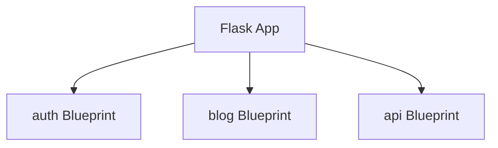

Blueprints let you organize routes into modules.

Instead of one giant `app.py`, you can split features like:

- auth
- blog
- admin
- api

Each module can own:

- routes
- templates
- static files

## Mental model

- `Flask()` app is the “main application”
- `Blueprint()` is a reusable, modular set of routes



## Why Blueprints matter

- Keeps routes manageable
- Encourages separation of concerns
- Makes collaboration easier
- Works well with the app factory pattern

## A simple blueprint

`auth/routes.py`:

```python
from flask import Blueprint

auth_bp = Blueprint("auth", __name__)


auth_bp.route("/login")(lambda: "login")
```

You still must register the blueprint with the app (next page).
