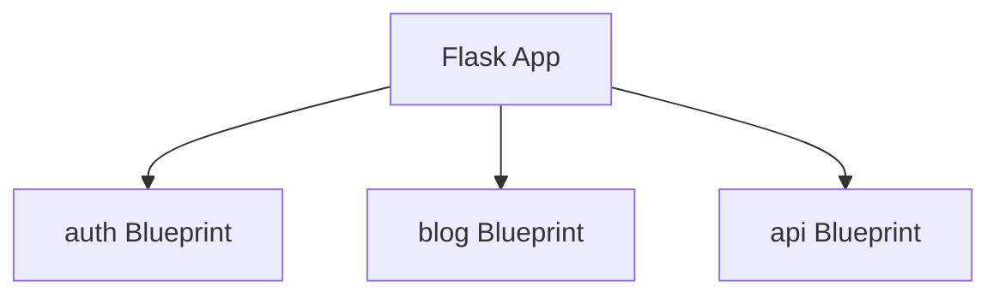

Blueprints let you organize routes into modules.

Instead of one giant `app.py`, you can split features like:

- auth
- blog
- admin
- api

Each module can own:

- routes
- templates
- static files

## Mental model

- `Flask()` app is the “main application”
- `Blueprint()` is a reusable, modular set of routes


```mermaid
flowchart TB
  App[Flask App] --> BP1[auth Blueprint]
  App --> BP2[blog Blueprint]
  App --> BP3[api Blueprint]
```

## Why Blueprints matter

- Keeps routes manageable
- Encourages separation of concerns
- Makes collaboration easier
- Works well with the app factory pattern

## A simple blueprint

`auth/routes.py`:

```python
from flask import Blueprint

auth_bp = Blueprint("auth", __name__)


@auth_bp.route("/login")
def login():
    return "login"
```

You still must register the blueprint with the app (next page).

## The problem blueprints solve

Every route so far has lived in one file. That is fine for ten routes. With a login system, a blog, an admin area, and a JSON API, a single `app.py` with hundreds of lines is hard to read and hard to share between people. A blueprint lets you put related routes in their own module and plug that module into the app.

A blueprint is not an app. It cannot run by itself. It is a recorded set of routes, error handlers, and settings that is applied to an app when you register it. Until then the routes do not exist.

## A worked example

The one-line version shown above works, but the normal way is with decorators, exactly like `@app.route`:

```python title="myapp/auth/routes.py" showLineNumbers{1}
from flask import Blueprint, render_template

auth_bp = Blueprint(
    "auth",                      # name, used to build endpoints like auth.login
    __name__,                    # where the blueprint lives
    template_folder="templates", # optional, relative to this file
)


@auth_bp.route("/login")
def login():
    return render_template("auth/login.html")


@auth_bp.route("/register")
def register():
    return "Register page"
```

The first argument is the blueprint's name. It becomes a prefix for endpoints, so the login view is called `auth.login`. That is the name you pass to `url_for("auth.login")`. Two blueprints can both define a `login` function without clashing, because their full endpoint names differ.

Notice that `auth_bp.route` is used instead of `app.route`. There is no `app` in this file, which is why blueprints work well with the application factory: the module does not need the app to exist yet.

## What a blueprint can own

Beyond routes, a blueprint can have its own error handlers (`@auth_bp.errorhandler`), request hooks (`@auth_bp.before_request`), template folder, and static folder. A `before_request` on a blueprint runs only for that blueprint's routes, which is a clean way to protect a whole admin section.

## A common layout

```
myapp/
  __init__.py       # create_app()
  auth/
    __init__.py
    routes.py       # auth_bp
  blog/
    __init__.py
    routes.py       # blog_bp
```

## Common mistakes

- **Defining the blueprint and never registering it.** Every route returns 404 and there is no error.
- **Forgetting the endpoint prefix.** `url_for("login")` fails. Use `url_for("auth.login")`.
- **Giving two blueprints the same name.** Names must be unique on the app.
- **Splitting too early.** A five-route app does not need blueprints. Split when a module has a clear topic.

## How it connects

The next lesson, Registering Blueprints, attaches `auth_bp` to the app and adds a URL prefix. The Application Factory lesson shows the best place to do that. Together they replace the single-file app.

## Check yourself

<Quiz
  questions={[
    {
      q: "You define a blueprint with routes, run the app, and every blueprint URL returns 404. What is the most likely cause?",
      options: [
        "The blueprint name is too short",
        "The blueprint was never registered on the app with app.register_blueprint()",
        "Blueprints only work in debug mode",
        "The routes need lambda functions",
      ],
      answer: 1,
      explain: "A blueprint is only a recorded set of routes. Its routes become part of the app when you register it.",
    },
    {
      q: "A blueprint is created as Blueprint('auth', __name__) and has a view function login. What should you pass to url_for?",
      options: [
        "'login'",
        "'auth.login'",
        "'auth/login'",
        "'Blueprint.login'",
      ],
      answer: 1,
      explain: "Endpoints are the blueprint name, a dot, and the function name. This is what keeps two blueprints with a login function from colliding.",
    },
    {
      q: "Why do blueprints fit well with the application factory pattern?",
      options: [
        "They are the same thing",
        "Routes are declared on the blueprint object, so the module does not need an app to exist; the factory registers it later",
        "Blueprints create the app",
        "Factories only work with blueprints in one file",
      ],
      answer: 1,
      explain: "Because auth_bp.route does not need app, the module can be imported anywhere, and create_app decides when to attach it.",
    },
  ]}
/>
