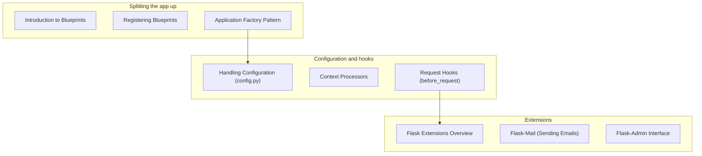

import Quiz from "../../../../components/Quiz.astro";

Once your app grows beyond a few routes, architecture matters more than individual features.

Phase 7 focuses on organizing code so it stays maintainable.

## You’ll learn

- Blueprints (modular routes)
- Registering Blueprints
- Application factory pattern
- Configuration management (`config.py`)
- Context processors
- Request hooks (`before_request`, etc.)
- Extension patterns (Flask-Login, SQLAlchemy, Migrate, etc.)
- Common extensions (Mail, Admin)

## Phase checklist

1. Introduction to Blueprints
2. Registering Blueprints
3. Application Factory Pattern
4. Handling Configuration (config.py)
5. Context Processors
6. Request Hooks (before_request)
7. Flask Extensions Overview
8. Flask-Mail (Sending Emails)
9. Flask-Admin Interface

## The phase at a glance

This phase exists to **structure an app that has outgrown one file**. It assumes a working app with several features, and once it is done you can build an app split into modules, configurable per environment.



## Where this sits in the track

```p5 title="The track, and what each phase unlocks" desc="Each phase assumes the one before it. Click a phase to see what you can build once it is done." height="330"
let sel = 6;
const NAMES = ['Fundamentals', 'Routing', 'Templating', 'Forms', 'Databases', 'Auth', 'Architecture', 'REST APIs', 'Deployment'];
const BUILDS = ['a page that says hello', 'a site with several URLs and a JSON endpoint', 'a real multi-page site with a shared layout', 'a site that accepts and validates input', 'a site whose data survives a restart', 'a site with accounts and private pages', 'an app split into modules, configurable per environment', 'an API other programs can call', 'all of it, running on a public server'];

function setup() {
  createCanvas(600, 330);
  textFont('monospace');
}

function draw() {
  background(13, 17, 23);
  noStroke();
  fill(230);
  textSize(13);
  textAlign(LEFT, TOP);
  text('the Flask track', 24, 16);
  fill(120);
  textSize(11);
  text('click a phase', 24, 36);

  for (let i = 0; i < NAMES.length; i++) {
    const col = i % 3;
    const row = floor(i / 3);
    const x = 24 + col * 186;
    const y = 62 + row * 56;
    const done = i < sel;
    const on = i === sel;
    stroke(on ? color(255, 211, 67) : (done ? color(120, 190, 130) : color(48, 56, 68)));
    strokeWeight(on ? 2 : 1);
    fill(on ? color(38, 34, 18) : (done ? color(18, 28, 22) : color(17, 22, 29)));
    rect(x, y, 174, 46, 4);
    noStroke();
    fill(on ? color(255, 211, 67) : (done ? color(120, 190, 130) : 110));
    textSize(11);
    textAlign(LEFT, TOP);
    text('Phase ' + (i + 1), x + 12, y + 8);
    fill(on ? color(255, 211, 67) : (done ? 150 : 90));
    textSize(11);
    text(NAMES[i], x + 12, y + 26);
  }

  stroke(48, 56, 68);
  strokeWeight(1);
  fill(18, 23, 30);
  rect(24, 240, 552, 62, 5);
  noStroke();
  fill(110);
  textSize(10);
  textAlign(LEFT, TOP);
  text('after Phase ' + (sel + 1) + ' you can build', 38, 250);
  fill(120, 190, 130);
  textSize(13);
  text(BUILDS[sel], 38, 272);

  fill(90);
  textSize(10);
  textAlign(LEFT, TOP);
  text('green = assumed knowledge by the time you reach the highlighted phase', 24, 312);
}

function mousePressed() {
  for (let i = 0; i < NAMES.length; i++) {
    const col = i % 3;
    const row = floor(i / 3);
    const x = 24 + col * 186;
    const y = 62 + row * 56;
    if (mouseX > x && mouseX < x + 174 && mouseY > y && mouseY < y + 46) sel = i;
  }
}
```

## The pages, in reading order

| # | page |
|--:|:--|
| 1 | Introduction to Blueprints |
| 2 | Registering Blueprints |
| 3 | Application Factory Pattern |
| 4 | Handling Configuration (config.py) |
| 5 | Context Processors |
| 6 | Request Hooks (before_request) |
| 7 | Flask Extensions Overview |
| 8 | Flask-Mail (Sending Emails) |
| 9 | Flask-Admin Interface |

9 pages. They are ordered so that each one only uses ideas from the pages above it — reading out of order mostly works, but the examples assume what came before.

## Check yourself

<Quiz
  questions={[
    {
      q: "What triggers the need for this phase?",
      options: [
        "adding a database",
        "an application that has outgrown a single file",
        "switching to an API",
        "deploying to production",
      ],
      answer: 1,
      explain:
        "Blueprints, the application factory and configuration handling all address the same problem: structuring code that no longer fits in one module.",
    },
    {
      q: "Why is the Application Factory Pattern grouped with Blueprints rather than with configuration?",
      options: [
        "it is only about naming",
        "both split the app into parts that can be assembled, which is what makes several apps and per-test configuration possible",
        "factories replace blueprints",
        "blueprints require a factory to work",
      ],
      answer: 1,
      explain:
        "A module-level app is created once with one configuration. A factory makes configuration a parameter, which is what testing needs.",
    },
    {
      q: "What do the phase overview pages give you that the individual pages do not?",
      options: [
        "the full code for each topic",
        "the reading order, what the phase assumes, and what you can build once it is done",
        "a downloadable project template",
        "the deployment configuration",
      ],
      answer: 1,
      explain:
        "Each overview lists its pages in sidebar order and names the phase's prerequisites and outcome, so you can tell whether you are ready for it.",
    },
  ]}
/>
