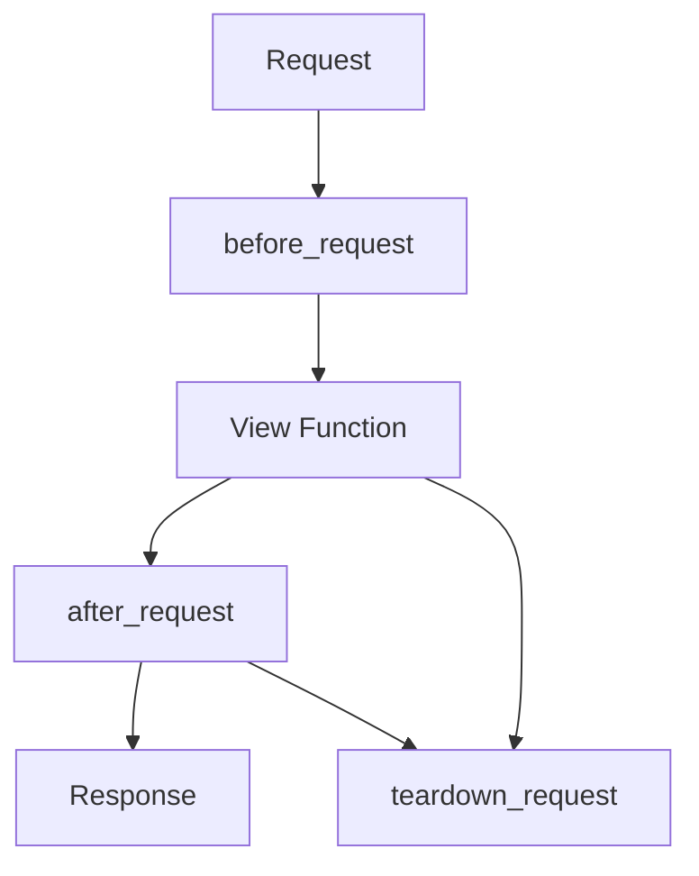

Flask provides request hooks to run code at specific points in the request lifecycle.

## Common hooks

- `@app.before_request`
- `@app.after_request`
- `@app.teardown_request`



## Example: add a header

```python
@app.after_request
def add_security_headers(response):
    response.headers["X-Content-Type-Options"] = "nosniff"
    return response
```

## Example: simple request logging

```python
from flask import request

@app.before_request
def log_request():
    app.logger.info("%s %s", request.method, request.path)
```

## teardown_request

Runs even on errors.

Good for:

- closing resources
- cleaning up per-request state

Avoid running heavy logic here.
