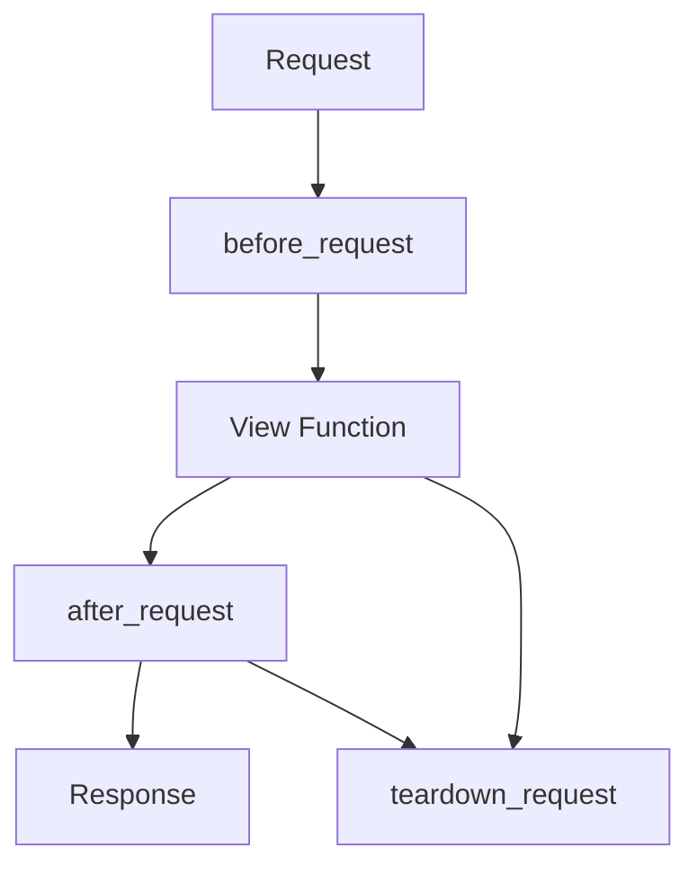

Flask provides request hooks to run code at specific points in the request lifecycle.

## Common hooks

- `@app.before_request`
- `@app.after_request`
- `@app.teardown_request`


```mermaid
flowchart TD
  A[Request] --> B[before_request]
  B --> C[View Function]
  C --> D[after_request]
  D --> E[Response]
  C --> F[teardown_request]
  D --> F
```

## Example: add a header

```python
@app.after_request
def add_security_headers(response):
    response.headers["X-Content-Type-Options"] = "nosniff"
    return response
```

## Example: simple request logging

```python
from flask import request

@app.before_request
def log_request():
    app.logger.info("%s %s", request.method, request.path)
```

## teardown_request

Runs even on errors.

Good for:

- closing resources
- cleaning up per-request state

Avoid running heavy logic here.

## The request lifecycle

Every request passes through the same stages. Hooks let you run your own code at fixed points in that sequence, without touching each view.

1. `before_request` functions run first. If one returns a response, the view is skipped.
2. The view function runs.
3. `after_request` functions run with the response object. They must return a response.
4. `teardown_request` functions run last, even if something raised an exception.

Use a hook when the same code would otherwise be copied into many views: logging, timing, security headers, loading the current user, or checking that an API key is present.

## A worked example

```python title="hooks_demo.py" showLineNumbers{1}
import time
from flask import Flask, g, request, abort

app = Flask(__name__)


@app.before_request
def start_timer():
    g.start = time.perf_counter()


@app.before_request
def require_api_key():
    if request.path.startswith("/api/") and request.headers.get("X-API-Key") != "secret":
        abort(401)


@app.after_request
def add_headers(response):
    elapsed_ms = (time.perf_counter() - g.start) * 1000
    response.headers["X-Response-Time"] = f"{elapsed_ms:.1f}ms"
    response.headers["X-Content-Type-Options"] = "nosniff"
    return response


@app.teardown_request
def cleanup(exception):
    # release resources; exception is None when the request succeeded
    pass
```

The first hook stores the start time on `g`, an object that lives for one request. The second aborts unauthorized API calls before any view runs. The `after_request` hook reads the start time and adds two headers to every response. `teardown_request` receives the exception, if any, and is the place to close things that a request opened.

There is a subtlety with `g.start`. If a `before_request` hook that runs earlier returns a response, later hooks are skipped, but `after_request` still runs, and `g.start` may not exist. Use `g.get("start")` when in doubt.

## Rules to remember

- `before_request` must return `None` to let the request continue. Returning any value ends the request with that response.
- `after_request` must return the response object. Forgetting the `return` causes a 500 error.
- Hooks registered on `app` run for every route. Hooks registered on a blueprint run only for that blueprint's routes.

## Common mistakes

- **Forgetting `return response`.** The most common bug with `after_request`.
- **Doing slow work in a hook.** It slows down every request.
- **Using `teardown_request` to change the response.** It cannot. Use `after_request`.
- **Applying auth to everything.** Remember to skip public paths like login and static files.

## How it connects

Blueprints from the earlier lessons can have their own hooks, which is a neat way to guard an admin area. Context processors, the next lesson, work in a similar spirit but feed data into templates instead of wrapping requests.

## Check yourself

<Quiz
  questions={[
    {
      q: "A before_request function returns the string 'Blocked'. What happens?",
      options: [
        "The request continues to the view",
        "The view is skipped and 'Blocked' is sent as the response",
        "The value is ignored",
        "Flask raises an error",
      ],
      answer: 1,
      explain: "Returning anything other than None from before_request ends the request with that response. That is how you block a request early.",
    },
    {
      q: "An after_request function adds a header but has no return statement. What is the outcome?",
      options: [
        "The header is added and all is well",
        "The function returns None instead of a response, and the request fails with a 500 error",
        "The header is silently dropped",
        "Flask returns the original response automatically",
      ],
      answer: 1,
      explain: "after_request must return a response object, because Flask passes it on to the next handler and finally to the client.",
    },
    {
      q: "Which hook is guaranteed to run even when a view raises an exception?",
      options: [
        "before_request",
        "after_request",
        "teardown_request",
        "context_processor",
      ],
      answer: 2,
      explain: "Teardown functions run at the end of every request, including failed ones, which makes them the right place to release resources.",
    },
  ]}
/>
