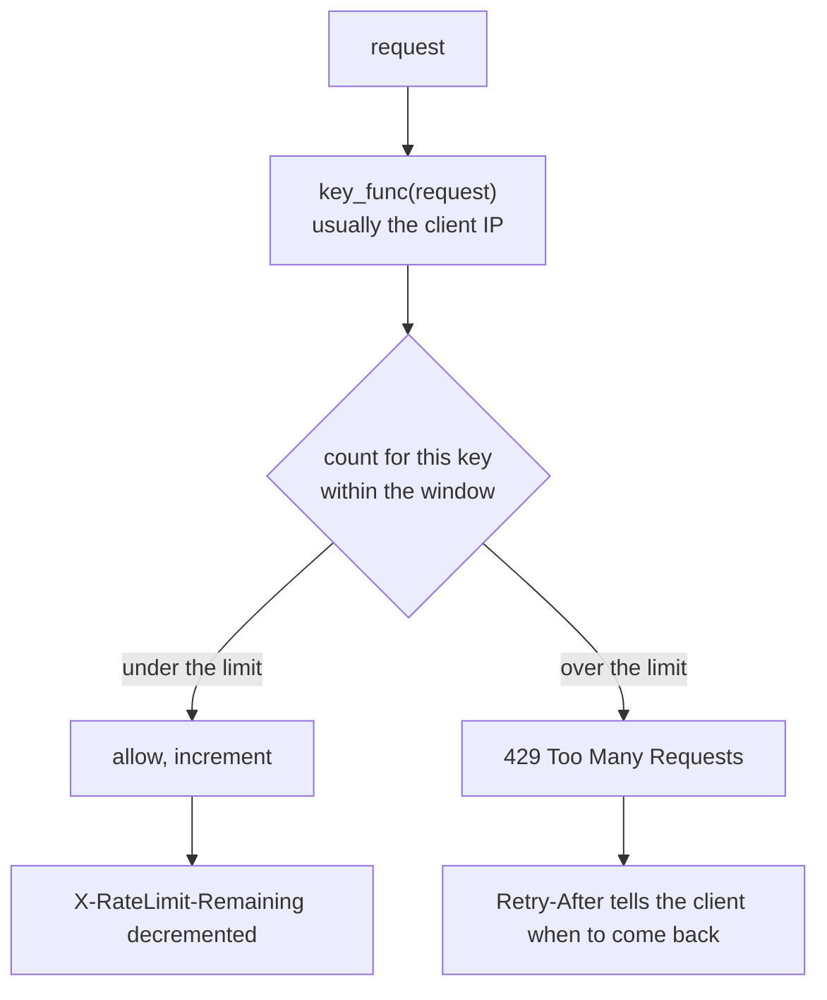

Rate limiting protects your API from:

- brute force login attacks
- abusive clients
- accidental traffic spikes

## Flask-Limiter

A popular extension is Flask-Limiter.

Install:

```bash
pip install Flask-Limiter
```

## Basic usage (example)

```python
from flask import Flask
from flask_limiter import Limiter
from flask_limiter.util import get_remote_address

app = Flask(__name__)

limiter = Limiter(
    get_remote_address,
    app=app,
    default_limits=["200 per day", "50 per hour"],
)


@app.get("/api/status")
@limiter.limit("10 per minute")
def status():
    return {"status": "ok"}
```

## Choosing limits

Good limits depend on:

- endpoint type (login should be tighter)
- expected client behavior
- whether the endpoint is expensive (DB-heavy)

## Production note

For multi-instance deployments, configure shared storage (Redis) so limits are consistent across instances.

## What a limiter actually counts

A rate limit is a counter keyed by *something about the caller*, reset on a schedule.
Flask-Limiter's key function decides what that something is:



```python title="setup.py" showLineNumbers{1}
from flask_limiter import Limiter
from flask_limiter.util import get_remote_address

limiter = Limiter(get_remote_address, app=app, default_limits=["5 per minute"])

@app.route("/api")
@limiter.limit("3 per minute")      # overrides the default for this route
def api():
    return jsonify(ok=True)

@app.route("/health")
@limiter.exempt                      # never limited
def health():
    return "ok"
```

Measured, with `RATELIMIT_HEADERS_ENABLED`:

| request | status | `X-RateLimit-Remaining` |
|--:|--:|--:|
| 1 | 200 | 2 |
| 2 | 200 | 1 |
| 3 | 200 | 0 |
| 4 | **429** | 0 |

The default limit applied to undecorated routes exactly as configured: seven calls to a
route under `5 per minute` measured `[200, 200, 200, 200, 200, 429, 429]`. An exempt route
took eight calls and returned `200` every time. A request from a different IP had its own
budget and was allowed immediately.

## Two defaults that will bite an API

**The 429 body is HTML.** Measured, with no error handler:

```text title="default 429"
Content-Type: text/html; charset=utf-8
<!doctype html><html lang=en><title>429 Too Many Requests</title>...
```

A JSON client receiving that will fail to parse it and report something unhelpful. Give
it a JSON handler:

```python title="json_429.py" showLineNumbers{1}
@app.errorhandler(429)
def too_many(e):
    return jsonify(error="rate limit exceeded", detail=str(e.description)), 429
```

```text title="measured"
Content-Type: application/json
{"detail":"3 per 1 minute","error":"rate limit exceeded"}
```

**Storage is in memory by default.** Measured: `MemoryStorage`, and two limiters held two
separate storage objects.

:::danger[In-memory counters multiply your limit by the number of workers]
Each worker process keeps its own counters. Behind `gunicorn -w 4`, a limit of `100 per
hour` becomes up to **400 per hour** in practice, and which limit a caller hits depends
on which worker answers. Counters also reset on every deploy.

```python title="shared_storage.py" showLineNumbers{1}
limiter = Limiter(
    get_remote_address, app=app,
    storage_uri="redis://localhost:6379/0",   # shared by every worker
)
```

Anything beyond a single-process toy needs shared storage.
:::

## Choosing the key

`get_remote_address` is the default and is wrong in two common situations:

- **Behind a proxy or load balancer**, every request appears to come from the proxy, so
  all your users share one budget. You need `ProxyFix` and the forwarded header — and you
  must only trust it when your own proxy sets it.
- **For an authenticated API**, the fair unit is the account, not the connection. Key on
  the API key or user id so one customer on a shared office IP is not throttled by their
  colleagues.

```python title="key_by_user.py" showLineNumbers{1}
def key_func():
    return request.headers.get("X-API-Key") or get_remote_address()

limiter = Limiter(key_func, app=app)
```

## See it move

```p5 title="A limit of 3 per minute" desc="Each allowed request decrements the remaining budget. When it reaches zero the next request is refused with 429 and a Retry-After header." height="340"
let used = 0;
const LIMIT = 3;

function setup() {
  createCanvas(600, 340);
  textFont('monospace');
}

function draw() {
  background(13, 17, 23);
  const remaining = max(0, LIMIT - used);
  const blocked = used >= LIMIT;

  noStroke();
  fill(230);
  textSize(13);
  textAlign(LEFT, TOP);
  text('@limiter.limit(\u00223 per minute\u0022)', 24, 16);

  for (let i = 0; i < LIMIT; i++) {
    const x = 24 + i * 100;
    const spent = i < used;
    stroke(spent ? color(60, 70, 84) : color(120, 190, 130));
    strokeWeight(1);
    fill(spent ? color(18, 22, 28) : color(18, 30, 22));
    rect(x, 50, 88, 46, 5);
    noStroke();
    fill(spent ? 60 : color(120, 190, 130));
    textSize(11);
    textAlign(CENTER, CENTER);
    text(spent ? 'used' : 'available', x + 44, 73);
  }

  noStroke();
  fill(150);
  textSize(11);
  textAlign(LEFT, TOP);
  text('X-RateLimit-Limit: ' + LIMIT, 340, 52);
  fill(remaining === 0 ? color(232, 110, 110) : color(120, 190, 130));
  text('X-RateLimit-Remaining: ' + remaining, 340, 72);
  fill(150);
  text('Retry-After: 60', 340, 92);

  const c = blocked ? color(232, 110, 110) : color(120, 190, 130);
  stroke(c);
  strokeWeight(1);
  fill(18, 23, 30);
  rect(24, 118, 552, 80, 5);
  noStroke();
  fill(c);
  textSize(26);
  textAlign(LEFT, TOP);
  text(blocked ? '429' : '200', 40, 134);
  fill(150);
  textSize(11);
  text(blocked ? 'Too Many Requests' : 'request served', 100, 142);
  fill(blocked ? color(232, 110, 110) : 110);
  textSize(10);
  text(blocked
    ? 'default body is HTML - add an errorhandler(429) to return JSON'
    : 'the counter is keyed by the client IP unless you change key_func', 100, 166);

  fill(255, 211, 67);
  textSize(11);
  textAlign(LEFT, TOP);
  text('requests made: ' + used, 24, 214);
  fill(90);
  textSize(10);
  text('with gunicorn -w 4 and in-memory storage, four separate counters exist', 24, 236);
  text('so the effective limit is up to 4x what you configured', 24, 252);

  drawBtn(24, 282, 180, 'send a request');
  drawBtn(216, 282, 140, 'window resets');
}

function drawBtn(x, y, w, label) {
  const hot = mouseX > x && mouseX < x + w && mouseY > y && mouseY < y + 24;
  stroke(hot ? color(255, 211, 67) : color(60, 70, 84));
  strokeWeight(1);
  fill(hot ? color(34, 40, 50) : color(22, 28, 36));
  rect(x, y, w, 24, 4);
  noStroke();
  fill(hot ? color(255, 211, 67) : 200);
  textSize(11);
  textAlign(CENTER, CENTER);
  text(label, x + w / 2, y + 12);
}

function mousePressed() {
  if (mouseY < 282 || mouseY > 306) return;
  if (mouseX > 24 && mouseX < 204) used = min(LIMIT + 2, used + 1);
  if (mouseX > 216 && mouseX < 356) used = 0;
}
```

## Check yourself

<Quiz
  questions={[
    {
      q: "With flask-limiter's default storage and gunicorn -w 4, what does a configured limit of 100 per hour actually allow?",
      options: [
        "100 per hour, the workers share a counter",
        "up to 400 per hour, because each worker process keeps its own in-memory counters",
        "25 per hour, the limit is divided between workers",
        "unlimited, the limit is ignored under gunicorn",
      ],
      answer: 1,
      explain:
        "Measured storage was MemoryStorage, and two limiters held separate storage objects. Use a shared backend such as storage_uri=redis://... for anything beyond one process.",
    },
    {
      q: "By default, what Content-Type does flask-limiter's 429 response use?",
      options: [
        "application/json, matching the API",
        "text/html, which a JSON client cannot parse",
        "text/plain",
        "it returns no body at all",
      ],
      answer: 1,
      explain:
        "Measured an HTML error page. Register an errorhandler(429) returning jsonify so API clients get something they can read.",
    },
    {
      q: "Why is get_remote_address a poor key function behind a load balancer?",
      options: [
        "it is slower than other key functions",
        "every request appears to come from the proxy, so all users share a single budget",
        "it returns None behind a proxy",
        "it changes on every request",
      ],
      answer: 1,
      explain:
        "You need ProxyFix and the forwarded header — trusted only when your own proxy sets it. For an authenticated API, keying on the API key or user id is fairer still.",
    },
  ]}
/>
