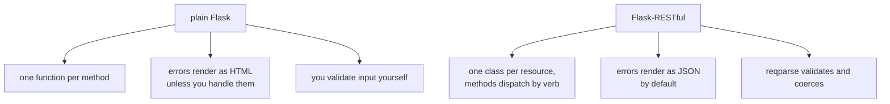

import Quiz from "../../../../components/Quiz.astro";

You can build REST APIs in Flask in multiple styles.

## Plain Flask (recommended for learning)

Advantages:

- fewer dependencies
- you learn the fundamentals
- easy to debug

A plain Flask API is just:

- routes + JSON responses

## Flask-RESTful

Flask-RESTful provides a resource class style:

- `Resource` classes
- automatic parsing helpers

Pros:

- slightly more structured for large APIs

Cons:

- another abstraction layer
- not necessary for most beginner/intermediate projects

## Practical recommendation

Use plain Flask until:

- you feel your API structure is repeating too much

At that point you can evaluate:

- Flask-RESTful
- Flask-Smorest (OpenAPI)
- or even moving to FastAPI for API-first services

For this tutorial track, we stick to plain Flask patterns so the concepts are clear.

## The same endpoint, both ways

```python title="plain_flask.py" showLineNumbers{1}
@app.route("/items/<int:id>", methods=["GET"])
def get_item(id):
    if id not in ITEMS:
        abort(404)
    return jsonify(ITEMS[id])

@app.route("/items/<int:id>", methods=["DELETE"])
def del_item(id):
    ITEMS.pop(id, None)
    return "", 204
```

```python title="flask_restful.py" showLineNumbers{1}
class Item(Resource):
    @marshal_with(ITEM_FIELDS)
    def get(self, id):
        if id not in ITEMS:
            abort(404)
        return ITEMS[id]

    def delete(self, id):
        ITEMS.pop(id, None)
        return "", 204

api.add_resource(Item, "/items/<int:id>")
```

Both return the same body for a successful GET. The differences show up at the edges:



## The difference that matters most

Measured, requesting an item that does not exist:

| | status | `Content-Type` | body |
|:--|--:|:--|:--|
| plain Flask | 404 | `text/html; charset=utf-8` | `<!doctype html><title>404 Not Found</title>...` |
| Flask-RESTful | 404 | **`application/json`** | `{"message": "The requested URL was not found..."}` |

An API that answers errors in HTML forces every client to special-case them. Plain Flask
can do the same thing — it just needs saying:

```python title="json_errors.py" showLineNumbers{1}
@app.errorhandler(404)
@app.errorhandler(500)
def json_error(e):
    return jsonify(error=e.name, status=e.code), e.code
```

Which is a fair summary of the whole comparison: Flask-RESTful's advantages are all
achievable in plain Flask, and it decides them for you.

## Input validation

```python title="reqparse.py" showLineNumbers{1}
parser = reqparse.RequestParser()
parser.add_argument("name", type=str, required=True, help="name is required")
parser.add_argument("qty", type=int, default=0)
```

Measured:

```text title="missing a required field"
400  {"message": {"name": "name is required"}}
```

```text title="qty sent as the string '7'"
201  {"received": {"name": "bolt", "qty": 7}}      <- coerced to int
```

Validation errors come back as JSON keyed by field, with no extra work.

## Routing shape

Measured `url_map`:

```text title="plain Flask"
/items/<int:id>  ['GET']
/items/<int:id>  ['DELETE']      two rules for one path
```

```text title="Flask-RESTful"
/items/<int:id>                  one rule; the class dispatches by verb
```

## Which to choose

| choose plain Flask when | choose Flask-RESTful when |
|:--|:--|
| the API is a handful of endpoints | many resources with uniform CRUD |
| you want no extra dependency | the class-per-resource shape fits |
| you already handle errors centrally | you want JSON errors by default |

:::caution[Check the project's activity before adopting it]
`reqparse` has been documented as deprecated for years, and Flask-RESTful releases
infrequently. Plain Flask with `pydantic` for validation, or a framework built for APIs
such as FastAPI, is where much of this work has moved. An extension is easy to add and
hard to remove.
:::

## See it move

```p5 title="Where the two approaches actually differ" desc="Both serve the same successful response. The differences appear in error format, input validation and how routes are registered." height="340"
let scenario = 0;
const S = [
  { n: 'GET an existing item', plain: '200  application/json', rest: '200  application/json', same: true },
  { n: 'GET a missing item', plain: '404  text/html', rest: '404  application/json', same: false },
  { n: 'POST with a field missing', plain: 'you write the check', rest: '400  JSON per-field errors', same: false },
  { n: 'route registration', plain: 'two rules, one per method', rest: 'one rule, class dispatches', same: false },
];

function setup() {
  createCanvas(600, 340);
  textFont('monospace');
}

function draw() {
  background(13, 17, 23);
  const s = S[scenario];

  noStroke();
  fill(230);
  textSize(13);
  textAlign(LEFT, TOP);
  text(s.n, 24, 18);

  const cols = [
    { t: 'plain Flask', v: s.plain, x: 24, c: s.same ? [120, 190, 130] : [255, 211, 67] },
    { t: 'Flask-RESTful', v: s.rest, x: 312, c: [120, 190, 130] },
  ];
  for (let i = 0; i < 2; i++) {
    const col = cols[i];
    stroke(col.c[0], col.c[1], col.c[2]);
    strokeWeight(1);
    fill(18, 23, 30);
    rect(col.x, 56, 264, 92, 5);
    noStroke();
    fill(110);
    textSize(10);
    textAlign(LEFT, TOP);
    text(col.t, col.x + 14, 68);
    fill(col.c[0], col.c[1], col.c[2]);
    textSize(12);
    text(col.v, col.x + 14, 96);
  }

  noStroke();
  fill(s.same ? color(120, 190, 130) : color(255, 211, 67));
  textSize(12);
  textAlign(LEFT, TOP);
  text(s.same ? 'identical - no reason to prefer either here'
              : 'they differ, but plain Flask can be configured to match', 24, 170);

  if (!s.same && scenario === 1) {
    fill(120);
    textSize(10);
    text('@app.errorhandler(404) returning jsonify gives plain Flask the same behaviour', 24, 196);
  }
  if (!s.same && scenario === 2) {
    fill(120);
    textSize(10);
    text('measured: {\u0022message\u0022: {\u0022name\u0022: \u0022name is required\u0022}}', 24, 196);
  }

  for (let i = 0; i < S.length; i++) {
    const y = 226 + i * 22;
    const on = i === scenario;
    noStroke();
    fill(on ? color(255, 211, 67) : 90);
    textSize(10);
    textAlign(LEFT, TOP);
    text((on ? '> ' : '  ') + S[i].n, 24, y);
  }

  drawBtn(380, 292, 190, 'next comparison');
}

function drawBtn(x, y, w, label) {
  const hot = mouseX > x && mouseX < x + w && mouseY > y && mouseY < y + 24;
  stroke(hot ? color(255, 211, 67) : color(60, 70, 84));
  strokeWeight(1);
  fill(hot ? color(34, 40, 50) : color(22, 28, 36));
  rect(x, y, w, 24, 4);
  noStroke();
  fill(hot ? color(255, 211, 67) : 200);
  textSize(11);
  textAlign(CENTER, CENTER);
  text(label, x + w / 2, y + 12);
}

function mousePressed() {
  if (mouseY > 292 && mouseY < 316 && mouseX > 380 && mouseX < 570) scenario = (scenario + 1) % S.length;
}
```

## Check yourself

<Quiz
  questions={[
    {
      q: "Requesting a missing item returned 404 from both. How did the responses differ?",
      options: [
        "they were identical",
        "plain Flask returned an HTML error page while Flask-RESTful returned application/json",
        "Flask-RESTful returned 400 instead",
        "plain Flask returned no body",
      ],
      answer: 1,
      explain:
        "That is the single most practical difference for an API client. Plain Flask matches it with an errorhandler that returns jsonify.",
    },
    {
      q: "reqparse receives qty as the string '7' with type=int. What arrives in the parsed arguments?",
      options: [
        "the string '7'",
        "the integer 7, coerced by the declared type",
        "a 400, since the type does not match",
        "None, because coercion is not automatic",
      ],
      answer: 1,
      explain:
        "Measured 201 with qty 7 as an int. A missing required field instead produced 400 with per-field JSON errors.",
    },
    {
      q: "What is the strongest argument against adopting Flask-RESTful today?",
      options: [
        "it cannot handle DELETE requests",
        "everything it provides is achievable in plain Flask, while reqparse has long been documented as deprecated and releases are infrequent",
        "it is incompatible with Flask 3",
        "it does not support URL parameters",
      ],
      answer: 1,
      explain:
        "Its advantages are defaults rather than capabilities. Much of this work has moved to plain Flask with pydantic, or to frameworks built for APIs.",
    },
  ]}
/>
