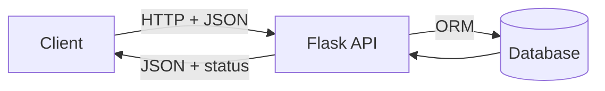

REST (Representational State Transfer) is a set of conventions for designing web APIs.

## Core idea: resources

A REST API is organized around **resources**:

- `/users`
- `/posts`
- `/orders`

You use HTTP methods to operate on them:

- GET `/users` → list users
- GET `/users/1` → get one user
- POST `/users` → create user
- PUT/PATCH `/users/1` → update
- DELETE `/users/1` → delete

## Status codes matter

- 200 OK — success
- 201 Created — created successfully
- 400 Bad Request — invalid request data
- 401 Unauthorized — missing/invalid auth
- 403 Forbidden — authenticated but not allowed
- 404 Not Found — resource doesn’t exist

## Statelessness

REST APIs are typically stateless:

- every request contains everything needed (auth token, parameters)

That’s why token-based auth (JWT) is common.

## A good REST mental model

## Practical tip

REST is a guideline, not a law.

Aim for:

- consistency
- clear error responses
- predictable URLs

import DataCampExercise from "../../../../components/DataCampExercise.astro";

## 🧪 Try It Yourself

### Exercise 1 – Create a Flask App

<DataCampExercise
  lang="python"
  hint={`Import Flask, create \`app = Flask(__name__)\`, then define a route.`}
  code={`# Task: Exercise 1 – Create a Flask App
# (Simulated – we run the route function directly)
from flask import Flask

app = ___(  __name__  )   # replace ___ with Flask

@app.route("/")
def home():
    return "Hello, Flask!"

# Simulate calling the route
with app.test_client() as client:
    r = client.get("/")
    print(r.data.decode())

# ── Expected Output ───────────────────────────────────────────
# Hello, Flask!
# ──────────────────────────────────────────────────────────────`}
  solution={`from flask import Flask

app = Flask(__name__)

@app.route("/")
def home():
    return "Hello, Flask!"

with app.test_client() as client:
    r = client.get("/")
    print(r.data.decode())`}
  sct={`test_output_contains("Hello, Flask!")
success_msg("First Flask route works!")`}
  height={148}
/>

### Exercise 2 – Dynamic Route

<DataCampExercise
  lang="python"
  hint={`Use \`<name>\` in the route path and add it as a function parameter.`}
  code={`# Task: Exercise 2 – Dynamic Route
from flask import Flask

app = Flask(__name__)

# Hint: add a <name> variable to the route
@app.route("/greet/<___>")   # replace ___ with name
def greet(name):
    return f"Hello, {name}!"

with app.test_client() as c:
    print(c.get("/greet/Alice").data.decode())

# ── Expected Output ───────────────────────────────────────────
# Hello, Alice!
# ──────────────────────────────────────────────────────────────`}
  solution={`from flask import Flask

app = Flask(__name__)

@app.route("/greet/<name>")
def greet(name):
    return f"Hello, {name}!"

with app.test_client() as c:
    print(c.get("/greet/Alice").data.decode())`}
  sct={`test_output_contains("Hello, Alice!")
success_msg("Dynamic routes work!")`}
  height={140}
/>

### Exercise 3 – Return JSON

<DataCampExercise
  lang="python"
  hint={`Use \`flask.jsonify(data)\` to return a JSON response.`}
  code={`# Task: Exercise 3 – Return JSON
from flask import Flask, jsonify

app = Flask(__name__)

@app.route("/status")
def status():
    # Hint: use jsonify to return a dict as JSON
    return ___({"ok": True, "code": 200})   # replace ___ with jsonify

with app.test_client() as c:
    import json
    data = json.loads(c.get("/status").data)
    print("ok:", data["ok"])
    print("code:", data["code"])

# ── Expected Output ───────────────────────────────────────────
# ok: True
# code: 200
# ──────────────────────────────────────────────────────────────`}
  solution={`from flask import Flask, jsonify
import json

app = Flask(__name__)

@app.route("/status")
def status():
    return jsonify({"ok": True, "code": 200})

with app.test_client() as c:
    data = json.loads(c.get("/status").data)
    print("ok:", data["ok"])
    print("code:", data["code"])`}
  sct={`test_output_contains("ok: True")
test_output_contains("code: 200")
success_msg("jsonify returns JSON responses!")`}
  height={152}
/>

