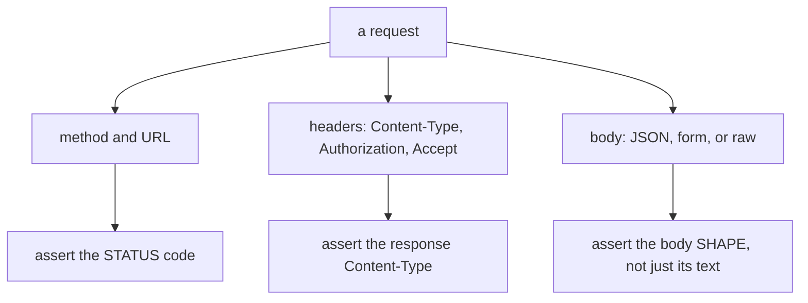

Postman is a handy tool for exploring and debugging APIs.

## What to test

- URL + method
- Query parameters
- Headers (Content-Type, Authorization)
- JSON body
- Status codes
- Response schema

## Common Postman setup

### POST JSON

- Method: POST
- Body: raw → JSON

Example payload:

```json
{ "title": "Buy milk" }
```

### Add headers

- `Content-Type: application/json`

## Auth testing

When you add token auth later, you’ll often set:

- `Authorization: Bearer <token>`

Postman can store variables and environments for tokens.

## Debugging tips

- If Flask returns 415 Unsupported Media Type, your Content-Type might be wrong.
- If you get 400, inspect validation errors.
- If you get 401/403, inspect Authorization header.

## Bonus: keep docs in sync

If you maintain an API, consider documenting endpoints with:

- OpenAPI (Swagger)

That’s a more advanced step, but worth it for real projects.

## What an API test is actually checking

Postman is a graphical client for constructing HTTP requests. Everything it sends is
ordinary HTTP, so the things worth asserting are the same whether you click them or
script them:



:::note[What this page verifies, and what it does not]
Every HTTP behaviour below was measured against a running Flask app. The Postman
**interface** steps — creating a collection, saving an environment — are described from
its documented behaviour and were not executed here, because a GUI cannot run in this
environment. The `curl` and `requests` equivalents were run, and are what the numbers
come from.
:::

## Content-Type decides how your body is read

Measured, sending `{"name": "ada"}` three ways to the same endpoint:

| how it was sent | `Content-Type` | `request.is_json` | `request.json` | `request.form` |
|:--|:--|:--|:--|:--|
| JSON body | `application/json` | `True` | `{'name': 'ada'}` | `{}` |
| form fields | `application/x-www-form-urlencoded` | `False` | `None` | `{'name': 'ada'}` |
| raw string, no header | `None` | `False` | `None` | `{}` |

The third row is the one that wastes afternoons: the body was sent, the server received
15 bytes of it, and `request.json` is `None` purely because no `Content-Type` was set. In
Postman this is the difference between the **raw + JSON** body type and **raw + Text**.

```bash title="curl equivalent"
curl -X POST http://localhost:5000/echo \
  -H "Content-Type: application/json" \
  -d '{"name": "ada"}'
```

## The error codes you should be provoking

Measured against a real endpoint:

| what you send | status |
|:--|--:|
| valid JSON with the right header | 200 |
| malformed JSON with `application/json` | **400** |
| valid JSON with `Content-Type: text/plain` | **415** |

`415 Unsupported Media Type` is a genuinely useful signal — the body was fine and the
header was wrong — and it is easy to misread as a server bug.

```python title="tolerant.py" showLineNumbers{1}
request.get_json()                 # raises -> 400 on a malformed body
request.get_json(silent=True)      # returns None instead, measured 200
```

## A checklist worth running against every endpoint

| case | expect |
|:--|:--|
| the happy path | 200 or 201, correct body shape |
| a required field missing | 400 or 422, an error naming the field |
| no credentials | 401 |
| valid credentials, someone else's record | **403**, not 404 and not 200 |
| an id that does not exist | 404 |
| a duplicate of something unique | 409 |
| the same request repeated quickly | 429 once limited |

The fourth row is the one most often missed. Fetching `/orders/999` while logged in as a
different user must not return that order — an ownership check is not the same as an
authentication check, and only a deliberate test catches it.

```python title="auth_header.py" showLineNumbers{1}
client.post("/echo", json={}, headers={"Authorization": "Bearer abc123"})
# the app sees: 'Bearer abc123'
```

## Automate what you have proved by hand

Postman is excellent for exploring an API and poor as the only place your tests live —
a collection on one laptop is not something CI can run. Once a case is understood, move
it into the test suite:

```python title="test_api.py" showLineNumbers{1}
def test_create_requires_name(client):
    r = client.post("/items", json={})
    assert r.status_code == 400
    assert "name" in r.get_json()["message"]

def test_cannot_read_another_users_order(client, other_users_token):
    r = client.get("/orders/999", headers={"Authorization": other_users_token})
    assert r.status_code == 403
```

## See it move

```p5 title="The same body, different Content-Type" desc="Flask parses the body according to the Content-Type header. A correct body with the wrong header is invisible to request.json." height="340"
let mode = 0;
const M = [
  { n: 'JSON body', ct: 'application/json', isj: true, json: "{'name': 'ada'}", form: '{}', code: 200 },
  { n: 'form fields', ct: 'application/x-www-form-urlencoded', isj: false, json: 'None', form: "{'name': 'ada'}", code: 200 },
  { n: 'raw, no header', ct: 'None', isj: false, json: 'None', form: '{}', code: 200 },
  { n: 'malformed JSON', ct: 'application/json', isj: true, json: 'raises', form: '{}', code: 400 },
  { n: 'JSON, wrong header', ct: 'text/plain', isj: false, json: 'refused', form: '{}', code: 415 },
];

function setup() {
  createCanvas(600, 340);
  textFont('monospace');
}

function draw() {
  background(13, 17, 23);
  const m = M[mode];
  const ok = m.code === 200 && m.json !== 'None';

  noStroke();
  fill(230);
  textSize(13);
  textAlign(LEFT, TOP);
  text('POST /echo   -   ' + m.n, 24, 16);

  stroke(75, 139, 190);
  strokeWeight(1);
  fill(18, 26, 36);
  rect(24, 48, 552, 42, 4);
  noStroke();
  fill(110);
  textSize(9);
  textAlign(LEFT, TOP);
  text('Content-Type', 38, 56);
  fill(75, 139, 190);
  textSize(12);
  text(m.ct, 38, 72);

  const rows = [
    { l: 'request.is_json', v: m.isj ? 'True' : 'False', good: m.isj },
    { l: 'request.json', v: m.json, good: m.json.indexOf('name') >= 0 },
    { l: 'request.form', v: m.form, good: m.form.indexOf('name') >= 0 },
  ];
  for (let i = 0; i < 3; i++) {
    const y = 104 + i * 40;
    stroke(48, 56, 68);
    strokeWeight(1);
    fill(17, 22, 29);
    rect(24, y, 552, 34, 4);
    noStroke();
    fill(150);
    textSize(11);
    textAlign(LEFT, CENTER);
    text(rows[i].l, 38, y + 17);
    fill(rows[i].good ? color(120, 190, 130) : color(232, 110, 110));
    textSize(12);
    text(rows[i].v, 220, y + 17);
  }

  const c = m.code === 200 ? color(120, 190, 130) : color(232, 110, 110);
  noStroke();
  fill(c);
  textSize(22);
  textAlign(LEFT, TOP);
  text(m.code, 24, 232);
  fill(150);
  textSize(11);
  text(m.code === 415 ? 'Unsupported Media Type - body fine, header wrong'
     : (m.code === 400 ? 'Bad Request - the body was not valid JSON'
     : (rows[1].good || rows[2].good ? 'parsed successfully' : 'accepted, but nothing was parsed')), 76, 240);

  drawBtn(24, 288, 200, 'next request');
  fill(90);
  textSize(10);
  textAlign(LEFT, TOP);
  text(mode + 1 + ' of ' + M.length, 240, 294);
}

function drawBtn(x, y, w, label) {
  const hot = mouseX > x && mouseX < x + w && mouseY > y && mouseY < y + 24;
  stroke(hot ? color(255, 211, 67) : color(60, 70, 84));
  strokeWeight(1);
  fill(hot ? color(34, 40, 50) : color(22, 28, 36));
  rect(x, y, w, 24, 4);
  noStroke();
  fill(hot ? color(255, 211, 67) : 200);
  textSize(11);
  textAlign(CENTER, CENTER);
  text(label, x + w / 2, y + 12);
}

function mousePressed() {
  if (mouseY > 288 && mouseY < 312 && mouseX > 24 && mouseX < 224) mode = (mode + 1) % M.length;
}
```

## Check yourself

<Quiz
  questions={[
    {
      q: "You send a correct JSON body but forget the Content-Type header. What does request.json contain?",
      options: [
        "the parsed object, since Flask inspects the body",
        "None, because Flask parses the body according to the header",
        "the raw string",
        "it raises a 400",
      ],
      answer: 1,
      explain:
        "Measured: the server received 15 bytes and request.json was still None. In Postman this is the difference between the raw JSON body type and raw Text.",
    },
    {
      q: "Valid JSON is sent with Content-Type: text/plain. What status does Flask return?",
      options: [
        "200",
        "400",
        "415",
        "422",
      ],
      answer: 2,
      explain:
        "415 Unsupported Media Type: the body was fine and the header was wrong. A malformed body with the correct header measured 400 instead.",
    },
    {
      q: "Which test case is most often missed when testing an API by hand?",
      options: [
        "the happy path returns 200",
        "a missing required field returns 400",
        "an authenticated user requesting someone else's record must get 403",
        "an unknown id returns 404",
      ],
      answer: 2,
      explain:
        "Authentication and ownership are different checks. Logging in proves who you are, not that a given record is yours, and only a deliberate test catches the gap.",
    },
    {
      q: "Why should a Postman collection not be where your API tests live permanently?",
      options: [
        "Postman cannot send authenticated requests",
        "a collection on one machine is not something CI can run, so move proven cases into the test suite",
        "collections cannot be saved",
        "Postman does not support JSON bodies",
      ],
      answer: 1,
      explain:
        "Postman is excellent for exploring an API. Once a case is understood it belongs in code that runs on every commit.",
    },
  ]}
/>
