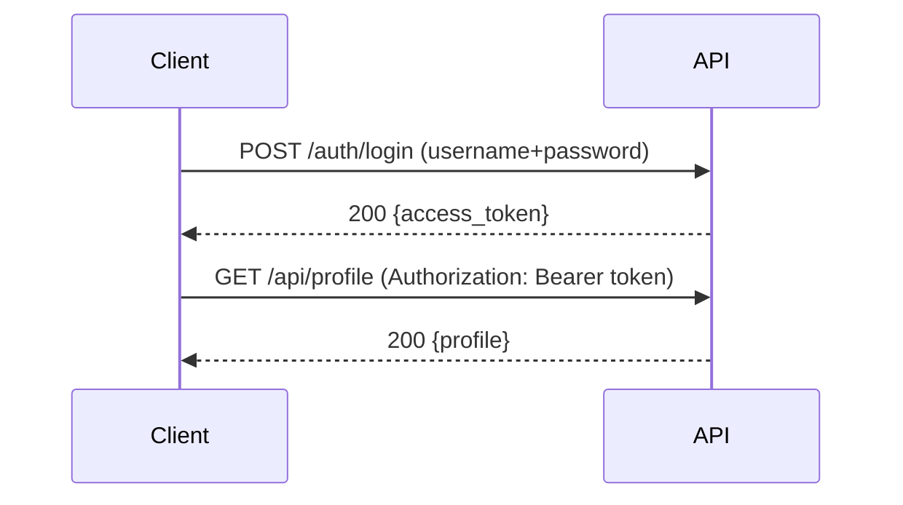

APIs commonly use token-based auth because they’re stateless.

## What is JWT?

JWT = JSON Web Token.

A JWT is a signed string that typically contains:

- user identity (subject)
- expiration time
- optional claims (roles, permissions)

## Common flow


```mermaid
sequenceDiagram
  participant C as Client
  participant A as API

  C->>A: POST /auth/login (username+password)
  A-->>C: 200 {access_token}
  C->>A: GET /api/profile (Authorization: Bearer token)
  A-->>C: 200 {profile}
```

## Flask options

Popular library:

- Flask-JWT-Extended

Install:

```bash
pip install Flask-JWT-Extended
```

## High-level usage (conceptual)

- create token on login
- require token on protected API routes

## Security notes

- Keep JWT secret keys safe (env vars)
- Use short expiration times
- For browser-based apps, be careful where you store tokens (XSS risk)
- Consider refresh tokens for longer sessions

JWT is powerful, but misuse can create security issues.

## Why tokens instead of sessions

Browser pages can rely on a session cookie, which the browser sends automatically. An API is often called by a mobile app or another server, where cookies are awkward. Token authentication solves this. The client logs in once with a username and password, receives a token, and sends that token in an `Authorization` header on every later request. The server does not need to look up a session, because the token itself proves who the caller is.

A JWT has three parts separated by dots: a header, a payload of claims such as the user id (`sub`) and expiry (`exp`), and a signature made with your secret key. Anyone can read the payload, because it is only encoded, not encrypted. What they cannot do is change it without invalidating the signature. So never put secrets in a JWT.

## A worked example with Flask-JWT-Extended

```python title="jwt_demo.py" showLineNumbers{1}
from datetime import timedelta
from flask import Flask, request
from flask_jwt_extended import (
    JWTManager, create_access_token, jwt_required, get_jwt_identity,
)

app = Flask(__name__)
app.config["JWT_SECRET_KEY"] = "change-me-and-load-from-env"
app.config["JWT_ACCESS_TOKEN_EXPIRES"] = timedelta(minutes=15)
jwt = JWTManager(app)

USERS = {"ravi": "pass1234"}   # demo only: real apps store password hashes


@app.post("/api/login")
def login():
    data = request.get_json(silent=True) or {}
    username = data.get("username", "")
    if USERS.get(username) != data.get("password"):
        return {"error": "bad_credentials"}, 401
    token = create_access_token(identity=username)
    return {"access_token": token}


@app.get("/api/me")
@jwt_required()
def me():
    return {"user": get_jwt_identity()}
```

The flow is: `POST /api/login` returns a token. The client then calls `GET /api/me` with the header `Authorization: Bearer <token>`. Without a valid token, `@jwt_required()` answers 401 and your function does not run. With one, `get_jwt_identity()` returns `"ravi"`.

The demo compares plain passwords to keep the example short. In a real app, look up the user and check the hash with `check_password_hash`, as covered in the password hashing lesson.

## Choosing expiry

A stolen token works until it expires, and the server cannot easily cancel it. That is why access tokens are short, often 5 to 15 minutes. A separate, longer-lived refresh token is used to get a new access token without logging in again.

## Common mistakes

- **Hardcoding the secret.** Load it from an environment variable, and use a long random value.
- **Long-lived access tokens.** A leak stays useful for too long.
- **Putting sensitive data in claims.** The payload is readable by anyone.
- **Sending tokens over plain HTTP.** Always use HTTPS.
- **Storing tokens in `localStorage` in a browser app.** Injected scripts can read them.

## How it connects

The earlier API lessons made open endpoints. This lesson protects them, the same job `@login_required` did for pages in Phase 6, but with headers instead of cookies.

## 🧪 Try It Yourself

### Exercise 1 – Create a Flask App

<DataCampExercise
  lang="python"
  hint={`Import Flask, create \`app = Flask(__name__)\`, then define a route.`}
  code={`# Task: Exercise 1 – Create a Flask App
# (Simulated – we run the route function directly)
from flask import Flask

app = ___(  __name__  )   # replace ___ with Flask

@app.route("/")
def home():
    return "Hello, Flask!"

# Simulate calling the route
with app.test_client() as client:
    r = client.get("/")
    print(r.data.decode())

# ── Expected Output ───────────────────────────────────────────
# Hello, Flask!
# ──────────────────────────────────────────────────────────────`}
  solution={`from flask import Flask

app = Flask(__name__)

@app.route("/")
def home():
    return "Hello, Flask!"

with app.test_client() as client:
    r = client.get("/")
    print(r.data.decode())`}
  sct={`test_output_contains("Hello, Flask!")
success_msg("First Flask route works!")`}
  height={148}
/>

### Exercise 2 – Dynamic Route

<DataCampExercise
  lang="python"
  hint={`Use \`<name>\` in the route path and add it as a function parameter.`}
  code={`# Task: Exercise 2 – Dynamic Route
from flask import Flask

app = Flask(__name__)

# Hint: add a <name> variable to the route
@app.route("/greet/<___>")   # replace ___ with name
def greet(name):
    return f"Hello, {name}!"

with app.test_client() as c:
    print(c.get("/greet/Alice").data.decode())

# ── Expected Output ───────────────────────────────────────────
# Hello, Alice!
# ──────────────────────────────────────────────────────────────`}
  solution={`from flask import Flask

app = Flask(__name__)

@app.route("/greet/<name>")
def greet(name):
    return f"Hello, {name}!"

with app.test_client() as c:
    print(c.get("/greet/Alice").data.decode())`}
  sct={`test_output_contains("Hello, Alice!")
success_msg("Dynamic routes work!")`}
  height={140}
/>

### Exercise 3 – Return JSON

<DataCampExercise
  lang="python"
  hint={`Use \`flask.jsonify(data)\` to return a JSON response.`}
  code={`# Task: Exercise 3 – Return JSON
from flask import Flask, jsonify

app = Flask(__name__)

@app.route("/status")
def status():
    # Hint: use jsonify to return a dict as JSON
    return ___({"ok": True, "code": 200})   # replace ___ with jsonify

with app.test_client() as c:
    import json
    data = json.loads(c.get("/status").data)
    print("ok:", data["ok"])
    print("code:", data["code"])

# ── Expected Output ───────────────────────────────────────────
# ok: True
# code: 200
# ──────────────────────────────────────────────────────────────`}
  solution={`from flask import Flask, jsonify
import json

app = Flask(__name__)

@app.route("/status")
def status():
    return jsonify({"ok": True, "code": 200})

with app.test_client() as c:
    data = json.loads(c.get("/status").data)
    print("ok:", data["ok"])
    print("code:", data["code"])`}
  sct={`test_output_contains("ok: True")
test_output_contains("code: 200")
success_msg("jsonify returns JSON responses!")`}
  height={152}
/>

