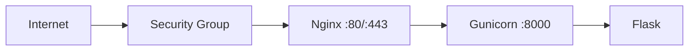

An EC2 deployment is a classic “you manage the server” approach.

## High-level architecture

- EC2 instance (Linux)
- Gunicorn runs your app as a systemd service
- Nginx reverse proxies from port 80/443 to Gunicorn

## Key pieces to understand

- Security groups (open ports 80/443)
- SSH access
- systemd service files
- Nginx site config
- TLS certificates (Let’s Encrypt)

## Typical deployment approach

- configure environment variables (systemd service)
- start/restart service on code changes
- log to journald (systemctl logs)

## Operational caution

EC2 gives you full control but also full responsibility:

- patching OS
- firewall rules
- backups
- monitoring

It’s great for learning real-world deployment fundamentals.
