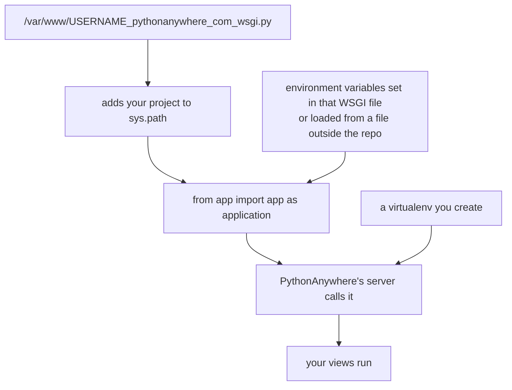

PythonAnywhere is beginner-friendly for Flask hosting.

## Typical steps (conceptual)

- Create a web app (Flask)
- Create a virtualenv on PythonAnywhere
- Install requirements
- Configure the WSGI file to point to your Flask app

## WSGI file idea

PythonAnywhere provides a WSGI config file where you import your app:

```python
from myapp import create_app

application = create_app()
```

Note: PythonAnywhere uses `application` as the variable name.

## Common pitfalls

- wrong virtualenv selected
- missing packages
- incorrect module import paths
- static files not configured

## Good fit

PythonAnywhere is great for:

- learning deployments
- small projects

For advanced ops (containers, autoscaling), use a cloud VM or container platform.

## A different model from most hosts

PythonAnywhere does not run your process from a start command. It hosts a WSGI file that
**imports your application object**, and its own web server calls it:



:::note[This page was not executed]
Deploying here needs an account and a live host. The mechanism below is the documented
one; **the dashboard and console steps are described, not performed**. What was checked
locally is the part that actually decides whether it works — that a `module:variable`
target resolves to a WSGI callable, which is the same assertion their WSGI file makes.
:::

## The WSGI file is the whole integration

```python title="/var/www/USERNAME_pythonanywhere_com_wsgi.py" showLineNumbers{1}
import sys
import os

path = "/home/USERNAME/mysite"
if path not in sys.path:
    sys.path.insert(0, path)

os.environ["SECRET_KEY"] = "..."          # or load from a file outside the repo
os.environ["DATABASE_URL"] = "..."

from app import app as application         # the name MUST be `application`
```

Two details cause most failures:

- **The variable must be called `application`.** That is the WSGI convention their server
  looks for. `from app import app` alone leaves it undefined, and the error is an import
  failure rather than anything mentioning WSGI.
- **`sys.path` must include your project**, because the WSGI file lives in `/var/www/` and
  your code does not.

The same local check applies as anywhere else:

```python title="verify.py" showLineNumbers{1}
import importlib
application = getattr(importlib.import_module("app"), "app")
assert callable(application)
```

Measured on the demo app: resolved to a `Flask` object and served **200**. If this fails
locally it will fail there, for the same reason, with a worse error message.

## What is different from a container platform

| | PythonAnywhere | container platform |
|:--|:--|:--|
| how your app starts | their server imports it | you supply a start command |
| the server | provided, you do not run gunicorn | you run gunicorn yourself |
| static files | mapped in the dashboard, served directly | usually your own concern |
| filesystem | **persistent** | ephemeral |
| deploy | pull or upload, then reload | push, rebuild, replace |

The persistent filesystem is the genuinely notable difference: a SQLite database in your
home directory survives reloads, which makes this a reasonable host for a small project
that would need a managed database elsewhere. It is also a single machine, so that
convenience does not scale horizontally.

## The reload step

Code changes take effect only after **Reload** in the Web tab — there is no watcher. An
edit that appears to have no effect is almost always an unreloaded app, and it is worth
checking that before debugging anything else.

## Static files

Map the URL prefix to the directory in the dashboard:

```text title="static mapping"
URL:       /static/
Directory: /home/USERNAME/mysite/static
```

Their server then serves those files directly, without touching your application — the
same division of labour as Nginx in front of gunicorn.

## See it move

```p5 title="Two hosting models, same application" desc="One platform imports your WSGI callable; the other runs a command you supply. The application object is identical either way." height="330"
let model = 0;

function setup() {
  createCanvas(600, 330);
  textFont('monospace');
}

function draw() {
  background(13, 17, 23);
  const pa = model === 0;

  noStroke();
  fill(230);
  textSize(13);
  textAlign(LEFT, TOP);
  text(pa ? 'PythonAnywhere: the host imports your app' : 'container platform: you run the server', 24, 16);

  const steps = pa
    ? ['their web server starts', 'it loads the WSGI file', "from app import app as application", 'it calls application(...)']
    : ['the platform runs your start command', 'gunicorn starts', 'gunicorn imports app:app', 'gunicorn calls it'];
  for (let i = 0; i < 4; i++) {
    const y = 52 + i * 42;
    const c = i === 2 ? [255, 211, 67] : [75, 139, 190];
    stroke(c[0], c[1], c[2]);
    strokeWeight(1);
    fill(c[0] * 0.16, c[1] * 0.16, c[2] * 0.16);
    rect(24, y, 420, 34, 4);
    noStroke();
    fill(c[0], c[1], c[2]);
    textSize(11);
    textAlign(LEFT, CENTER);
    text(steps[i], 38, y + 17);
    if (i < 3) {
      stroke(60, 70, 84);
      strokeWeight(1);
      line(234, y + 34, 234, y + 42);
    }
  }

  stroke(120, 190, 130);
  strokeWeight(1);
  fill(18, 30, 22);
  rect(24, 228, 552, 54, 5);
  noStroke();
  fill(110);
  textSize(10);
  textAlign(LEFT, TOP);
  text('what your code provides in BOTH cases', 38, 238);
  fill(120, 190, 130);
  textSize(14);
  text('a WSGI callable named by module:variable', 38, 258);

  fill(90);
  textSize(10);
  textAlign(LEFT, TOP);
  text(pa ? 'note: the variable must be named `application` in their WSGI file'
          : 'note: the command must bind the port the platform assigns', 24, 296);

  drawBtn(460, 20, 116, pa ? 'model: PA' : 'model: PaaS');
}

function drawBtn(x, y, w, label) {
  const hot = mouseX > x && mouseX < x + w && mouseY > y && mouseY < y + 24;
  stroke(hot ? color(255, 211, 67) : color(60, 70, 84));
  strokeWeight(1);
  fill(hot ? color(34, 40, 50) : color(22, 28, 36));
  rect(x, y, w, 24, 4);
  noStroke();
  fill(hot ? color(255, 211, 67) : 200);
  textSize(11);
  textAlign(CENTER, CENTER);
  text(label, x + w / 2, y + 12);
}

function mousePressed() {
  if (mouseY > 20 && mouseY < 44 && mouseX > 460 && mouseX < 576) model = 1 - model;
}
```

## Check yourself

<Quiz
  questions={[
    {
      q: "In a PythonAnywhere WSGI file, why is the import written as from app import app as application?",
      options: [
        "to avoid a name collision with the module",
        "their server looks for a WSGI callable named application, which is the WSGI convention",
        "application is faster to import",
        "it is only a style preference",
      ],
      answer: 1,
      explain:
        "Importing it under any other name leaves application undefined, and the failure looks like an ordinary import error rather than anything about WSGI.",
    },
    {
      q: "Your code change appears to have no effect on PythonAnywhere. What is the most likely cause?",
      options: [
        "the virtualenv is broken",
        "the app was not reloaded from the Web tab; there is no file watcher",
        "static files are cached",
        "the WSGI file has a syntax error",
      ],
      answer: 1,
      explain:
        "Reload is an explicit step. Checking it first saves debugging a problem that does not exist.",
    },
    {
      q: "How does PythonAnywhere's filesystem differ from a typical container platform?",
      options: [
        "it is ephemeral in both cases",
        "it is persistent, so a SQLite file survives reloads — convenient, but tied to a single machine",
        "it is read-only",
        "it has no filesystem",
      ],
      answer: 1,
      explain:
        "That makes it reasonable for a small project that would need a managed database on an ephemeral host, at the cost of not scaling horizontally.",
    },
  ]}
/>
