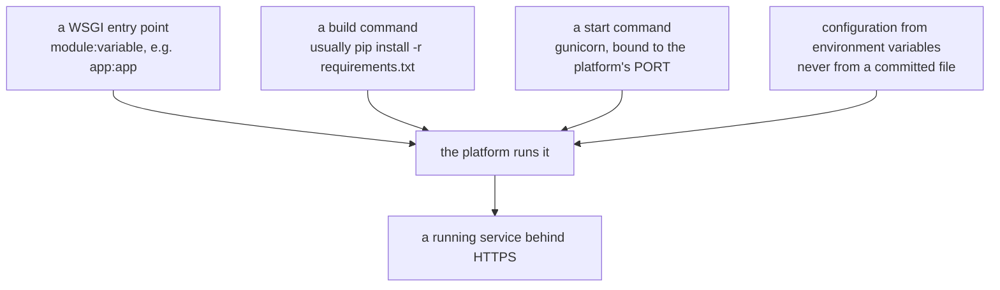

Render is a popular platform for deploying web services.

## What you typically need

- a `requirements.txt`
- a WSGI entrypoint (`wsgi.py`)
- a start command (Gunicorn)

## Typical start command

```text
gunicorn "wsgi:app" --bind 0.0.0.0:$PORT
```

## Environment variables

Set in Render dashboard:

- `SECRET_KEY`
- `DATABASE_URL` (if using managed DB)

## Static files

If your app serves lots of static assets, consider:

- platform static hosting
- or put a CDN in front

## Deployment sanity checklist

- debug is off
- migrations run
- logs show requests responding
- health endpoint returns 200

## What every host needs from you

Platforms differ in their dashboards and almost not at all in what they require. Learn the
four things below once, and each host becomes a matter of where you type them:



:::note[This page was not executed]
Deploying to Render needs an account and a network deploy, neither of which is available
in the environment these notes were written in. What follows is the documented mechanism
and the parts that are checkable locally — the entry point, the requirements file, the
start command's shape. **The dashboard steps are described, not performed**, and Render's
interface changes more often than any of the underlying mechanics.
:::

## The two commands

```bash title="build command"
pip install -r requirements.txt
```

```bash title="start command"
gunicorn app:app --bind 0.0.0.0:$PORT
```

`$PORT` is the part people get wrong. The platform chooses a port and passes it in; an
app hard-coded to 8000 will not receive traffic and the deploy will be marked unhealthy
for a reason the logs make look unrelated.

`app:app` means "the variable `app` in `app.py`". With an application factory it is
different:

```bash title="with a factory"
gunicorn "myapp:create_app()" --bind 0.0.0.0:$PORT
```

Locally, that target can be checked without any platform at all:

```python title="verify_entrypoint.py" showLineNumbers{1}
import importlib
mod, _, attr = "app:app".partition(":")
wsgi = getattr(importlib.import_module(mod), attr)
assert callable(wsgi)          # a WSGI application is a callable
```

Measured on the demo app: the target resolved to a `Flask` object, `callable` was `True`,
and serving it returned **200**. If that assertion fails locally, no amount of dashboard
configuration will help.

## Configuration and the filesystem

Set `SECRET_KEY`, `DATABASE_URL` and anything else as **environment variables in the
dashboard**, not in a committed file. This is exactly the `.env` model with a different
place to type it.

Two constraints worth planning around on any platform-as-a-service:

- **The filesystem is ephemeral.** Anything written to disk disappears on the next deploy
  or restart. A SQLite file in `instance/` works until the first redeploy, then silently
  resets. Use a managed database, and object storage for uploads.
- **Free tiers sleep.** An idle service is suspended and the next request pays the cold
  start — tens of seconds. Fine for a demo, not for anything with users waiting.

## A checklist before you deploy anything

| check | why |
|:--|:--|
| `requirements.txt` pins exact versions | an unpinned dependency can change under you between deploys |
| `gunicorn` is in it | it is a dependency of the deployment, not of your laptop |
| the start command binds `$PORT` | a hard-coded port receives no traffic |
| `debug` is off | the interactive debugger is remote code execution |
| `SECRET_KEY` comes from the environment | a committed key is a forged session for anyone |
| the database is not SQLite on local disk | it disappears on redeploy |

## See it move

```p5 title="Why the platform port matters" desc="The platform assigns a port and expects your server to bind it. Hard-coding one means the health check never succeeds." height="330"
let bindPort = 0;   // 0 = $PORT, 1 = hard-coded 8000
let assigned = 10000;

function setup() {
  createCanvas(600, 330);
  textFont('monospace');
}

function draw() {
  background(13, 17, 23);
  const ok = bindPort === 0;

  noStroke();
  fill(230);
  textSize(12);
  textAlign(LEFT, TOP);
  text(ok ? 'gunicorn app:app --bind 0.0.0.0:$PORT'
          : 'gunicorn app:app --bind 0.0.0.0:8000', 24, 16);

  stroke(75, 139, 190);
  strokeWeight(1);
  fill(18, 26, 36);
  rect(24, 48, 260, 74, 5);
  noStroke();
  fill(110);
  textSize(10);
  textAlign(LEFT, TOP);
  text('the platform assigns', 38, 58);
  fill(75, 139, 190);
  textSize(20);
  text('PORT=' + assigned, 38, 80);

  stroke(ok ? color(120, 190, 130) : color(232, 110, 110));
  strokeWeight(1);
  fill(18, 23, 30);
  rect(312, 48, 264, 74, 5);
  noStroke();
  fill(110);
  textSize(10);
  textAlign(LEFT, TOP);
  text('your server listens on', 326, 58);
  fill(ok ? color(120, 190, 130) : color(232, 110, 110));
  textSize(20);
  text(ok ? String(assigned) : '8000', 326, 80);

  const c = ok ? color(120, 190, 130) : color(232, 110, 110);
  stroke(c);
  strokeWeight(1);
  fill(18, 23, 30);
  rect(24, 144, 552, 86, 5);
  noStroke();
  fill(110);
  textSize(10);
  textAlign(LEFT, TOP);
  text('the platform health check connects to PORT=' + assigned, 38, 156);
  fill(c);
  textSize(16);
  text(ok ? 'connected - service marked live' : 'connection refused - deploy marked unhealthy', 38, 180);
  fill(150);
  textSize(10);
  text(ok ? 'traffic reaches your app'
          : 'your logs say gunicorn started successfully, which makes this hard to spot', 38, 206);

  drawBtn(24, 254, 250, ok ? 'bind: $PORT' : 'bind: hard-coded 8000');
  drawBtn(286, 254, 200, 'reassign port');
  fill(90);
  textSize(10);
  textAlign(LEFT, TOP);
  text('the port changes between deploys, so hard-coding fails intermittently', 24, 296);
}

function drawBtn(x, y, w, label) {
  const hot = mouseX > x && mouseX < x + w && mouseY > y && mouseY < y + 24;
  stroke(hot ? color(255, 211, 67) : color(60, 70, 84));
  strokeWeight(1);
  fill(hot ? color(34, 40, 50) : color(22, 28, 36));
  rect(x, y, w, 24, 4);
  noStroke();
  fill(hot ? color(255, 211, 67) : 200);
  textSize(11);
  textAlign(CENTER, CENTER);
  text(label, x + w / 2, y + 12);
}

function mousePressed() {
  if (mouseY < 254 || mouseY > 278) return;
  if (mouseX > 24 && mouseX < 274) bindPort = 1 - bindPort;
  if (mouseX > 286 && mouseX < 486) assigned = 10000 + floor((frameCount * 37) % 40000);
}
```

## Check yourself

<Quiz
  questions={[
    {
      q: "Why must the start command bind to $PORT rather than a fixed port?",
      options: [
        "fixed ports are blocked by firewalls",
        "the platform assigns the port and connects its health check to it; a hard-coded port receives no traffic",
        "gunicorn cannot open port 8000",
        "$PORT is faster",
      ],
      answer: 1,
      explain:
        "The confusing part is that gunicorn reports a successful start, so the logs look healthy while the platform cannot reach it.",
    },
    {
      q: "Why is a SQLite file in instance/ a poor choice on a platform-as-a-service?",
      options: [
        "SQLite is too slow",
        "the filesystem is ephemeral, so the database disappears on the next deploy or restart",
        "SQLite cannot be installed there",
        "it requires a paid tier",
      ],
      answer: 1,
      explain:
        "It works right up until the first redeploy, then silently resets. Use a managed database, and object storage for uploads.",
    },
    {
      q: "With an application factory, what should the gunicorn target be?",
      options: [
        "app:app",
        "myapp:create_app()",
        "myapp.create_app",
        "flask run",
      ],
      answer: 1,
      explain:
        "gunicorn accepts a call expression, so the factory runs and returns the app. Verify the target locally: import the module, get the attribute and assert it is callable.",
    },
  ]}
/>
