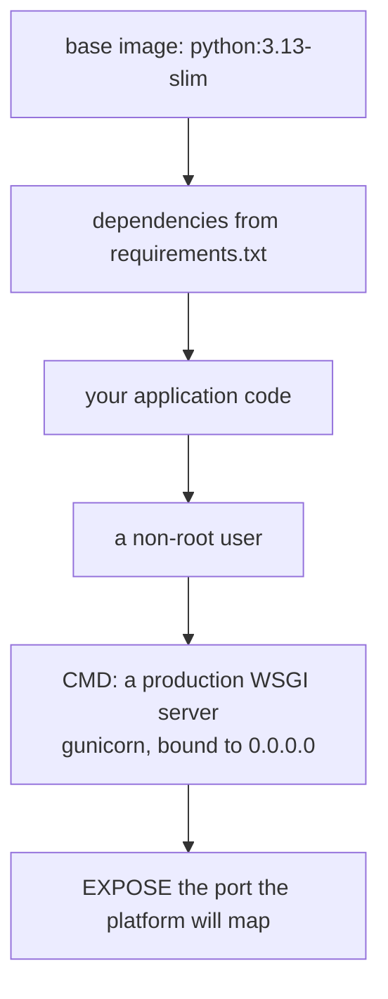

Docker packages your app and its dependencies into a container.

Benefits:

- consistent environments
- easier deploys
- simpler CI/CD

## Minimal Dockerfile (example)

```dockerfile
FROM python:3.12-slim

WORKDIR /app

COPY requirements.txt .
RUN pip install --no-cache-dir -r requirements.txt

COPY . .

ENV PORT=8000

CMD ["gunicorn", "wsgi:app", "--bind", "0.0.0.0:8000"]
```

## Notes

- Use Gunicorn inside the container (not `flask run`)
- Expose port via platform settings
- Store secrets via environment variables, not baked into the image

## Common improvements

- add a non-root user
- use multi-stage builds
- add health checks
- pin dependencies

## What a container has to contain



```dockerfile title="Dockerfile" showLineNumbers{1}
FROM python:3.13-slim

ENV PYTHONDONTWRITEBYTECODE=1 \
    PYTHONUNBUFFERED=1

WORKDIR /app

COPY requirements.txt .
RUN pip install --no-cache-dir -r requirements.txt

COPY . .

RUN useradd --create-home appuser && chown -R appuser /app
USER appuser

EXPOSE 8000
CMD ["gunicorn", "--bind", "0.0.0.0:8000", "--workers", "2", "app:app"]
```

Five decisions in that file are load-bearing:

- **`COPY requirements.txt` before `COPY . .`** — layers are cached by the files they
  depend on. Copying the code first means every source edit reinstalls every dependency.
  This ordering is the single biggest build-time win available.
- **`PYTHONUNBUFFERED=1`** — without it, your logs sit in a buffer and a crashed container
  takes its most useful output with it.
- **`USER appuser`** — a container process runs as root by default. A vulnerability then
  runs as root too.
- **`--bind 0.0.0.0:8000`** — binding to `127.0.0.1` inside a container means nothing
  outside it can connect, which looks exactly like a broken app.
- **gunicorn, not `flask run`** — the development server prints a warning telling you not
  to do this, and it is right.

:::note[What was verified here, and what was not]
The application side was checked: the `CMD` target **`app:app` was resolved** to a Flask
object, confirmed to be a WSGI callable, and **served over HTTP returning 200** with the
environment variable it was given. The `requirements.txt` pins were confirmed exact
(`flask==3.1.3`, `gunicorn==23.0.0`).

The **image itself was not built**. The Docker CLI is installed on this machine
(29.6.2) but the daemon is not running — `docker build` fails with
`failed to connect to the docker API at npipe:////./pipe/dockerDesktopLinuxEngine`. So the
Dockerfile above is presented as a correct pattern with a verified entry point, not as an
image someone watched succeed. A local check also cannot use gunicorn, which is POSIX-only
and does not run on Windows; the HTTP check used `waitress` instead, while the container
targets gunicorn on a linux base.
:::

## `.dockerignore` matters more than people expect

```text title=".dockerignore"
__pycache__/
*.pyc
.env
.git/
venv/
```

Everything not excluded is sent to the build daemon and can end up in a layer. A `.env`
copied into an image is a credential shipped to anyone who can pull it — and `docker
history` will show it even if a later layer deletes the file.

## Building and running

```bash title="commands"
docker build -t flask-demo:v1 .
docker run --rm -p 8000:8000 -e APP_NAME=prod flask-demo:v1
docker run --rm -p 8000:8000 --env-file .env flask-demo:v1
```

`-p 8000:8000` maps host to container. `--env-file` supplies configuration without baking
it in, which is the containerised equivalent of everything on the `.env` page.

## Sizing the worker count

```bash title="workers"
gunicorn --workers 2 --bind 0.0.0.0:8000 app:app
```

The usual starting point is `(2 x CPU cores) + 1`, then measure. Two things worth knowing
before you tune it:

- Each worker is a **separate process** with its own memory, and its own copy of anything
  in-process — which is why an in-memory rate limiter or cache stops working correctly the
  moment you have more than one.
- Containers are often limited to a fraction of a CPU. Reading the host's core count and
  sizing from that can start far more workers than the container can run.

## See it move

```p5 title="Layer caching, and what a rebuild costs" desc="Docker reuses a layer whose inputs have not changed. Copying requirements before the code is what keeps dependency installation cached." height="340"
let order = 0;   // 0 = requirements first, 1 = code first
let edited = 0;  // 0 = nothing, 1 = source edited, 2 = requirements edited

function setup() {
  createCanvas(600, 340);
  textFont('monospace');
}

function draw() {
  background(13, 17, 23);
  const good = order === 0;
  const layers = good
    ? [{ n: 'FROM python:3.13-slim', cost: 1 }, { n: 'COPY requirements.txt', cost: 1 },
       { n: 'RUN pip install', cost: 9 }, { n: 'COPY . .', cost: 1 }]
    : [{ n: 'FROM python:3.13-slim', cost: 1 }, { n: 'COPY . .', cost: 1 },
       { n: 'RUN pip install', cost: 9 }];

  let invalidFrom = 99;
  if (edited === 1) invalidFrom = good ? 3 : 1;
  if (edited === 2) invalidFrom = 1;

  noStroke();
  fill(230);
  textSize(13);
  textAlign(LEFT, TOP);
  text(good ? 'requirements copied BEFORE the code' : 'code copied before requirements', 24, 16);
  fill(120);
  textSize(11);
  text(edited === 0 ? 'no change since the last build'
     : (edited === 1 ? 'you edited one line of app.py' : 'you added a dependency'), 24, 36);

  let rebuilt = 0;
  for (let i = 0; i < layers.length; i++) {
    const y = 66 + i * 46;
    const stale = i >= invalidFrom;
    if (stale) rebuilt += layers[i].cost;
    stroke(stale ? color(232, 110, 110) : color(120, 190, 130));
    strokeWeight(1);
    fill(stale ? color(32, 18, 20) : color(18, 30, 22));
    rect(24, y, 400, 38, 4);
    noStroke();
    fill(stale ? color(232, 110, 110) : color(120, 190, 130));
    textSize(11);
    textAlign(LEFT, CENTER);
    text(layers[i].n, 38, y + 19);
    textAlign(RIGHT, CENTER);
    textSize(10);
    text(stale ? 'rebuilt' : 'cached', 412, y + 19);
    if (layers[i].cost > 5) {
      noStroke();
      fill(stale ? color(232, 110, 110) : 90);
      textAlign(LEFT, CENTER);
      textSize(9);
      text('the expensive one', 436, y + 19);
    }
  }

  noStroke();
  fill(rebuilt > 5 ? color(232, 110, 110) : color(120, 190, 130));
  textSize(13);
  textAlign(LEFT, TOP);
  text('rebuild cost: ' + (rebuilt === 0 ? 'nothing' : rebuilt + ' units'), 24, 256);
  fill(120);
  textSize(10);
  text(rebuilt > 5
    ? 'pip install ran again - the dependency layer was invalidated'
    : 'the dependency layer survived', 24, 278);

  drawBtn(24, 300, 250, good ? 'order: requirements first' : 'order: code first');
  drawBtn(286, 300, 250, ['change: none', 'change: edited app.py', 'change: added a dependency'][edited]);
}

function drawBtn(x, y, w, label) {
  const hot = mouseX > x && mouseX < x + w && mouseY > y && mouseY < y + 24;
  stroke(hot ? color(255, 211, 67) : color(60, 70, 84));
  strokeWeight(1);
  fill(hot ? color(34, 40, 50) : color(22, 28, 36));
  rect(x, y, w, 24, 4);
  noStroke();
  fill(hot ? color(255, 211, 67) : 200);
  textSize(11);
  textAlign(CENTER, CENTER);
  text(label, x + w / 2, y + 12);
}

function mousePressed() {
  if (mouseY < 300 || mouseY > 324) return;
  if (mouseX > 24 && mouseX < 274) order = 1 - order;
  if (mouseX > 286 && mouseX < 536) edited = (edited + 1) % 3;
}
```

## Check yourself

<Quiz
  questions={[
    {
      q: "Why does the Dockerfile COPY requirements.txt and install before COPY . .?",
      options: [
        "pip cannot find the file otherwise",
        "layers are cached by their inputs, so copying code first would reinstall every dependency on any source edit",
        "it reduces the final image size",
        "requirements.txt must be in the image root",
      ],
      answer: 1,
      explain:
        "Editing one line of app.py invalidates every layer after the COPY. With the dependency install above it, that expensive layer stays cached.",
    },
    {
      q: "Why must gunicorn bind to 0.0.0.0 rather than 127.0.0.1 inside a container?",
      options: [
        "127.0.0.1 is not available in containers",
        "binding to loopback accepts connections only from inside the container, so a mapped port appears dead from outside",
        "0.0.0.0 is faster",
        "gunicorn requires it",
      ],
      answer: 1,
      explain:
        "The symptom is an app that looks broken from the host while the container reports it is serving fine.",
    },
    {
      q: "Why should .env be listed in .dockerignore?",
      options: [
        "it would make the build slower",
        "otherwise it is copied into a layer, shipping credentials to anyone who can pull the image — visible in docker history even if deleted later",
        "Docker cannot parse .env files",
        "it conflicts with --env-file",
      ],
      answer: 1,
      explain:
        "Supply configuration at run time with -e or --env-file instead of baking it into the image.",
    },
    {
      q: "Why does an in-memory rate limiter or cache misbehave once gunicorn runs several workers?",
      options: [
        "workers share memory and corrupt it",
        "each worker is a separate process with its own copy, so counters are per-worker rather than global",
        "gunicorn disables in-process caches",
        "it only affects async workers",
      ],
      answer: 1,
      explain:
        "With four workers a limit of 100 per hour effectively allows up to 400. Shared state needs a shared backend such as Redis.",
    },
  ]}
/>
