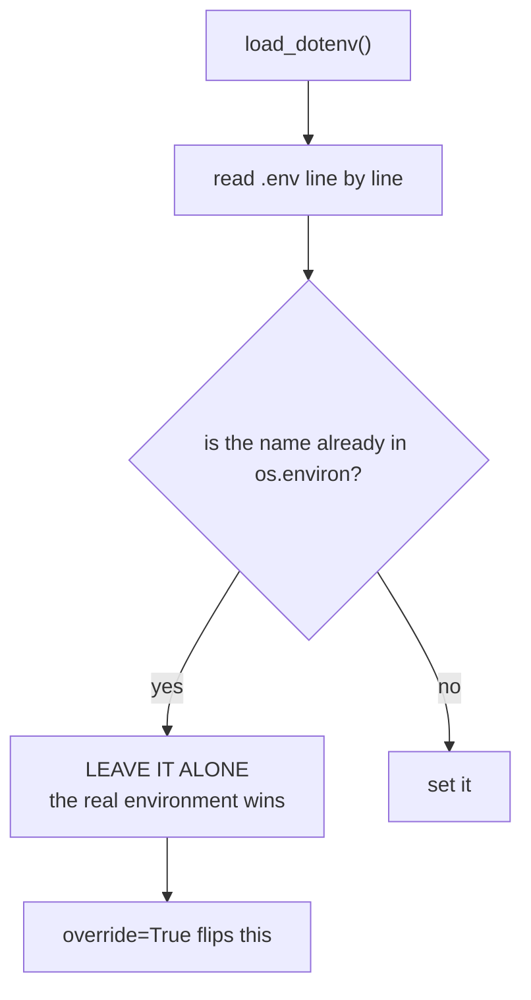

Environment variables are the standard way to configure apps.

Examples:

- `SECRET_KEY`
- `DATABASE_URL`
- `MAIL_USERNAME`
- `MAIL_PASSWORD`

:::caution[Configuration that must not live in the repository]
`SECRET_KEY` is what signs the session cookie. Anyone who has it can forge a session — which,
for a login system, means logging in as anyone. It belongs in the environment, not in
`config.py`, and it must be **stable**: regenerating it on each boot silently logs every user
out, because their existing cookies no longer verify.

The same applies to the database URI, mail credentials and API keys. A `.env` file is a
convenience for local development and should be listed in `.gitignore`; the deployment
platform supplies the real values as environment variables.

One thing worth checking before a first deploy: `app.config` reads most values **once, at
startup**. Setting an environment variable after the process has started changes nothing.
:::

## Why env vars?

- keeps secrets out of code
- same container/code can run in dev/staging/prod

## Local .env files

In local development, you can use a `.env` file.

Common library:

- `python-dotenv`

Install:

```bash
pip install python-dotenv
```

Then Flask can load `.env` automatically when using `flask run` (depending on setup), or you can load manually.

## Do not commit .env

Add `.env` to `.gitignore`.

Instead commit:

- `.env.example`

So people know what variables are required.

## Accessing env vars in Python

```python
import os
secret = os.environ.get("SECRET_KEY")
```

Always define safe defaults for development, but never for production secrets.

## What `load_dotenv()` does, and what it refuses to do



Measured with `APP_NAME` already present in the real environment:

```python title="precedence.py" showLineNumbers{1}
os.environ["APP_NAME"] = "already-in-real-env"

load_dotenv()
os.environ["APP_NAME"]        # 'already-in-real-env'   <- the file did NOT win
os.environ["SECRET_KEY"]      # 'dev-secret'            <- set, because it was absent

load_dotenv(override=True)
os.environ["APP_NAME"]        # 'from-dotenv'
```

This is the behaviour you want: `.env` supplies **local defaults**, and a real
environment variable — the kind your host injects — always beats the file. It also means
a stale export in your shell can quietly shadow the file, which is the first thing to
check when a value looks wrong.

## Everything is a string

```python title="types.py" showLineNumbers{1}
os.environ["MAX"]          # '25'    (str, never int)
int(os.environ["MAX"]) + 1 # 26
os.environ["EMPTY"]        # ''      <- empty string, not None
```

Which sets up the trap this page exists for:

| `.env` line | `bool(value)` |
|:--|:--|
| `DEBUG=false` | **`True`** |
| `DEBUG=0` | **`True`** |
| `DEBUG=no` | **`True`** |
| `DEBUG=False` | **`True`** |
| `DEBUG=` | `False` |

Measured — every one of those is a **non-empty string**, and every non-empty string is
truthy. `if os.environ.get("DEBUG"):` turns debug mode **on** when you wrote `DEBUG=false`.

:::danger[This is how debug mode reaches production]
Writing `DEBUG=false` and testing it with `if os.environ.get("DEBUG")` enables the
interactive debugger — remote code execution on a public host. Parse the value
explicitly:

```python title="parse_bool.py" showLineNumbers{1}
def env_bool(name, default=False):
    raw = os.environ.get(name)
    if raw is None:
        return default
    return raw.strip().lower() in ("1", "true", "yes", "on")
```
:::

## Quoting, comments and expansion

```text title=".env"
APP_NAME=from-dotenv
QUOTED="has spaces"
EXPANDED=${APP_NAME}-suffix
# a comment
EMPTY=
```

```text title="measured with dotenv_values()"
QUOTED    'has spaces'          <- the quotes are stripped
EXPANDED  'from-dotenv-suffix'  <- ${VAR} expanded from earlier lines
comments and blank lines skipped
```

## Reading it in the app

```python title="config.py" showLineNumbers{1}
import os
from dotenv import load_dotenv

load_dotenv()                                  # local development only

app.config["SECRET_KEY"] = os.environ["SECRET_KEY"]        # required: fail loudly
app.config["MAX_ITEMS"] = int(os.environ.get("MAX_ITEMS", 20))
app.config["DEBUG"] = env_bool("FLASK_DEBUG")
```

`os.environ[...]` for anything the app cannot run without. A missing `SECRET_KEY` should
stop startup, not produce a confusing failure on the first login.

:::danger[`.env` must never be committed]
```text title=".gitignore"
.env
.env.*
!.env.example
```
Commit a `.env.example` with the **keys and no values** so a new contributor knows what to
set. Anything that has ever been committed is in the history after you delete it, and must
be rotated rather than removed.
:::

## See it move

```p5 title="Which value wins, and is it true?" desc="A real environment variable beats the .env file unless override is set. And every value is a string, so 'false' is truthy." height="340"
let inRealEnv = true;
let override = false;
let raw = 0;
const RAWS = ['false', '0', 'true', ''];

function setup() {
  createCanvas(600, 340);
  textFont('monospace');
}

function draw() {
  background(13, 17, 23);
  const fileVal = RAWS[raw];
  const realVal = 'from-real-env';
  const winner = (inRealEnv && !override) ? realVal : fileVal;
  const truthy = winner.length > 0;
  const parsed = ['1', 'true', 'yes', 'on'].indexOf(winner.trim().toLowerCase()) >= 0;

  noStroke();
  fill(230);
  textSize(13);
  textAlign(LEFT, TOP);
  text('.env says   DEBUG=' + (fileVal === '' ? '(empty)' : fileVal), 24, 16);

  const rows = [
    { l: 'real environment', v: inRealEnv ? realVal : '(not set)', wins: inRealEnv && !override },
    { l: '.env file', v: fileVal === '' ? '(empty)' : fileVal, wins: !(inRealEnv && !override) },
  ];
  for (let i = 0; i < 2; i++) {
    const y = 50 + i * 52;
    const r = rows[i];
    stroke(r.wins ? color(120, 190, 130) : color(48, 56, 68));
    strokeWeight(r.wins ? 2 : 1);
    fill(r.wins ? color(18, 30, 22) : color(17, 22, 29));
    rect(24, y, 400, 42, 4);
    noStroke();
    fill(r.wins ? color(120, 190, 130) : 90);
    textSize(11);
    textAlign(LEFT, CENTER);
    text(r.l, 38, y + 21);
    fill(r.wins ? 210 : 80);
    text(r.v, 220, y + 21);
    if (r.wins) {
      fill(120, 190, 130);
      textSize(10);
      text('wins', 436, y + 21);
    }
  }

  stroke(48, 56, 68);
  strokeWeight(1);
  fill(18, 23, 30);
  rect(24, 162, 552, 96, 5);
  noStroke();
  fill(110);
  textSize(10);
  textAlign(LEFT, TOP);
  text('os.environ.get(\u0027DEBUG\u0027)', 38, 172);
  fill(210);
  textSize(13);
  text(winner === '' ? "''" : "'" + winner + "'", 38, 192);

  fill(110);
  textSize(10);
  text('if os.environ.get(\u0027DEBUG\u0027):', 300, 172);
  fill(truthy ? color(232, 110, 110) : color(120, 190, 130));
  textSize(13);
  text(truthy ? 'TRUE - debug on' : 'False - debug off', 300, 192);

  fill(110);
  textSize(10);
  text('env_bool(\u0027DEBUG\u0027)', 300, 218);
  fill(parsed ? color(255, 211, 67) : color(120, 190, 130));
  textSize(13);
  text(parsed ? 'True' : 'False', 300, 236);

  if (truthy && !parsed) {
    fill(232, 110, 110);
    textSize(11);
    textAlign(LEFT, TOP);
    text('you wrote ' + (fileVal === '' ? 'empty' : fileVal) + ' and got debug mode ON', 24, 268);
  }

  drawBtn(24, 296, 176, inRealEnv ? 'real env: set' : 'real env: unset');
  drawBtn(212, 296, 160, override ? 'override=True' : 'override=False');
  drawBtn(384, 296, 176, 'value: ' + (fileVal === '' ? '(empty)' : fileVal));
}

function drawBtn(x, y, w, label) {
  const hot = mouseX > x && mouseX < x + w && mouseY > y && mouseY < y + 24;
  stroke(hot ? color(255, 211, 67) : color(60, 70, 84));
  strokeWeight(1);
  fill(hot ? color(34, 40, 50) : color(22, 28, 36));
  rect(x, y, w, 24, 4);
  noStroke();
  fill(hot ? color(255, 211, 67) : 200);
  textSize(11);
  textAlign(CENTER, CENTER);
  text(label, x + w / 2, y + 12);
}

function mousePressed() {
  if (mouseY < 296 || mouseY > 320) return;
  if (mouseX > 24 && mouseX < 200) inRealEnv = !inRealEnv;
  if (mouseX > 212 && mouseX < 372) override = !override;
  if (mouseX > 384 && mouseX < 560) raw = (raw + 1) % RAWS.length;
}
```

## Check yourself

<Quiz
  questions={[
    {
      q: "A .env file contains DEBUG=false. What does if os.environ.get('DEBUG'): evaluate to?",
      options: [
        "False, as intended",
        "True, because every non-empty string is truthy",
        "None",
        "it raises a ValueError",
      ],
      answer: 1,
      explain:
        "Measured: 'false', '0', 'no' and 'False' are all truthy. This is a real route to enabling the interactive debugger in production. Parse the value explicitly instead.",
    },
    {
      q: "APP_NAME is already set in the real environment and also appears in .env. After load_dotenv(), which value is in os.environ?",
      options: [
        "the .env value, which overwrites the environment",
        "the real environment value; .env only fills in names that are absent",
        "both, joined together",
        "neither, it raises a conflict",
      ],
      answer: 1,
      explain:
        "That precedence is what makes .env safe for local defaults while a host's injected variables still win. load_dotenv(override=True) reverses it.",
    },
    {
      q: "Which belongs in version control?",
      options: [
        ".env, so the app runs after cloning",
        ".env.example listing the keys with no values",
        "both",
        "neither, keys should be undocumented",
      ],
      answer: 1,
      explain:
        "A committed .env is a leaked credential that stays in history after deletion. An example file tells a new contributor what to set without exposing anything.",
    },
  ]}
/>
