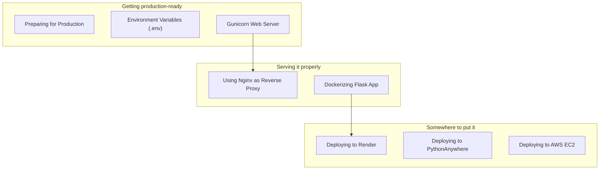

Deployment is where many Flask apps break because development and production environments behave differently.

This phase teaches a practical deployment mental model:

- your Flask app is a WSGI app
- Gunicorn runs it with multiple workers
- Nginx sits in front as a reverse proxy
- configuration comes from environment variables

## You’ll learn

- Preparing for production
- Environment variables and `.env`
- Gunicorn
- Nginx as reverse proxy
- Dockerizing a Flask app
- Deploying to Render
- Deploying to PythonAnywhere
- Deploying to AWS EC2

## Phase checklist

1. Preparing for Production
2. Environment Variables (.env)
3. Gunicorn Web Server
4. Using Nginx as Reverse Proxy
5. Dockerizing Flask App
6. Deploying to Render
7. Deploying to PythonAnywhere
8. Deploying to AWS EC2

## The phase at a glance

This phase exists to **run the app somewhere other than your laptop**. It assumes an application you are ready to expose, and once it is done you can build all of it, running on a public server.



## Where this sits in the track

```p5 title="The track, and what each phase unlocks" desc="Each phase assumes the one before it. Click a phase to see what you can build once it is done." height="330"
let sel = 8;
const NAMES = ['Fundamentals', 'Routing', 'Templating', 'Forms', 'Databases', 'Auth', 'Architecture', 'REST APIs', 'Deployment'];
const BUILDS = ['a page that says hello', 'a site with several URLs and a JSON endpoint', 'a real multi-page site with a shared layout', 'a site that accepts and validates input', 'a site whose data survives a restart', 'a site with accounts and private pages', 'an app split into modules, configurable per environment', 'an API other programs can call', 'all of it, running on a public server'];

function setup() {
  createCanvas(600, 330);
  textFont('monospace');
}

function draw() {
  background(13, 17, 23);
  noStroke();
  fill(230);
  textSize(13);
  textAlign(LEFT, TOP);
  text('the Flask track', 24, 16);
  fill(120);
  textSize(11);
  text('click a phase', 24, 36);

  for (let i = 0; i < NAMES.length; i++) {
    const col = i % 3;
    const row = floor(i / 3);
    const x = 24 + col * 186;
    const y = 62 + row * 56;
    const done = i < sel;
    const on = i === sel;
    stroke(on ? color(255, 211, 67) : (done ? color(120, 190, 130) : color(48, 56, 68)));
    strokeWeight(on ? 2 : 1);
    fill(on ? color(38, 34, 18) : (done ? color(18, 28, 22) : color(17, 22, 29)));
    rect(x, y, 174, 46, 4);
    noStroke();
    fill(on ? color(255, 211, 67) : (done ? color(120, 190, 130) : 110));
    textSize(11);
    textAlign(LEFT, TOP);
    text('Phase ' + (i + 1), x + 12, y + 8);
    fill(on ? color(255, 211, 67) : (done ? 150 : 90));
    textSize(11);
    text(NAMES[i], x + 12, y + 26);
  }

  stroke(48, 56, 68);
  strokeWeight(1);
  fill(18, 23, 30);
  rect(24, 240, 552, 62, 5);
  noStroke();
  fill(110);
  textSize(10);
  textAlign(LEFT, TOP);
  text('after Phase ' + (sel + 1) + ' you can build', 38, 250);
  fill(120, 190, 130);
  textSize(13);
  text(BUILDS[sel], 38, 272);

  fill(90);
  textSize(10);
  textAlign(LEFT, TOP);
  text('green = assumed knowledge by the time you reach the highlighted phase', 24, 312);
}

function mousePressed() {
  for (let i = 0; i < NAMES.length; i++) {
    const col = i % 3;
    const row = floor(i / 3);
    const x = 24 + col * 186;
    const y = 62 + row * 56;
    if (mouseX > x && mouseX < x + 174 && mouseY > y && mouseY < y + 46) sel = i;
  }
}
```

## The pages, in reading order

| # | page |
|--:|:--|
| 1 | Preparing for Production |
| 2 | Environment Variables (.env) |
| 3 | Gunicorn Web Server |
| 4 | Using Nginx as Reverse Proxy |
| 5 | Dockerizing Flask App |
| 6 | Deploying to Render |
| 7 | Deploying to PythonAnywhere |
| 8 | Deploying to AWS EC2 |

8 pages. They are ordered so that each one only uses ideas from the pages above it — reading out of order mostly works, but the examples assume what came before.

## Check yourself

<Quiz
  questions={[
    {
      q: "Why is the Flask development server not used in production?",
      options: [
        "it cannot serve HTML",
        "it is single-process by default, unhardened, and prints a warning saying so",
        "it requires debug mode",
        "it does not support HTTPS at all",
      ],
      answer: 1,
      explain:
        "Werkzeug prints the warning on every start. Gunicorn or uWSGI runs the app, and Nginx usually sits in front of it.",
    },
    {
      q: "Why do Environment Variables come before any hosting page in this phase?",
      options: [
        "hosting providers require a .env file",
        "every deployment target needs the same thing: configuration and secrets supplied from outside the code",
        ".env files are only used locally",
        "it is alphabetical",
      ],
      answer: 1,
      explain:
        "Render, PythonAnywhere, Docker and EC2 differ in how you supply them, not in whether you need them. Learning the principle once makes each host a detail.",
    },
    {
      q: "What do the phase overview pages give you that the individual pages do not?",
      options: [
        "the full code for each topic",
        "the reading order, what the phase assumes, and what you can build once it is done",
        "a downloadable project template",
        "the deployment configuration",
      ],
      answer: 1,
      explain:
        "Each overview lists its pages in sidebar order and names the phase's prerequisites and outcome, so you can tell whether you are ready for it.",
    },
  ]}
/>
