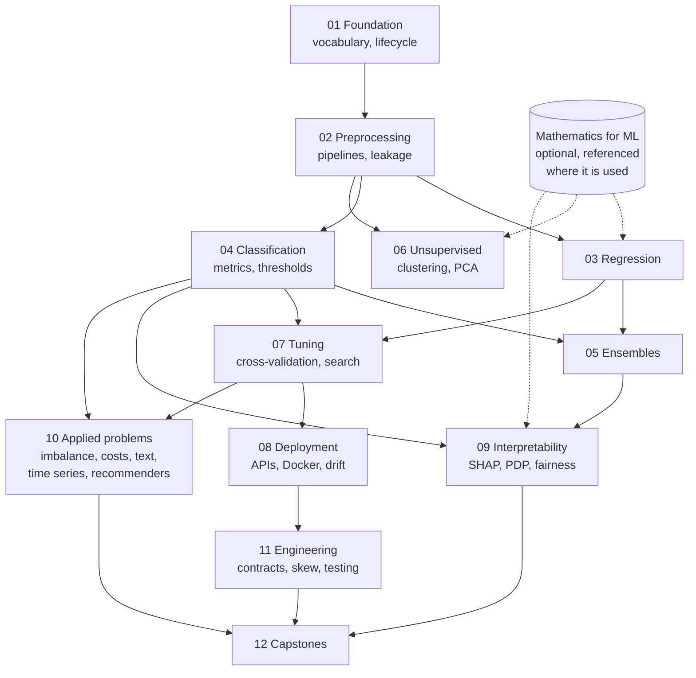

import DataCampExercise from "../../../components/DataCampExercise.astro";
import Quiz from "../../../components/Quiz.astro";

## What this module is

A complete, practical Machine Learning course in twelve phases: **89 pages, 440 exercises, 213 generated
figures, 85 interactive sketches and 98 diagrams**, built on scikit-learn, numpy and pandas.

Two things make it unusual.

**Every number is measured.** No page says "this usually works better". It says *0.9642 at one hospital
and 0.4998 at the next*, and the script that produced both numbers is on the page. When a technique fails,
the failure is shown: resampling that improves nothing, a shuffled split that reverses a model ranking, a
tuned safety stock that ties with a quantile model.

**Every phase ends in a decision.** Metrics are means, not ends — the later phases derive thresholds from
costs, price the model against the no-model baseline, and finish with a section on what the project still
cannot do.

## The twelve phases

| Phase | What it covers | A number from it |
| --- | --- | --- |
| [01 — The ML Foundation](/machine-learning/phase-01---the-ml-foundation/phase-1---the-ml-foundation/) | Vocabulary, the lifecycle, the environment | 50% of a real pipeline's lines are data work, not modelling |
| [02 — Preprocessing & Features](/machine-learning/phase-02---data-preprocessing--feature-engineering/phase-2---data-preprocessing--feature-engineering/) | Cleaning, scaling, encoding, pipelines | Dropping the scaler at serving time: 0.9591 → 0.3743 |
| [03 — Regression](/machine-learning/phase-03---supervised-learning---regression/phase-3---supervised-learning---regression/) | Linear, polynomial, regularised, gradient descent | $R^2$ can be strongly negative on a trending series |
| [04 — Classification](/machine-learning/phase-04---supervised-learning---classification/phase-4---supervised-learning---classification/) | Logistic regression, trees, SVM, KNN, metrics | Precision, recall and thresholds, from the confusion matrix up |
| [05 — Ensemble Learning](/machine-learning/phase-05---ensemble-learning/phase-5---ensemble-learning/) | Bagging, random forests, boosting, stacking | An ensemble can lose to its own best member |
| [06 — Unsupervised & Dimensionality](/machine-learning/phase-06---unsupervised-learning--dimensionality-reduction/phase-6---unsupervised-learning/) | k-means, DBSCAN, hierarchical, PCA, t-SNE | k-means finds k clusters in uniform noise, every time |
| [07 — Optimization & Tuning](/machine-learning/phase-07---model-optimization--tuning/phase-7---model-optimization--tuning/) | Cross-validation, grid/random search, regularisation | Where tuning stops paying, measured |
| [08 — Deployment (MLOps)](/machine-learning/phase-08---model-deployment-mlops/phase-8---model-deployment-mlops/) | Persistence, APIs, Docker, drift | Input PSI 2.0847 with accuracy 0.9995; PSI 0.0053 with accuracy 0.4775 |
| [09 — Interpretability & Responsible ML](/machine-learning/phase-09---interpretability--responsible-ml/phase-9---interpretability--responsible-ml/) | Importance, PDP/ICE, SHAP from scratch, fairness | Impurity importance ranks pure noise first, at 0.3853 |
| [10 — Applied ML Problems](/machine-learning/phase-10---applied-ml-problems/phase-10---applied-ml-problems/) | Imbalance, costs, time series, text, recommenders, anomalies | Threshold 0.50 costs EUR 12,005; $t^*$ costs EUR 3,410 |
| [11 — ML Engineering](/machine-learning/phase-11---ml-engineering/phase-11---ml-engineering/) | Reproducibility, data contracts, skew, testing | Two common ML tests caught 0 of 6 injected bugs |
| [12 — Capstone Projects](/machine-learning/phase-12---capstone-projects/phase-12---capstone-projects/) | Five projects, decision-first | The same AUC 0.7060 is worth EUR 576 or EUR 3,060 |

## How to read it

- **Phases 01–07 are the curriculum.** Read them in order; each page assumes the previous one.
- **Phase 08 onwards is what happens after the model works.** Deployment, interpretability, applied
  problem shapes, engineering, and finally the capstones.
- **Every concept page has the same shape**: what you'll learn, intuition, the maths, a worked example,
  at least one interactive sketch and one diagram, from-scratch code, the scikit-learn version, pitfalls,
  a recap, a quiz, and five or six exercises with their real output.
- **The capstones are different on purpose**: they start from a decision and end with what is still
  unsolved.

## Prerequisites

- Python basics — functions, lists and dicts, modules, and enough numpy to index an array.
- High-school algebra. The derivations are written out; you do not need calculus to start, and where a
  gradient appears it is derived rather than assumed.
- No GPU, no cloud account, no paid dataset. Everything runs on a laptop with scikit-learn.

## A first example

Traditional programming: you write the rules. Machine learning: you provide examples, and the model fits
the rules — after which the interesting work is deciding whether to trust them.

```python title="A tiny ML example (classification)" showLineNumbers{1}
from sklearn.datasets import load_iris
from sklearn.model_selection import train_test_split
from sklearn.linear_model import LogisticRegression
from sklearn.metrics import accuracy_score

X, y = load_iris(return_X_y=True)
X_train, X_test, y_train, y_test = train_test_split(X, y, test_size=0.2, random_state=42)

model = LogisticRegression(max_iter=1000)
model.fit(X_train, y_train)

pred = model.predict(X_test)
print("accuracy:", accuracy_score(y_test, pred))
```

That is the whole of the mechanical part. The rest of the module is about the questions it does not
answer: how much of that accuracy is the seed, what it would score on next month's data, what the model
is actually reading, and what to do when the two kinds of mistake cost different amounts.

### Start with the first of those questions

`random_state=42` prints **1.0000** on that snippet. Run the identical code over 500 different split
seeds and the accuracy takes five distinct values, because 30 test rows can only be right or wrong in
steps of $1/30$:

| Accuracy | Seeds out of 500 |
| --- | --- |
| 0.8667 | 8 |
| 0.9000 | 39 |
| 0.9333 | 104 |
| 0.9667 | **208** |
| 1.0000 | **141** |

Mean 0.9623, standard deviation 0.0322, and a range from 0.8667 to a perfect score. The sketch deals
the seeds one at a time so the shape builds up.

```p5 title="The same code, 500 different seeds" desc="One split seed at a time, the iris logistic-regression snippet is re-run and its accuracy added to a histogram. The distribution has five possible values because the test set holds 30 rows, and seed 42 lands on the best of them. The running mean settles near 0.9623 while any single run could report anything from 0.8667 to 1.0000." height="400"
// Measured over seeds 0..499: accuracy value -> number of seeds landing on it.
const OUTCOMES = [
  [0.8667, 8], [0.9000, 39], [0.9333, 104], [0.9667, 208], [1.0000, 141],
];
const TOTAL = 500;
let drawn = [0, 0, 0, 0, 0];
let n = 0;
let sum = 0;
let bag = [];
let timer = 0;
let latest = -1;

function setup() {
  createCanvas(620, 400);
  textFont("monospace");
  refill();
}
function refill() {
  bag = [];
  for (let i = 0; i < OUTCOMES.length; i++) {
    for (let k = 0; k < OUTCOMES[i][1]; k++) bag.push(i);
  }
  // shuffle so the seeds arrive in a random order
  for (let i = bag.length - 1; i > 0; i--) {
    const j = Math.floor(random(i + 1));
    [bag[i], bag[j]] = [bag[j], bag[i]];
  }
  drawn = [0, 0, 0, 0, 0];
  n = 0;
  sum = 0;
  latest = -1;
}
function draw() {
  background(13, 17, 23);

  fill(215);
  textSize(12);
  textAlign(LEFT, TOP);
  text("seeds run: " + n + " of " + TOTAL, 30, 14);
  if (latest >= 0) {
    fill(255, 211, 67);
    text("this run: " + OUTCOMES[latest][0].toFixed(4), 250, 14);
  }

  // histogram
  const bx = 150, bw = 380, top = 52, rowH = 46;
  const maxCount = Math.max(...OUTCOMES.map((o) => o[1]));
  for (let i = 0; i < OUTCOMES.length; i++) {
    const [acc, total] = OUTCOMES[i];
    const y = top + i * rowH;
    fill(150);
    textSize(11);
    textAlign(RIGHT, CENTER);
    text(acc.toFixed(4), bx - 12, y + 10);
    // the eventual shape, faint
    noStroke();
    fill(38, 45, 54);
    rect(bx, y, (total / maxCount) * bw, 20, 2);
    // what has been drawn so far
    fill(i === latest ? color(255, 211, 67) : color(75, 139, 190));
    rect(bx, y, (drawn[i] / maxCount) * bw, 20, 2);
    fill(200);
    textSize(10);
    textAlign(LEFT, CENTER);
    text(drawn[i] + "", bx + (total / maxCount) * bw + 8, y + 10);
  }
  fill(105);
  textSize(9);
  textAlign(LEFT, TOP);
  text("faint bar = where 500 seeds eventually land", bx, top + 5 * rowH - 12);

  // running mean
  const mean = n ? sum / n : 0;
  fill(150);
  textSize(11);
  textAlign(LEFT, TOP);
  text("running mean accuracy", 30, 300);
  fill(120, 200, 120);
  textSize(20);
  text(n ? mean.toFixed(4) : "-", 30, 318);
  fill(105);
  textSize(10);
  text("settles at 0.9623 with sd 0.0322", 200, 326);
  text("a single run reports one of five numbers, and 9.4% of", 30, 356);
  text("seeds report 0.9000 or worse. seed 42 reports 1.0000.", 30, 370);
  text("click to reshuffle and start again", 30, 386);

  timer += deltaTime;
  if (timer > 24 && n < TOTAL) {
    timer = 0;
    latest = bag[n];
    drawn[latest]++;
    sum += OUTCOMES[latest][0];
    n++;
  }
}
function mousePressed() { refill(); }
```

This is the module's first lesson and the reason so many of its numbers come with a spread attached: a
single train/test score is a draw from a distribution, and the difference between two models is only
real if it is larger than that spread. Phase 07 makes it rigorous with cross-validation and paired
comparisons; Phase 11 shows what happens when you pick the maximum of twenty such draws and report it.

### How the phases depend on each other

The twelve phases are not a strict chain. This is what actually depends on what:



Two shortcuts the graph licenses. If you only need to ship a tabular model, **01 → 02 → 04 → 07 → 08**
is a complete path. If you have a model already and need to defend it, **04 → 09 → 11** is the one that
matters. Nothing in Phase 06 is required for the capstones, and the Mathematics module is referenced
rather than assumed — each link appears at the point where the maths is actually used.

## Check what you expect

Five questions about how this module reads, before you start it. Each answer is measured somewhere in
the twelve phases.

<Quiz
  questions={[
    {
      q: "The iris snippet above prints accuracy 1.0000 with random_state=42. What does that number tell you about the model?",
      options: [
        "It is a perfect classifier",
        "Almost nothing on its own — over 500 split seeds the same code returns five different values between 0.8667 and 1.0000, with a mean of 0.9623 and a standard deviation of 0.0322",
        "It is overfitting, since perfect accuracy is impossible",
        "It generalises, because the score came from held-out data",
      ],
      answer: 1,
      explain: "A single train/test score is one draw from a distribution. With 30 test rows the resolution is 1/30, and 42 happens to be a lucky seed. This is why the module reports spreads and uses cross-validation from Phase 07 onwards.",
    },
    {
      q: "A rare-event classifier reports 98% accuracy. What should you compute first?",
      options: [
        "The ROC-AUC",
        "A DummyClassifier baseline — with a 2% positive rate, always predicting 'negative' also scores 0.98, and accuracy can even rank the useless model above a real detector",
        "A larger training set",
        "The F1 score, which is always the right metric for imbalance",
      ],
      answer: 1,
      explain: "Phase 04 measures exactly this: at a 2% positive rate the always-negative model scores 0.9800 while a detector that finds one positive in five scores 0.9740 — accuracy prefers the model that finds nothing.",
    },
    {
      q: "Two errors have different costs: a false positive costs EUR 5 to review, a false negative costs EUR 500. How should the decision threshold be chosen?",
      options: [
        "Leave it at 0.50, the default",
        "Derive it from the costs: t* = C_FP / (C_FP + C_FN) = 0.0099, which on the capstone data costs EUR 3,410 against EUR 12,005 at the default",
        "Tune it to maximise F1",
        "Tune it to maximise accuracy on the validation set",
      ],
      answer: 1,
      explain: "Phases 10 and 12 derive the threshold from the cost ratio rather than tuning it. The default 0.50 flagged three transactions in six thousand and was barely better than doing nothing.",
    },
    {
      q: "You standardise the whole dataset, then cross-validate. What have you done?",
      options: [
        "Nothing wrong — scaling does not use the labels",
        "Leaked information from the validation folds into training, which inflates the score with no error and no warning; the fix is to put the scaler inside a Pipeline so it refits per fold",
        "Made the model slower to train",
        "Guaranteed the model will underfit",
      ],
      answer: 1,
      explain: "Phase 02 measures this: selecting features on the full dataset before cross-validating manufactured 0.867 accuracy from pure noise, where the honest estimate is 0.50. Any step that learns from data belongs inside the CV loop.",
    },
    {
      q: "`feature_importances_` ranks a column highly. What can you conclude?",
      options: [
        "That column drives the model's predictions on new data",
        "Very little — impurity-based importance ranked a pure-noise column first at 0.3853 in Phase 09; permutation importance on held-out data is the measurement that answers the question",
        "That column is causally related to the target",
        "The column should be dropped to reduce variance",
      ],
      answer: 1,
      explain: "High-cardinality and continuous columns attract impurity importance whether or not they carry signal. Phase 09 shows the noise column ranking first, and permutation importance scoring it at -0.0011 ± 0.0052 — correctly indistinguishable from zero.",
    },
  ]}
/>

## Next

Start with
[Phase 1 — The ML Foundation](/machine-learning/phase-01---the-ml-foundation/phase-1---the-ml-foundation/).

## 🧪 Try It Yourself

### Exercise 1 – Train-Test Split

<DataCampExercise
  lang="python"
  hint={`Use \`train_test_split(X, y, test_size=0.2)\` from scikit-learn.`}
  code={`# Task: Exercise 1 – Train-Test Split
from sklearn.model_selection import ___   # replace ___ with train_test_split
import numpy as np

X = np.arange(20).reshape(10, 2)
y = np.arange(10)

X_train, X_test, y_train, y_test = ___(X, y, test_size=0.2, random_state=42)
print("Train size:", len(X_train))
print("Test size:", len(X_test))

# ── Expected Output ───────────────────────────────────────────
# Train size: 8
# Test size: 2
# ──────────────────────────────────────────────────────────────`}
  solution={`from sklearn.model_selection import train_test_split
import numpy as np

X = np.arange(20).reshape(10, 2)
y = np.arange(10)
X_train, X_test, y_train, y_test = train_test_split(X, y, test_size=0.2, random_state=42)
print("Train size:", len(X_train))
print("Test size:", len(X_test))`}
  sct={`test_output_contains("Train size: 8")
test_output_contains("Test size: 2")
success_msg("Data split correctly!")`}
  height={148}
/>

### Exercise 2 – Fit a Linear Model

<DataCampExercise
  lang="python"
  hint={`Call \`model.fit(X_train, y_train)\` then \`model.predict(X_test)\`.`}
  code={`# Task: Exercise 2 – Fit a Linear Model
from sklearn.linear_model import LinearRegression
import numpy as np

X = np.array([[1], [2], [3], [4], [5]])
y = np.array([2, 4, 6, 8, 10])

model = LinearRegression()
model.___(X, y)            # replace ___ with fit
preds = model.___(X)       # replace ___ with predict
print("Predictions:", preds.astype(int))

# ── Expected Output ───────────────────────────────────────────
# Predictions: [ 2  4  6  8 10]
# ──────────────────────────────────────────────────────────────`}
  solution={`from sklearn.linear_model import LinearRegression
import numpy as np

X = np.array([[1], [2], [3], [4], [5]])
y = np.array([2, 4, 6, 8, 10])
model = LinearRegression()
model.fit(X, y)
preds = model.predict(X)
print("Predictions:", preds.astype(int))`}
  sct={`test_output_contains("Predictions:")
success_msg("Model fitted and predictions made!")`}
  height={148}
/>

### Exercise 3 – Evaluate with MSE

<DataCampExercise
  lang="python"
  hint={`Use \`mean_squared_error(y_true, y_pred)\` to measure prediction error.`}
  code={`# Task: Exercise 3 – Evaluate with MSE
from sklearn.metrics import ___   # replace ___ with mean_squared_error
import numpy as np

y_true = np.array([3, 5, 7, 9])
y_pred = np.array([2.8, 5.1, 7.2, 8.9])

mse = ___(y_true, y_pred)         # replace ___ with mean_squared_error
print(f"MSE: {mse:.4f}")

# ── Expected Output ───────────────────────────────────────────
# MSE: 0.0250
# ──────────────────────────────────────────────────────────────`}
  solution={`from sklearn.metrics import mean_squared_error
import numpy as np

y_true = np.array([3, 5, 7, 9])
y_pred = np.array([2.8, 5.1, 7.2, 8.9])
mse = mean_squared_error(y_true, y_pred)
print(f"MSE: {mse:.4f}")`}
  sct={`test_output_contains("MSE:")
success_msg("MSE evaluated successfully!")`}
  height={138}
/>

